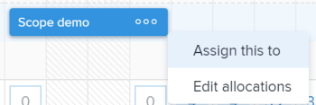
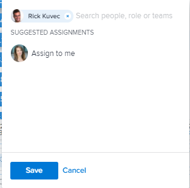

# Overview of assigning work in the Workload Balancer

>[!IMPORTANT]
>
>You're currently viewing the Adobe Workfront Classic version of this document. Adobe Workfront Classic is no longer supported. All Adobe Workfront Classic functionality, along with this documentation, will be removed in July 2022. Please transition to the the new Adobe Workfront experienceas soon as possible, and switch to the new Adobe Workfront experience version of this document.

As a resource manager, you can use the Adobe Workfront Workload Balancer to view work items that have not yet been assigned to users as well as assign these items to them.

For general information about the Workload Balancer, see [Overview of the Workload Balancer](../../resource-mgmt/workload-balancer/overview-workload-balancer.md).

You can assign work items (tasks and issues) to users in other areas of Workfront. However, by using the Workload Balancer you can easily understand users' availability and clearly see all other items they are assigned to before assigning them more work.

For information about assigning work items in other areas of Workfront, see the following articles:

* [Assign tasks](../../manage-work/tasks/assign-tasks/assign-tasks.md) 
* [Assign issues](../../manage-work/issues/manage-issues/assign-issues.md)

## User availability in the Workload Balancer

You can assign work in the Workload Balancer to match the users' available time. To ensure that you assign the right amount of work and not overallocate the user, the total of the Planned Hours of the work items assigned to the user must match the user daily or weekly allocations.

You must understand how Workfront calculates the available time for a user.

Workfront uses the following information to calculate the capacity of the user in the Workload Balancer:

* The Resource Management Preferences. The Workfront administrator determines how the available time is calculated for the system by selecting to use one of the following in the Resource Management area in&nbsp;Setup:

   * The Default Schedule of the system and the user's FTE. 
   * The user's schedule.&nbsp;

     This calculates the user's daily and weekly availability. Any schedule exceptions on the schedule selected are reflected in the user's capacity in the Workload Balancer.

  For more information, see [Configure Resource Management preferences](../../administration-and-setup/set-up-workfront/configure-system-defaults/configure-resource-mgmt-preferences.md).

* The user's time off. This indicates which days the user is planning to take off.

  For more information, see [Configure personal time off in Adobe Workfront](../../workfront-basics/manage-your-account-and-profile/configuring-your-user-profile/personal-time-overview.md).

## Assign work in the Workload Balancer

You can assign work items that have not yet been assigned to a user or reassign items that have been assigned to users in the Workload Balancer.

You can assign work in the Workload Balancer in the following ways:

* One item at a time by manually assigning each item.

  For more information, see [Assign work manually using the Workload Balancer](../../resource-mgmt/workload-balancer/assign-work-in-workload-balancer-manually.md).

For information about unassigning work, see [Unassign work in the Workload Balancer](../../resource-mgmt/workload-balancer/unassign-work-in-workload-balancer.md).

## Assignment areas in the Workload Balancer

You can assign work to users using the Workload Balancer in the Resourcing area, at the project, or at the team level. For more information about where the Workload Balancer is located in&nbsp;Workfront, see [Locate the Workload Balancer](../../resource-mgmt/workload-balancer/locate-workload-balancer.md).

There are two areas in the Workload Balancer where you can view work items:

* **Unassigned Work**:&nbsp;displays items that are not assigned to users.
* **Assigned Work**: displays items that are assigned to users.

The following table describes which items display in each area based on their assignments:

<table> 
 <col> 
 <col> 
 <col> 
 <tbody> 
  <tr> 
   <td><strong>Type of assignment</strong> </td> 
   <td colspan="2"><strong>Visible in the:</strong> </td> 
  </tr> 
  <tr> 
   <td>&nbsp;</td> 
   <td>Unassigned Work </td> 
   <td>Assigned Work </td> 
  </tr> 
  <tr data-mc-conditions=""> 
   <td>Unassigned item </td> 
   <td>✔ </td> 
   <td>&nbsp;</td> 
  </tr> 
  <tr> 
   <td>Team</td> 
   <td>✔</td> 
   <td>&nbsp;</td> 
  </tr> 
  <tr data-mc-conditions=""> 
   <td>Role </td> 
   <td>✔ </td> 
   <td>&nbsp;</td> 
  </tr> 
  <tr> 
   <td>Role and Team</td> 
   <td>✔</td> 
   <td>&nbsp;</td> 
  </tr> 
  <tr> 
   <td>User</td> 
   <td>&nbsp;</td> 
   <td>✔</td> 
  </tr> 
  <tr> 
   <td>User and Team</td> 
   <td> 
&nbsp;
 </td> 
   <td>✔</td> 
  </tr> 
  <tr> 
   <td>User,&nbsp;Role, and Team</td> 
   <td>✔*</td> 
   <td>✔**</td> 
  </tr> 
  <tr data-mc-conditions=""> 
   <td> 
User&nbsp;and Role
 </td> 
   <td>✔*</td> 
   <td>✔**</td> 
  </tr> 
 </tbody> 
</table>

&#42;When a work item is assigned to a user and a role, it displays in the Unassigned Work area only when the role is the Primary Assignee.

&#42;&#42;When a work item is assigned to a user and another entity, it displays in the Assigned Work area only when the user is the Primary Assignee.

For more information about the Unassigned and Assigned areas of the Workload Balancer, see [Navigate the Workload Balancer](../../resource-mgmt/workload-balancer/navigate-the-workload-balancer.md).

## Considerations for multiple assignments to job roles, teams, and users

Consider the following when assigning multiple resources to a work item:

* Users can have more than one job role associated with their profile. For information about associating users with job roles, see [Edit a user's profile](../../administration-and-setup/add-users/create-and-manage-users/edit-a-users-profile.md).

* Tasks or issues are usually first assigned to one or multiple job roles or to a team. When projects are ready to start, they might need to also be assigned to users.   
  If a task or an issue is assigned to one or multiple roles and then you also assign a user, Adobe Workfront decides which job role to associate with the additional user (if any)&nbsp;according to the following rules:

   * If there is only one job role assigned and it matches the user's Primary Role, then the task or issue is assigned only to the user fulfilling their&nbsp;Primary Role. 
   * If there are multiple roles assigned and at least one of the roles matches the user's secondary roles, then the task or issue is assigned to the user fulfilling one of their Other Roles — which Workfront selects at random if there are multiple matches — as well as any additional roles that are assigned.
   * If there is one or more job roles assigned and there are no matches to the user's roles, then the task or issue is assigned to both&nbsp;the role or roles as well as to the user.

* If a task or an issue is assigned to a team and you also assign a user, the task or issue remains assigned to both the team and the user.

<!--

 

(NOTE: Moved manual assignment and drag-and-drop to their own articles) 

<h2 data-mc-conditions="QuicksilverOrClassic.Classic">Assign work in the Workload Balancer</h2>

You can assign work items that have not yet been assigned to a user or reassign items that have been assigned to users in the Workload Balancer.

<ol>
<li value="1">Go to the Workload Balancer.</li>
<li value="2"> 
Go to the <strong>Unassigned Work</strong> area and apply a filter to view work items
 
Or
 
Go to the <strong>Assigned Work</strong> area and expand the name of a user to view the work items assigned to them.
 <note type="important">
You cannot view and assign issues from the Unassigned Work area. You can only reassign issues already assigned to users in the Assigned Work area. Otherwise, you can assign issues from a list or at the issue level. For information, see
<a href="../../manage-work/issues/manage-issues/assign-issues.md" class="MCXref xref">Assign issues</a>.
</note> </li>
<li value="3"> 
Click the <strong>More menu</strong>  on the bar of a work item, then click <strong>Assign this to</strong>. 
 
  
 <note type="tip">

You can also use the following shortcuts to assign tasks or issues: 

<ul>
<li>In Windows: CTRL+click the task or issue bar. </li>
<li>In&nbsp;Mac: CMD+click the task or issue bar. </li>
</ul>
</note> </li>
<li value="4"> 
Start typing the name of a user, job role, or team that you want to assign to the item in the <strong>Search people, role or teams</strong> field, select it when it displays in the list, then click&nbsp;<strong>Save</strong>. 
 
  
 
This assigns or reassigns the work item to the specified assignees.
 
If you assign an item to just a team or a job role, the item displays only in the Unassigned Work area. You must assign work items to users in order to display them in the Assigned Work area of the Workload Balancer.
 <note type="tip">

You can assign multiple users or job roles, and you can assign only one team. You can assign only active users, job roles, and teams.

If a user, job role, or a team was assigned before they were deactivated, they remain assigned to the work item. In this case, we recommend the following: 

<ul>
<li> 
Reassign the work item to active resources. 
 </li>
<li> 
Associate the users in a deactivated team with an active team and reassign the work item to the active team. 
 </li>
</ul>
</note> </li>
<li value="5"> 
(Optional) Click the <strong>Show allocations icon</strong> , then click the <strong>More menu</strong>  > <strong>Edit allocations</strong>.
 
Or
 
Double-click a daily or weekly allocation to modify the amount of time the user is allocated to the work item.
 
For information about modifying user allocations in the Workload Balancer, see the "Modify user allocations"&nbsp;section in the article <a href="../../resource-mgmt/workload-balancer/manage-user-allocations-workload-balancer.md" class="MCXref xref">Manage user allocations in the Workload Balancer</a>.
 </li>
</ol>

-->

<!--

<h2>Unassign work items in the Workload Balancer</h2>

(NOTE: moved this section to a new article. Draft here at release to preview) 

You can either unassign items from users and move them to the Unassigned Work area, or reassign them to other users. 

To unassign work items from users: 

<ol>
<li value="1">In the Workload Balancer, go to the <strong>Assigned Work</strong> area and expand a user.</li>
<li value="2">Do
<MadCap:conditionalText data-mc-conditions="QuicksilverOrClassic.Draft mode">
one of
</MadCap:conditionalText>
the following:
<ul>
<li class="preview" data-mc-conditions="QuicksilverOrClassic.Draft mode">
Find the item you want to unassign in a user's area, click it, drag and drop it in the Unassigned area or in another user's area. 
</li>
<li>
Click the <strong>More</strong> icon  to the right of the name of a work item, click&nbsp;<strong>Assign this to</strong> , then remove the name of the entities assigned to the work item or enter another name and click&nbsp;<strong>Save</strong>.

</li>
</ul>
The item displays in the Unassigned Work area if it matches the filtering criteria for that area and it is not assigned to any users or it displays in the user area if it is assigned to that user. 
<note type="tip">
Unassigned issues do not display in the Unassigned area.
</note>
For information about filtering information in the Workload Balancer, see <a href="../../resource-mgmt/workload-balancer/filter-information-workload-balancer.md" class="MCXref xref">Manage filters in the Workload Balancer</a>. 
</li>
</ol>

-->

