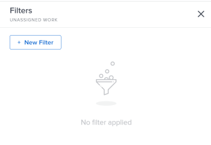
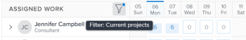
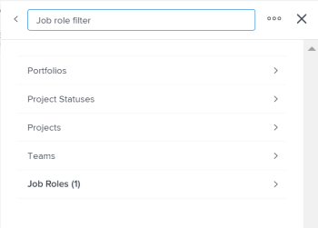
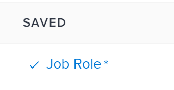

# Manage filters in the Workload Balancer

As a resource manager, you can use the Workload Balancer to view and manage the workload of your users. For more general information about the Workload Balancer, see the following articles:

* [Overview of the Workload Balancer](../../resource-mgmt/workload-balancer/overview-workload-balancer.md) 
* [Navigate the Workload Balancer](../../resource-mgmt/workload-balancer/navigate-the-workload-balancer.md)

To efficiently find work items and to focus on the users you manage, we strongly recommend that you use filters in the Workload Balancer. This allows you to display the correct information before you start managing the assignments of your resources.

This article contains information about filters in the Workload Balancer. For information about filters in Workfront, see [Filters overview in Adobe Workfront](../../reports-and-dashboards/reports/reporting-elements/filters-overview.md).

## Access requirements

You must have the following:

<table cellspacing="0"> 
 <col> 
 </col> 
 <col> 
 </col> 
 <tbody> 
  <tr> 
   <td role="rowheader">Adobe Workfront plan*</td> 
   <td> <p>Any plan</p> </td> 
  </tr> 
  <tr> 
   <td role="rowheader">Adobe Workfront license*</td> 
   <td> <p>Plan or higher</p> </td> 
  </tr> 
  <tr> 
   <td role="rowheader">Access level*</td> 
   <td> <p>View or higher access to&nbsp;the following:</p> 
    <ul> 
     <li> <p>Resource Management</p> </li> 
     <li> <p>Projects</p> </li> 
     <li> <p>Tasks</p> </li> 
     <li> <p>Issues</p> </li> 
    </ul> <p>Note: If you still don't have access, ask your Workfront administrator if they set additional restrictions in your access level. For information on how a Workfront administrator can change your access level, see <a href="../../administration-and-setup/add-users/configure-and-grant-access/create-modify-access-levels.md" class="MCXref xref">Create or modify custom access levels</a>.</p> </td> 
  </tr> 
  <tr> 
   <td role="rowheader">Object permissions</td> 
   <td> <p>View or higher permissions to the projects, tasks, issues</p> <p>For information on requesting additional access, see <a href="../../workfront-basics/grant-and-request-access-to-objects/request-access.md" xmlns:MadCap="http://www.madcapsoftware.com/Schemas/MadCap.xsd" class="MCXref xref">Request access to objects in Adobe Workfront</a>.</p> </td> 
  </tr> 
 </tbody> 
</table>

&#42;To find out what plan, license type, or access you have, contact your Workfront administrator.

## Overview of filters in the Workload Balancer

Consider the following when working with filters in the Workload Balancer:

* Depending on where you access the Workload Balancer from, Workfront might already be filtering the information for you.&nbsp;For information about pre-applied filters, see the section [Pre-applied filters in the Workload Balancer](#pre-applied-filters-in-the-workload-balancer) in this article. 
* You can create and apply a filter without saving it, or you can save a filter to reuse at a later time. 
* When you apply a filter without saving it, you can revert to the original lists by refreshing your page. 
* You can only view and apply filters you created. Filters created by other users display only for those users. 
* When you save and apply a new filter then navigate away from the Workload Balancer, the filter is preserved even after you log off and log back on. 
* When you create filters in the Workload Balancer in one area, they are not available in other areas. 

  ``` ```**Example: **`````` Filters created in the People area are not available in the Workload Balancer of a project or a team.

  For information about where to locate the Workload Balancer, see [Locate the Workload Balancer](../../resource-mgmt/workload-balancer/locate-workload-balancer.md).

* You can view only the items that match the selected filters that also match the dates within the timeline displayed on the screen of the Workload Balancer.

## Pre-applied filters in the Workload Balancer {#pre-applied-filters-in-the-workload-balancer}

The Workload Balancer displays information in two separate areas:

* **The Unassigned Work area**: work items that are not yet assigned to users. 
* **The Assigned Work area**: work items that are assigned to users.

  For information about what displays in each of the areas, see [Navigate the Workload Balancer](../../resource-mgmt/workload-balancer/navigate-the-workload-balancer.md).

>[!IMPORTANT]
>
>Each area of the Workload Balancer has its own set of filters which work independently from one another. You must configure both filters to indicate what information you want to see in each area.

Depending on where you access the Workload Balancer from, the Unassigned and&nbsp;Assigned areas are already filtered by certain criteria, as described in the following table:

<table cellspacing="0"> 
 <col> 
 <col> 
 <col> 
 <tbody> 
  <tr> 
   <td role="rowheader">Workfront area where you access the Workload Balancer </td> 
   <td><b>Items that display in the Unassigned Work area by default</b> </td> 
   <td><b>Items that display in the Assigned Work area by default</b> </td> 
  </tr> 
  <tr> 
   <td role="rowheader">The People area</td> 
   <td>No items display here by default. You must customize filters to view work items in this area.</td> 
   <td>Users who are members of any of your teams and their work items.</td> 
  </tr> 
  <tr> 
   <td role="rowheader">A team</td> 
   <td>Work items that are assigned to the team or the team and a job role. </td> 
   <td> <p>Users who are members of the selected team and their work items that match the timeline selected on the screen.</p> </td> 
  </tr> 
  <tr> 
   <td role="rowheader">A project</td> 
   <td> <p>Unassigned work items or items assigned to teams or job roles in the selected project display in this area.</p> </td> 
   <td> <p>Users that are assigned to at least one work item on the selected project and their work items on the selected project or on other projects that match the timeline selected on the screen.</p> </td> 
  </tr> 
 </tbody> 
</table>

&nbsp;

## Create Workload Balancer filters

The process for creating filters for the Unassigned Work and Assigned Work areas in the Workload Balancer is identical, regardless of where you access the Workload Balancer from. For information about locating the Workload Balancer, see [Locate the Workload Balancer](../../resource-mgmt/workload-balancer/locate-workload-balancer.md).

You can create a filter from scratch or edit one of the predefined filters. For information about existing filters that you can edit, see the [Edit an existing filter in the Workload Balancer](#edit-an-existing-filter-in-the-workload-balancer) section in this article.

1. Go to the Workload Balancer.

   For information about accessing the Workload Balancer, see [Navigate the Workload Balancer](../../resource-mgmt/workload-balancer/navigate-the-workload-balancer.md).

1. Click the **Filter** icon  in the upper-right corner of either the **Unassigned Work** or the **Assigned Work** areas.

   The list of filters and filter builder box displays on the right.

   The filter builder box displays on the right. The name of the area you create the filter for displays in the header of the box.

   

1. (Optional and conditional) If you access the Workload Balancer in the People area, the predefined Default filter might already be applied to the Assigned Work area. You can edit and save a copy of this filter.

   >[!TIP]
   >
   >The Default filter displays users that belong to any of your teams and their work items. You can edit a copy of this filter.

   If you access the Workload Balancer from a project, select one of the following predefined filters in the Assigned Work area:

   * **All work items**: Displays work items assigned to users in this project and their work items in other projects. This is the filter selected by default. You cannot edit this filter.
   * **This project's work items**: Displays only work items assigned to users in this project. You can edit and save a copy of this filter.

1. Click **New Filter** to create a new filter.

   The filter builder replaces the list of filters on the right. 

1. Select a field, then a value that matches what information you want to filter by.

   >[!IMPORTANT]
   >
   >When referencing custom fields, you must type the field name and not the field label. The field label displays on a custom form attached to an object. For information about the difference between the label and the name of a custom field, see ``` [Create or edit a custom form](../../administration-and-setup/customize-workfront/create-manage-custom-forms/create-or-edit-a-custom-form.md)``` ```.```

   When you select more than one field, the filter assumes that all conditions must apply simultaneously.

   ``` ```**Example: **``````If you want to filter for items that belong to the Marketing portfolio and are assigned to the Job Role of Designer, the work items must be on projects associated with the Marketing portfolio as well as be assigned to Designers at the same time to display in the Workload Balancer.

1. (Optional) Click **Reset** to clear all the fields you have selected and start building the filter from scratch. 
1. (Optional) Click **Apply** to apply the filter without saving.

   The filter displays in the **Unsaved** area of the filter builder as **New Filter**.

   >[!TIP]
   >
   >
   >   
   >   
   >   * You cannot rename an unsaved filter. 
   >   * Unsaved filters are removed from the Workload Balancer next time you log out of Workfront and log back in.
   >   * You can have only one unsaved filter at one time. 
   >   
   >

1. Click **Save** to save the filter to use it later, then add a name for the filter in the **Add filter name** field and click **Done**.

   This saves the filter in the **Saved** section of the filter builder. You can use this filter in the future.

   The last saved and applied filter displays by default next time you log back in to Workfront.

   >[!NOTE]
   >
   >You can view filters only in the areas of Workfront where you build them.&nbsp;For example, if you save a filter in the People area, it is not available when you access the Workload Balancer of a project or of a team. The filters you create are only visible you and cannot be shared with other users.

1. (Optional) Click the **left-pointing arrow** next to **New Filter** to exit the filter builder and return to the list of filters. 
1. Click the **X icon** in the upper-right corner of the filter builder to close the filter builder.
1. (Conditional) Hover over the **Filter icon**  in the upper-right corner of the **Unassigned Work** or the **Assigned Work** areas to display the name of the filter that is currently applied. A blue dot indicator appears when a filter has already been applied to the list.

   

##

## Edit an existing filter in the Workload Balancer {#edit-an-existing-filter-in-the-workload-balancer}

You can edit a saved filter in the Workload Balancer.

1. Go to the Workload Balancer.

   For information about accessing the Workload Balancer, see [Navigate the Workload Balancer](../../resource-mgmt/workload-balancer/navigate-the-workload-balancer.md).

1. Click the **Filter icon**  in the upper-right corner of the **Unassigned** or **Assigned Work** areas.   
   The filter builder displays on the right. 

1. Expand the **Saved** area in the filter builder, then mouse over the filter you want to edit.

   Or

   Expand the **Unsaved** area in the filter builder, then mouse over **New Filter**, then click the **Edit icon** . 

1. (Conditional) If you selected to edit a saved filter, edit the name of the filter.

   

   Unsaved filters cannot be renamed. An asterisk displays next to the name of a saved filter when you edited the filter but you have not saved the changes.

   

1. Update the filter criteria to edit the existing filter and create a new one. For information about creating a filter, see the [Manage filters in the Workload Balancer](#Create) section in this article. 
1. (Optional and conditional) Click **Apply** to apply your changes temporarily without saving them.

   >[!IMPORTANT]
   >
   >Unsaved changes to a previously saved filter are deleted when you navigate away from the Workload Balancer.

1. Click **Save** to save the changes you made to the existing filter. 
1. (Optional) Click the **left-pointing arrow** next to the name of the filter to exit the filter builder and return to the list of filters. 
1. Click the **X icon** in the upper-right corner of the filter builder to close the filter builder.

##

## Delete a saved filter in the Workload Balancer

Consider the following before deleting a filter:

* You cannot recover deleted filters.
* You cannot delete predefined filters. 
* You cannot delete an unsaved filter. They are removed automatically after logging out and logging back in to Workfront. 
* After you delete all saved filters, the Workload Balancer displays according to the original defaults.&nbsp;

To delete a saved filter:

1. Go to the Workload Balancer
1. Click the **Filter icon**  in the upper-right corner of the **Unassigned** or **Assigned Work** areas.   
   The filter builder displays on the right. 

1. Expand the **Saved** area in the filter builder, mouse over the name of a filter, click the **More menu** , then **Delete**.

   

1. Click **Delete** to confirm that you want to remove the filter. 
1. Click the **X icon** in the upper-right corner of the filter builder to close the filter builder.

