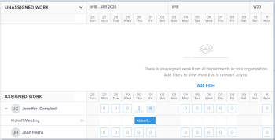
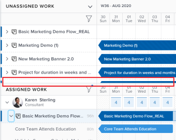
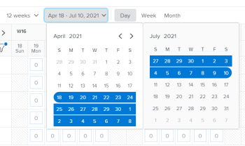
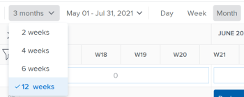
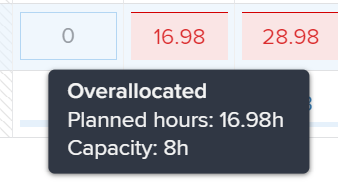
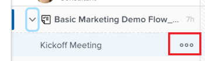

# Navigate the Workload Balancer

Use the Workload Balancer to understand the availability of your resources as well as to assign work to your users. This article walks you through using the icons and settings available to update the view for and navigate the Workload Balancer.

>[!NOTE]
>
>The Workload Balancer is a resource scheduling tool that will eventually replace the current resource scheduling tools which are currently deprecated. 
>
>For more information about removing the resource scheduling tools and replacing them with the Workload Balancer, see [Deprecation of Resource Scheduling tools in Adobe Workfront](../../resource-mgmt/resource-mgmt-overview/deprecate-resource-scheduling.md).
>
>We recommend that you use the Workload Balancer for scheduling your resources.

The Workload Balancer is available in multiple areas of Adobe Workfront. Navigating it is similar in all areas.&nbsp;This article describes how to navigate the Workload Balancer for multiple projects in the Peoplearea.&nbsp;For more information about where the Workload Balancer is located, see [Locate the Workload Balancer](../../resource-mgmt/workload-balancer/locate-workload-balancer.md).

Also consider reading the following articles:

* For information about assigning work using the Workload Balancer, see ` [Overview of assigning work in the Adobe Workfront Workload Balancer](../../resource-mgmt/workload-balancer/assign-work-in-workload-balancer.md)`. 
* For information about managing user allocations, see [Manage user allocations in the Workload Balancer](../../resource-mgmt/workload-balancer/manage-user-allocations-workload-balancer.md).

## Access requirements

You must have the following access to perform the steps in this article:

<table cellspacing="0"> 
 <col> 
 <col> 
 <tbody> 
  <tr> 
   <td role="rowheader">Adobe Workfront plan*</td> 
   <td> <p>Any </p> </td> 
  </tr> 
  <tr> 
   <td role="rowheader">Adobe Workfront license*</td> 
   <td> <p>Plan </p> </td> 
  </tr> 
  <tr> 
   <td role="rowheader">Access level configurations*</td> 
   <td> <p>View or higher access to&nbsp;the following:</p> 
    <ul> 
     <li> <p>Resource Management</p> </li> 
     <li> <p>Projects</p> </li> 
     <li> <p>Tasks</p> </li> 
     <li> <p>Issues</p> </li> 
    </ul> <p>Note: If you still don't have access, ask your Workfront administrator if they set additional restrictions in your access level. For information on how a Workfront administrator can change your access level, see <a href="../../administration-and-setup/add-users/configure-and-grant-access/create-modify-access-levels.md" class="MCXref xref">Create or modify custom access levels</a>.</p> </td> 
  </tr> 
  <tr> 
   <td role="rowheader">Object permissions</td> 
   <td> <p>View or higher permissions to the projects, tasks, and issues </p> <p>For information on requesting additional access, see <a href="../../workfront-basics/grant-and-request-access-to-objects/request-access.md" class="MCXref xref">Request access to objects in Adobe Workfront</a>.</p> </td> 
  </tr> 
 </tbody> 
</table>

&#42;To find out what plan, license type, or access you have, contact your Workfront administrator.

## Considerations for viewing items in the Workload Balancer

Consider the following when viewing the Workload Balancer:

* Projects display in the Workload Balancer only when the Group by Project setting is enabled. This setting is enabled by default.
* When a project has no tasks during a period of time, the bar at the project level becomes a dimmed color.

  

* When you don't have permissions to see certain items, they display as `Inaccessible work items` or `Inaccessible projects`.

  

* The names of the work items display on the left and within the timeline selected on the right. 
* The total of Planned Hours for each work item displays to the right of the name of the work items on the left. 
* The total of the Planned Hours for each project displays to the right of the name of the project on the left.

  The Planned Hours information for the project is a total of Planned Hours from all items listed in the Workload Balancer, and not a total of Planned Hours on the project.

##  Overview of the Unassigned Work and Assigned Work areas

The Workload Balancer displays work items in two separate areas, depending on their assignments.

The two areas of the Workload Balancer display the following information:

<table cellspacing="0"> 
 <col> 
 <col> 
 <tbody> 
  <tr> 
   <td role="rowheader">Unassigned Work</td> 
   <td> <p>This area displays tasks unassigned to users. It does not display issues. </p> <p>Projects display when the Group by Project setting is enabled.</p> <p>This area does not display any work items by default. We recommend using filters to display relevant information for you in this area.</p> <p>After you apply a filter, this area displays the following work items:</p> 
    <ul> 
     <li>unassigned</li> 
     <li>assigned to a team </li> 
     <li>assigned to a job role</li> 
     <li> <p>assigned to a team and a role at the same time</p> </li> 
    </ul> <p>Tip: Items assigned to a user as the primary assignee do not display in the Unassigned Work area. </p> </td> 
  </tr> 
  <tr> 
   <td role="rowheader">Assigned Work</td> 
   <td> The Default filter is applied by default and users who are members of any of your teams and their work items display here. <p>Both tasks and issues display in the Assigned Work area. </p> <p>Projects display when the Group by Project setting is enabled.</p> <p>The work items that the users are assigned to display under their names. </p> <p>If a work item is assigned to multiple users, the item displays under each assigned user. </p> </td> 
  </tr> 
 </tbody> 
</table>

For information about applying a filter in the Workload Balancer, see [Manage filters in the Workload Balancer](../../resource-mgmt/workload-balancer/filter-information-workload-balancer.md).



## Navigate the Workload Balancer

You can update the view in the Workload Balancer to display exactly the information you need to focus on in the time frame that makes the most sense to you.

After selecting the settings you want to apply to your view, the Workload Balancer remembers these settings every time you access it from any browser or device.

1. Click People in the Global Navigation Bar. 
1. Click the Workload Balancer tab.

   You might need to click `Scheduling`, then select Workload Balancer in the upper-left corner. 

   The Workload Balancer displays work assignment information starting with the current week. The names of work items are listed on the left side as well as represented by bars on the right side of the of the Workload Balancer within their respective timelines. `By default, blue bars represent the timelines of projects and tasks and maroon bars represent issues.`

   The work items that display under the name of users in the Workload Balancer are sorted by the following criteria, in this order:

  1. Planned Start Date (oldest first)
  1. Planned Completion Date (oldest first)
  1. Alphabetical by project (only when the first two criteria are identical for multiple work items)

1. Use the horizontal scroll to navigate the timelines of work items that extends beyond the limits of the screen. 
1. Use the vertical scroll to display additional users and work items. 
1. Click the `Filter icon`  in the upper-right corner of the `Unassigned Work` or the `Assigned Work` areas to select the type of information to display in the Workload Balancer.

   For information about filtering information in the Workload Balancer, see [Manage filters in the Workload Balancer](../../resource-mgmt/workload-balancer/filter-information-workload-balancer.md). 

1. Click the right-pointing arrow next to `Unassigned Work` to expand this area or the down-pointing arrow to collapse it.

   >[!TIP]
   >
   >No items display in this area by default. You must apply a filter to view unassigned work items.

1. Drag and drop the separation line between the `Unassigned Work` and `Assigned Work` areas to adjust their size.

   

1. Click the back or forward icons  to navigate the timeline, then click `Today` to return to the current week. 

1. Click the `time frame drop-down menu` on the toolbar, then click the beginning date of the period selected in step 8 on the calendar that displays. By default, the first week selected on the calendar is the week you navigated to.

   

   ` `**Tips: **``

  * When you view the Workload Balancer on smaller screens the time frame drop-down menu is replaced by the calendar icon . 
  * A dual calendar displays only when you select to view 12 weeks at a time.

1. Click one of the following options in the toolbar to display information by different time frames:

   | Day |Displays information by day for four weeks starting with today's date, by default.  |
   |---|---|
   | Week |Displays information by week for four weeks.  |

1. Select the number of weeks you want to display at one time in the Workload Balancer from the following options:

  * 2 weeks
  * 4 weeks.&nbsp;This is the default setting.
  * 6 weeks
  * 12 weeks
  
    ` `**Tip: **``

    * `When you display the Workload Balancer by month, the option for 12 weeks becomes 3 months.`

      

    * `When you display the Workload Balancer by a time frame shorter than 3 months or 12 weeks, the time frame switches automatically from Month to Week.`

1. Click the `Chart icon`  to display the user allocation in a chart format. Days where the user is overallocated display as red blocks, and days where the user is underallocated or at capacity display as blue blocks. The size of the blocks indicates the amount of the allocation: the larger the box, the more time the user is allocated to work items for that day or week.

   

1. Click the `Show allocations icon`  to view the daily or weekly Planned Hours for work items.

   This replaces the name in the bars of the work items with the amount of daily or weekly Planned Hours in the Unassigned and Assigned Work areas. This setting is disabled by default. 

   ` `**Tip: **``

  * The Show allocations setting only affects what displays for projects, tasks, `issues` and inaccessible items. Daily Planned Hours for users display by default and cannot be hidden.
  * You must enable the Group by Project setting to display daily Planned Hours for projects. 
  * When you view the Workload Balancer by week, the hours displayed are the weekly Planned Hours.

   Days that show overallocations display in red. 

1. (Optional) Hover over the allocated time in the user line to understand what the capacity and allocation of the user. The capacity is the availability of the user according to their schedule.

   

1. (Optional) Click the `Hide allocations icon`  to display the name of the tasks in the bars of the work items. 
1. `Click the `More menu` icon  to the right of a task or issue name,` then click one of the following:

  * `Assign this to`, then start typing the name of a user, role, or team you want to assign the work item to.

    

    ` `**Tip: **```You can also use the following shortcuts to assign tasks or issues:`

    * `In Windows: CTRL+click the task or issue bar.`
    * `In Mac: CMD+click the task or issue bar.`

    For more information about assigning work items to users in the Workload Balancer, see [Overview of assigning work in the Adobe Workfront Workload Balancer](../../resource-mgmt/workload-balancer/assign-work-in-workload-balancer.md). 
  
  * `Edit allocations`, then edit the daily or weekly allocations for the user. For information about managing user allocations, see [Manage user allocations in the Workload Balancer](../../resource-mgmt/workload-balancer/manage-user-allocations-workload-balancer.md).

1. (Optional) Double-click a daily or weekly allocation for a user inside the bar of a work item to edit the number of allocated hours, then click the `Save` icon to save the allocations or the `Cancel` icon  to remove the allocations you adjusted.

   >[!TIP]
   >
   >The Save and Cancel icons display towards the end of a task or an issue's timeline bar.

   For information about managing user allocations, see [Manage user allocations in the Workload Balancer](../../resource-mgmt/workload-balancer/manage-user-allocations-workload-balancer.md). 

1. Click the name of a work item on the left to access it. 
1. Click the `Shareable link icon`  to copy the direct URL for the Workload Balancer to your clipboard. 
1. (Optional) Share the link with any user who does not have direct access to the Workload Balancer.

   For information about sharing the Workload Balancer with a link, see [Share the Workload Balancer with a link](../../resource-mgmt/workload-balancer/share-link-for-workload-balancer.md). 

1. (Conditional) From the Workload Balancer of a project, click the `Show role allocations` icon .

   The Role Allocation panel displays. You can view information about Planned Hours associated with job roles on the project and job roles associated with initiatives from the Scenario Planner. For more information, see [Overview of reconciling resource allocations between projects and initiatives](../../scenario-planner/overview-reconcile-allocations-between-projects-initiatives.md).

   >[!TIP]
   >
   >You cannot view initiative job role information if your organization has not purchased a license for the Workfront Scenario Planner. In this case, you can only view the planned hours associated with job roles on the project. For more information, see [Access needed to use the Adobe Workfront Scenario Planner](../../scenario-planner/access-needed-to-use-sp.md).

1. (Optional) Click Switch back to Scheduling to access the scheduling area.

