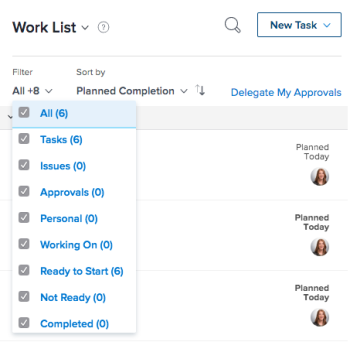
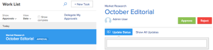
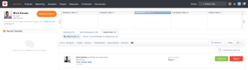
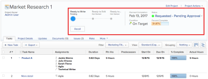
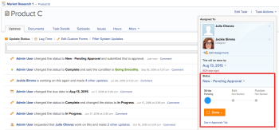

# Approving work

>[!IMPORTANT]
>
>You're currently viewing the Adobe Workfront Classic version of this document. Adobe Workfront Classic is no longer supported. All Adobe Workfront Classic functionality, along with this documentation, will be removed in July 2022. Please transition to the the new Adobe Workfront experienceas soon as possible, and switch to the new Adobe Workfront experience version of this document.

<!--

(NOTE:&nbsp;From&nbsp;Courtney: Linked to Training sites/ articles , don't change title and link)

-->

If you are set&nbsp;as an approver, you&nbsp;should regularly review what work is awaiting your approval.

For information about creating approval processes, see [Create an approval process for work items](../../administration-and-setup/customize-workfront/configure-approval-milestone-processes/create-approval-processes.md).

For information about associating approvals with work in Workfront, see [Associate a new or existing approval process with work](../../review-and-approve-work/manage-approvals/associate-approval-with-work.md).

## Access requirements

You must have the following access to perform the steps in this article:

<table cellspacing="0"> 
 <col> 
 <col> 
 <tbody> 
  <tr> 
   <td role="rowheader">Adobe Workfront plan*</td> 
   <td> 
Any
 </td> 
  </tr> 
  <tr> 
   <td role="rowheader">Adobe Workfront license*</td> 
   <td> 
Review or higher
 </td> 
  </tr> 
  <tr> 
   <td role="rowheader">Access level configurations*</td> 
   <td> 
View or higher access to the objects associated with approvals
 
Note: If you still don't have access, ask your Workfront administrator if they set additional restrictions in your access level. For information on how a Workfront administrator can modify your access level, see <a href="../../administration-and-setup/add-users/configure-and-grant-access/create-modify-access-levels.md" class="MCXref xref">Create or modify custom access levels</a>.
 </td> 
  </tr> 
  <tr> 
   <td role="rowheader">Object permissions</td> 
   <td> 
View or higher permissions to the objects associated with approvals
 
For information on requesting additional access, see <a href="../../workfront-basics/grant-and-request-access-to-objects/request-access.md" class="MCXref xref">Request access to objects </a>.
 </td> 
  </tr> 
 </tbody> 
</table>

&#42;To find out what plan, license type, or access you have, contact your Workfront administrator.

## Locate approvals in Adobe Workfront

You can view and manage approvals in various areas of Workfront.

For more information about viewing items awaiting approvals or items that you have submitted for approval yourself, see [View approvals](../../review-and-approve-work/manage-approvals/view-approvals.md).

## Approve work from the Home area

1. Go to the&nbsp;**Home**&nbsp;area.  
   For information about accessing the Home area if it is not visible to you, see&nbsp; [Try the Home area](../../workfront-basics/using-home/using-the-home-area/try-home-area.md).

1. Click the **Filter** drop-down menu.

   

1. Select **Approvals**.  
   All work items that require your approval display.&nbsp;

   >[!NOTE]
   >
   >Approvals assigned to Job Roles or Groups don't display in Home. Approvals assigned to Teams display in the Team Request grouping in the Work List.

1. (Optional) Change the order in which approvals are displayed, as described in the section "Group and sort by Date, Project, or Priority" in the article [Display items in the Work List in the Home area](../../workfront-basics/using-home/using-the-home-area/display-items-in-home-work-list.md).
1. Select the item where you want to make an approval decision.  
   

1. Click one of the available options when making an approval decision in the right panel. The following options display in the upper-right corner of the page, depending on the type of item you are approving:

   * **Projects:** Click **Approve**&nbsp;or **Reject**.
   
   * **Tasks:**&nbsp;Click **Approve**&nbsp;or **Reject**&nbsp;.
   
   * **Issues:**&nbsp;Click **Approve**&nbsp;or **Reject** .
   
   * **Timesheets:**&nbsp;Click **Approve**&nbsp;or **Reject**&nbsp;.
   
   * **Documents:**&nbsp;Click **Approve**,&nbsp;**Reject**, or **Changes**.  
     &nbsp;Consider the following when viewing&nbsp; approvals:

      * Proof approvals display here when a user shares a proof with you, as described in the section "Share a proof link" in the article [Share a proof within Adobe Workfront](../../review-and-approve-work/proofing/managing-proofs-within-workfront/share-a-proof-in-workfront.md).
      * Proofing approvals are displayed in the Home area&nbsp;only if your Workfront environment is integrated with a Workfront Proof Premium account. If you cannot use proofing as discussed here, contact your Workfront administrator.
      * You receive an in-app notification, notifying you of the proofing approval.  
        For more information about in-app notifications, see [View and manage in-app notifications](../../workfront-basics/using-notifications/view-and-manage-in-app-notifications.md).
      
      * The name of the user who requested the approval&nbsp;is displayed next to the thumbnail image in the Home area, with the following text:  
        "*User A* would like your approval on..."       
      
        <!--      
        <MadCap:conditionalText data-mc-conditions="QuicksilverOrClassic.Draft mode">      
        (NOTE:&nbsp;From&nbsp;Courtney: Is this true?)      
        </MadCap:conditionalText>      
        -->

        If the user name is not available, the following text is displayed:  
        "A new version of a proof is ready to view"
      * To make an approval decision on the proof,&nbsp;click **Go to Proof**, click **Finish review**, then click&nbsp;one of the available options. The available options when approving a proof are:&nbsp;**Approved**, **Approved with changes**, **Changes required**, and **Not relevant**.
      
      * After a decision is made on the proof, the proof remains in the My Approvals tab with the text "Decision Made" until you click the **Refresh** button, or until you refresh the browser page.

        For information about reviewing a proof, see [Review proofs within Adobe Workfront](../../review-and-approve-work/proofing/reviewing-proofs-within-workfront/review-proofs-in-wf.md).

   * **Access:** Select the level of access to grant in the **Change access** drop-down menu, then click **Grant Access**. Or, click **Ignore**.

## Approve work from the My Work area

<!--

(NOTE: this is duplicated in the View Approvals article - consider leaving one or the other in?!)

-->

1. Click&nbsp;**My Work**&nbsp;in the Global Navigation bar.
1. Click the&nbsp;**Approvals**&nbsp;tab, then click&nbsp;**My Approvals**.  
   All work items that require your approval are displayed. Approvals&nbsp;are shown in the reverse order of when they were requested, with the most recently requested approvals&nbsp;at the bottom.  
   

1. Click one of the available options to filter the list of items waiting your approval (by default, all items waiting your approval are displayed):

* **Projects:**&nbsp;Click&nbsp;**Approve**&nbsp;or&nbsp;**Reject**&nbsp;next to the&nbsp;work item.

* **Tasks:**&nbsp;Click&nbsp;**Approve**&nbsp;or&nbsp;**Reject**&nbsp;next to the&nbsp;work item.

* **Issues:**&nbsp;Click&nbsp;**Approve**&nbsp;or&nbsp;**Reject**&nbsp;next to the&nbsp;work item.

* **Timesheets:**&nbsp;Click&nbsp;**Approve**&nbsp;or&nbsp;**Reject**&nbsp;next to the&nbsp;work item.

* **Documents:**&nbsp;Click&nbsp;**Approve**,&nbsp;**Reject**, or&nbsp;**Changes**&nbsp;next to the&nbsp;work item.  
  Consider the following when viewing&nbsp;proofing approvals: (Proof approvals are displayed here when a user shares a proof with you, as described in&nbsp; [Share a proof within Adobe Workfront](../../review-and-approve-work/proofing/managing-proofs-within-workfront/share-a-proof-in-workfront.md)&nbsp;in&nbsp; [Share a proof within Adobe Workfront](../../review-and-approve-work/proofing/managing-proofs-within-workfront/share-a-proof-in-workfront.md).)

   * Proofing approvals are displayed in the My Work area&nbsp;only if your Workfront environment is integrated with a Workfront Proof Premium account. If you cannot use proofing as discussed here, contact your Workfront administrator.
   * You receive an in-app notification, notifying you about the proofing approval.  
     For more information about in-app notifications, see&nbsp; [View and manage in-app notifications](../../workfront-basics/using-notifications/view-and-manage-in-app-notifications.md).
   
   * The name of the user who requested the approval&nbsp;is displayed next to the thumbnail image in the My Work area, with the following text:  
     "*User A*&nbsp;would like your approval on..."  
     If the user name is not available, the following text is displayed:  
     "A new version of a proof is ready to view"
   
   * To make an approval decision on the proof,&nbsp;click&nbsp;**Go to Proof**, click&nbsp;**Finish review**, then click&nbsp;one of the available options. The available options when approving a proof are:&nbsp;**Approved**,&nbsp;**Approved with changes**,&nbsp;**Changes required**, and&nbsp;**Not relevant**.  
     After a decision is made on the proof, the proof remains in the My Approvals tab with the text "Decision Made" until you click the&nbsp;**Refresh**&nbsp;button, or until you refresh the browser page.

* **Access:**&nbsp;Select the level of access to grant in the&nbsp;**Change access**&nbsp;drop-down menu, then click&nbsp;**Grant Access**. Or, click&nbsp;**Ignore**.

* **All:**&nbsp;Displays all work items in a combined view.

## Approve work directly from a project, task, or issue

When a project, task, or issue is pending approval, you can approve or reject the approval directly from the project, task, or issue. You can also view details regarding the approval process.

To approve work directly from a project, task, or issue:

1. Go to the project, task, or issue that requires your approval.

   Approval information regarding the current approval process of a project displays in the project's header.

   

   Approval information regarding a task or issue is displayed in the right panel.

   

   The following approval information is available:

   <table cellspacing="0"> 
    <col> 
    <col> 
    <tbody> 
     <tr> 
      <td role="rowheader">Status</td> 
      <td>The current status of the project, task, or issue. This is the current status of the item that is pending the approval. The status is approved after each stage in the approval process is approved.</td> 
     </tr> 
     <tr> 
      <td role="rowheader">Approval stages</td> 
      <td>The stages of the approval process.  The current stage that is pending approval is displayed as  blue .  You can view previous or future approval stages in the approval process by clicking the <strong>More</strong> buttons to the right and left of the current stage.  Stages that have already been approved are displayed as  green&nbsp; ; stages that have not yet been approved are displayed as  gray .</td> 
     </tr> 
     <tr data-mc-conditions="QuicksilverOrClassic.Classic"> 
      <td role="rowheader">See in Approvals Tab</td> 
      <td> 
Click this option to view the approval stage in the Approvals tab.
 
This is available for tasks and issues. 
 </td> 
     </tr> 
    </tbody> 
   </table>

1. Click **Approve** or **Reject**, depending on whether you want to approve or reject the approval process.  
   The approval stage that was pending approval is now approved, and the approval process moves to the next stage. The status is approved after all stages have been approved.

## Approve a document directly from a document&nbsp;

1. Go to the documents area that contains the document that requires your approval.
1. Select the document, then click **Approve**,&nbsp;**Changes**, or **Reject**.  
   

1. (Optional) If a proof has been generated for the document, you can approve the document within the proofing interface, as described in [Approve a document from a proof](#approve-a-document-from-a-proof).

## Approve a document from an approval notification email

Depending on your notification settings, you may receive emails notifying you about documents for which other users need you to make an approval decision. When you receive an email containing a **Make Approval Decision** button, you can can start the approval process directly from the email:

1. From the email, click **Make Approval Decision**. 
1. Click **Open** to view the document in a new browser tab.
1. When you are ready to make a decision on the document, return to the Workfront browser tab that opened from the email notification.
1. Click **Approve**, **Changes**, or **Reject**.

1. Type any comments to explain your decision, then click **Add Comment**.

   Or

   Click **Don't Comment**.

## Approve a document from a proof {#approve-a-document-from-a-proof}

You can approve a document within the proofing viewer. For more information, see [Make a decision on a proof in the proofing viewer](../../review-and-approve-work/proofing/reviewing-proofs-within-workfront/make-a-decision-on-a-proof/make-decisions-on-proof.md) in the article [Make a decision on a proof in the proofing viewer](../../review-and-approve-work/proofing/reviewing-proofs-within-workfront/make-a-decision-on-a-proof/make-decisions-on-proof.md).
