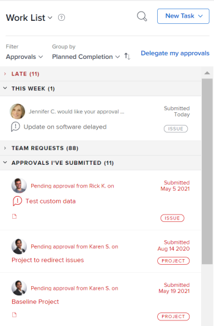
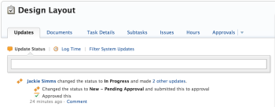
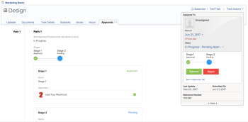

# View approvals in Adobe Workfront

Approval processes provide the flexibility to create multistep approvals for projects, tasks, and issues. Adobe Workfront administrators define approval processes to provide consistency throughout the system.

For information about creating approval processes, see [Create an approval process for work items](../../administration-and-setup/customize-workfront/configure-approval-milestone-processes/create-approval-processes.md).

For information about associating approvals with work in Workfront, see [Associate a new or existing approval process with work](../../review-and-approve-work/manage-approvals/associate-approval-with-work.md).

## Access requirements

You must have the following access to perform the steps in this article:

<table cellspacing="0"> 
 <col> 
 <col> 
 <tbody> 
  <tr> 
   <td role="rowheader">Adobe Workfront plan*</td> 
   <td> 
Any
 </td> 
  </tr> 
  <tr> 
   <td role="rowheader">Adobe Workfront license*</td> 
   <td> 
Review or higher
 </td> 
  </tr> 
  <tr> 
   <td role="rowheader">Access level configurations*</td> 
   <td> 
View or higher access to the objects associated with approvals
 
Note: If you still don't have access, ask your Workfront administrator if they set additional restrictions in your access level. For information on how a Workfront administrator can modify your access level, see <a href="../../administration-and-setup/add-users/configure-and-grant-access/create-modify-access-levels.md" class="MCXref xref">Create or modify custom access levels</a>.
 </td> 
  </tr> 
  <tr> 
   <td role="rowheader">Object permissions</td> 
   <td> 
View or higher permissions to the objects associated with approvals
 
For information on requesting additional access, see <a href="../../workfront-basics/grant-and-request-access-to-objects/request-access.md" class="MCXref xref">Request access to objects in Adobe Workfront</a>.
 </td> 
  </tr> 
 </tbody> 
</table>

&#42;To find out what plan, license type, or access you have, contact your Workfront administrator.

## Locate approvals in Adobe Workfront

You can view or manage approvals from several areas of Workfront. For information about how to manage approvals in various areas, see [Approving work in Adobe Workfront](../../review-and-approve-work/manage-approvals/approving-work.md).

You can view or manage approvals from the following areas:

* In the Home area

   * All projects, tasks,&nbsp;issues, timesheets,&nbsp;documents, and access awaiting your approval are displayed in the Home area when you select to view All or Approvals.
   * Approvals that you submitted yourself also display in the Home area, in the Approvals I've Submitted section of the Work List. For more information, see the [Review work you submit for approval in the Home area](#review) section in this article.
   * Approvals&nbsp;are removed from the Home area when the associated&nbsp;project, task, or issue&nbsp;is marked&nbsp;Resolved, On Hold, Closed, or Canceled.

  For information about using Home, see [Get started with Home](../../workfront-basics/using-home/using-the-home-area/get-started-with-home.md). 

* In the My Approvals area on your&nbsp;My&nbsp;Work page

   * The approvals tab&nbsp;displays all projects, tasks,&nbsp;issues, timesheets,&nbsp;documents, and access awaiting your approval.
   * Approvals&nbsp;are removed from the My Work area when the associated&nbsp;project, task, or issue&nbsp;is marked&nbsp;Resolved, Closed, or Canceled.&nbsp;

  For information about using My Work, see [Navigate My Work](../../workfront-basics/using-home/my-work/navigate-my-work.md). 

* In the header of a project, task, issue, document, or proof 
* In the Approvals tab&nbsp;of a project, task, or issue
* In a report

  >[!NOTE]
  >
  >You cannot make a decision on an approval from a report.

  You can create a project, task, issue, or document approval report that contains approval information.

  For information about creating reports, see [Create a custom report](../../reports-and-dashboards/reports/creating-and-managing-reports/create-custom-report.md).

## Review work you submit for approval in the Home area

1. 
   Click the **Home** icon  in the upper-left corner of Adobe Workfront.

   >[!NOTE]
   >
   >Your Workfront administrator might make the following changes to the Home icon in your environment:
   >
   >   
   >   
   >   * Replace it with an image customized to illustrate your organization. In this case, the icon will look different that shown in this article. 
   >   * Replace the page linked to it with a different page. In this case, click the **Main Menu**  in the upper-right corner of the page, then click **Home**.
   >   
   >

1. Select **Work List**, then click the **Filter** drop-down menu and select **Approvals**.
1. Expand the **Approvals I've Submitted** section and find the approvals you submitted.

   

##

## Review work you submit for approval&nbsp;in the My&nbsp;Work area

1. Click **My Work** in the Global Navigation bar.
1. Click the **Approvals** tab, then click **Work I've Submitted for Approval**.   
   The **Work I've Submitted for Approval** option displays all the projects, tasks, issues, timesheets, documents, and access approvals with an active approval step where you are the individual who initiated the step.

1. Click one of the available options to filter the list of items waiting your approval (by default, all items waiting your approval are displayed):

   * **Projects:** Click **Recall**&nbsp;next to the&nbsp;project&nbsp;if you want to recall the approval.
   
   * **Tasks:**&nbsp;Click&nbsp;**Recall**&nbsp;next to the&nbsp;task if you want to recall the approval.

     >[!NOTE]
     >
     >When the first status of a task or a project is associated with an approval process recalling it causes the item to bypass the approval process and to be marked in the first status selected, without the approval. You can associate the first status of a project or a task with an approval process by using a template.  
     >For more information about adding approvals to a template, see [Edit project templates](../../manage-work/projects/create-and-manage-templates/edit-templates.md).

   * **Issues:**&nbsp;Click&nbsp;**Recall**&nbsp;next to the&nbsp;issue if you want to recall the approval.  
     You can see the **Recall** button only when your Workfront administrator allows issues to be recalled.

     >[!NOTE]
     >
     >When the first status of a new issue is associated with an approval process, and your Workfront administrator allows you to recall it, doing so prompts a warning that notifies you that the item is also being deleted. If you accept the recall, the issue is also deleted and can then be recovered from the Recycle Bin.&nbsp;You can associate the first status of a new issue with an approval process as you create a request queue.   
     >For more information about creating a request queue, see [Create a Request Queue](../../manage-work/requests/create-and-manage-request-queues/create-request-queue.md).For more information about allowing issues to be recalled, see [Configure global approval settings](../../administration-and-setup/customize-workfront/configure-approval-milestone-processes/establish-approval-settings.md)

     >[!IMPORTANT]
     >
     >The issue is deleted even if you do not have access to delete the issue. An update is posted in the Update Stream of the project indicating that the user deleted the item.

   * **Timesheets:**&nbsp;Click&nbsp;**Recall**&nbsp;next to the&nbsp;timesheet if you want to recall the approval.  
     When you click&nbsp;**Recall**&nbsp;on any of the item that is waiting approval the item returns to the previous status, before it was placed in the approval status.&nbsp;
   
   * **Documents:**&nbsp;Click&nbsp;**Recall**&nbsp;next to the&nbsp;document&nbsp;if you want to recall the approval.  
     All approvals (including approvals for proofs) that you have submitted for approval are displayed here.  
     Consider the following when viewing approvals for proofs:

      * Proofing approvals are displayed in the My Work area&nbsp;only if your Workfront environment is integrated with a Workfront Proof Premium account. If you cannot use proofing as discussed here, contact your Workfront administrator.
      * Proof approvals are displayed only for active approvals (the approval process is currently Pending Approval).
      * Proofing approvals are displayed only when the reviewer is a licensed Workfront user. If the approver is not a user in Workfront, the approval is not displayed.
      * Proofing approvals contain a green **Proof**&nbsp;banner at the bottom of the thumbnail image.
      * The name of the user on whom the approval is pending is displayed next to the thumbnail image, with the following text:  
        "Pending approval from *User A*"
      
      * Click **Go to Proof** to launch the proof in the proof viewer.

   * **Access**:****Click **Remind**&nbsp;to remind the approver to grant the access, or click **Recall** if you want to recall the request for access.&nbsp;
   
   * **All:** Displays all work items you have submitted for approval in a combined view.

## View the approval status of an object

You can view the approval status of an object in the following tabs of the object:

<table cellspacing="0"> 
 <col> 
 <col> 
 <tbody> 
  <tr> 
   <td role="rowheader">Updates </td> 
   <td> 
Displays all approval statuses when they occur. Approval statuses display in line with other statuses displayed on the <strong>Updates</strong> tab .
 </td> 
  </tr> 
  <tr> 
   <td role="rowheader">Approvals</td> 
   <td> 
Displays more detailed information about the approval process, such as each stage of the approval process and whether approvers have granted the approval.
 </td> 
  </tr> 
 </tbody> 
</table>

* [Use the Updates area to view an approval status](#using-the-updates-tab-to-view-approval-status) 
* [Use the Approvals area to view an approval status](#using-the-approvals-tab-to-view-approval-status)

### Use the Updates area to view&nbsp;an approval status

When an approval is initiated on a project, task, or issue, a status displays in the **Updates** tab of the object,&nbsp;indicating the approval status. A new status displays&nbsp;any time the object transitions through the approval process. This includes the following events:

* An approval process is initiated on an&nbsp;object. The approval process is initiated when the status is changed.
* The object is&nbsp;rejected
* The object&nbsp;is approved&nbsp;

>[!TIP]
>
>If an approval is applied to a task, the approval updates are shown on the Updates tab of the task, not on the Updates tab of the project where the task resides.

### Use the Approvals area to view an approval status

You can gain visibility into where a task or issue that you are working on currently is in&nbsp;the approval&nbsp;process. You can see the following information:

* The phase of the approval process
* Which approvers have already approved it
* Which approvers have not yet approved it

To see the current state of where a task or issue is in the approval process:

1. Go to the project, task, or issue that the approval is associated with.
1. 
   Click the **Approvals** tab (this tab might be located on the**More** tab).

   The Approvals tab displays&nbsp;the full information about all past approval paths and steps. You can see exactly who made a decision on the approval or whether the approval is set for a team, job role, or user.

   

   For information about creating an Approval Process, see [Create an approval process for work items](../../administration-and-setup/customize-workfront/configure-approval-milestone-processes/create-approval-processes.md).

