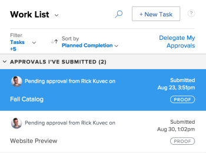

# View submitted proof approvals

>[!IMPORTANT]
>
>You're currently viewing the Adobe Workfront Classic version of this document. Adobe Workfront Classic is no longer supported. All Adobe Workfront Classic functionality, along with this documentation, will be removed in July 2022. Please transition to the the new Adobe Workfront experienceas soon as possible, and switch to the new Adobe Workfront experience version of this document.

Proofing approvals display in the Home area&nbsp;only if your Adobe Workfront environment is integrated with a Workfront Proof Premium account. If you cannot use proofing as discussed here, contact your Workfront administrator.

## Access requirements

You must have the following access to perform the steps in this article:

<table cellspacing="0"> 
 <col> 
 <col> 
 <tbody> 
  <tr> 
   <td role="rowheader">Adobe Workfront plan*</td> 
   <td> 
Any
 </td> 
  </tr> 
  <tr> 
   <td role="rowheader">Adobe Workfront license*</td> 
   <td> 
Review or higher
 </td> 
  </tr> 
  <tr> 
   <td role="rowheader">Access level configurations*</td> 
   <td> 
View or higher access to Projects, Tasks, Issues, Templates, Portfolios, Programs, Reports, Dashboards, and Calendars, Documents
 
Note: If you still don't have access, ask your Workfront administrator if they set additional restrictions in your access level. For information on how a Workfront administrator can modify your access level, see <a href="../../administration-and-setup/add-users/configure-and-grant-access/create-modify-access-levels.md" class="MCXref xref">Create or modify custom access levels</a>.
 </td> 
  </tr> 
  <tr> 
   <td role="rowheader">Object permissions</td> 
   <td> 
View or higher access to the object associated with the request access or approval 
 
For information on requesting additional access, see <a href="../../workfront-basics/grant-and-request-access-to-objects/request-access.md" class="MCXref xref">Request access to objects </a>.
 </td> 
  </tr> 
 </tbody> 
</table>

&#42;To find out what plan, license type, or access you have, contact your Workfront administrator.

## View submitted proof approvals

1. Go to **Home** in the Global Navigation Bar.
1. In the **Work List** area, Go to the **Approvals I've Submitted** grouping.

1. Click a **Proof** approval in the Work List.

   This opens the proof approval to the right of the Work list.

   >[!NOTE]
   >
   >&nbsp;If you submit an approval to a guest proofing user, the approval doesn't display in Home.

   

1. (Optional) Click **Go to Proof** in the upper-right corner of the right panel to launch the proofing viewer.

