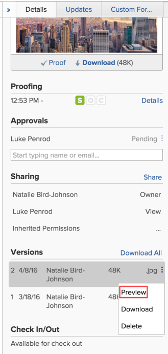

# View proof versions

>[!IMPORTANT]
>
>You're currently viewing the Adobe Workfront Classic version of this document. Adobe Workfront Classic is no longer supported. All Adobe Workfront Classic functionality, along with this documentation, will be removed in July 2022. Please transition to the the new Adobe Workfront experienceas soon as possible, and switch to the new Adobe Workfront experience version of this document.

You can view past versions of a proof.

## Access requirements

You must have the following access to perform the steps in this article:

<table cellspacing="0"> 
 <col> 
 <col> 
 <tbody> 
  <tr> 
   <td role="rowheader">Adobe Workfront plan*</td> 
   <td> 
Current plan: Pro or Higher
 
or
 
Legacy plan: Select or Premium
 
For more information about proofing access with the different plans, see .
 </td> 
  </tr> 
  <tr> 
   <td role="rowheader">Adobe Workfront license*</td> 
   <td> 
Current plan: Work or Plan
 
Legacy plan: Any (You must have proofing enabled for the user)
 </td> 
  </tr> 
  <tr> 
   <td role="rowheader">Proof Permission Profile </td> 
   <td>Manager or higher</td> 
  </tr> 
  <tr> 
   <td role="rowheader">Access level configurations*</td> 
   <td> 
Edit access to Documents
 
For information on requesting additional access, see <a href="../../../../workfront-basics/grant-and-request-access-to-objects/request-access.md" class="MCXref xref">Request access to objects </a>.
 </td> 
  </tr> 
 </tbody> 
</table>

&#42;To find out what plan, role, or Proof Permission Profile you have, contact your Workfront or Workfront Proof administrator.

## View a list of all proof versions

1. Go to the Document list, and select the proof.
1. On the **Details** tab in the right panel, view the **Versions** section.

## Preview a previous proof version

>[!NOTE]
>
>Files that cannot be previewed (such as XLSX and DOC) are&nbsp;downloaded.

1. Go to the document list, and select a proof.
1. On the **Details** tab in the panel to the right, click the version, then click **Preview** in the drop-down list that appears.

   

## View a previous proof version

Any user in Workfront with View access to the document can view past versions of a proofed document. It is not required that the user have a proofing license.

1. Go to the project, task, or issue that contains the document, then select **Documents**.
1. Find the proof you need.
1. On the **Details** tab in the panel to the right, click the version, then click **View****Proof**.

   

