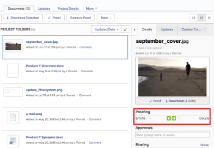
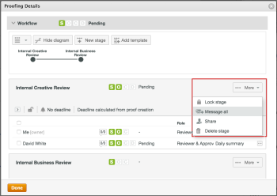
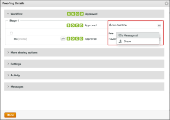
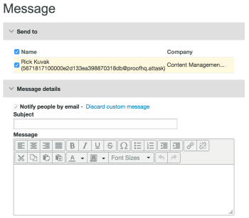
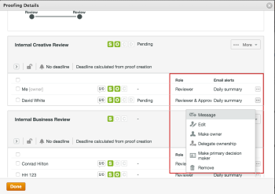
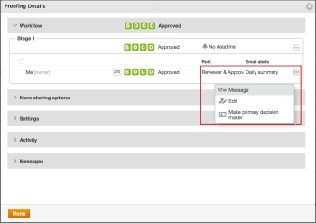

# Send email messages to reviewers on a proof

>[!IMPORTANT]
>
>You're currently viewing the Adobe Workfront Classic version of this document. Adobe Workfront Classic is no longer supported. All Adobe Workfront Classic functionality, along with this documentation, will be removed in July 2022. Please transition to the the new Adobe Workfront experienceas soon as possible, and switch to the new Adobe Workfront experience version of this document.

During the review and approval process, you can send a message to one or all of the reviewers on a proof. Messages are an easy way to remind reviewers to complete their review of a proof or to provide other information related to the proof.

You can choose between sending a generic reminder email or sending a customized message to one or all of the users associated with a given stage.

## Access requirements

You must have the following access to perform the steps in this article:

<table> 
 <col> 
 <col> 
 <tbody> 
  <tr> 
   <td role="rowheader">Adobe Workfront plan*</td> 
   <td> 
Current plan: Pro or Higher
 
or
 
Legacy plan: Select or Premium
 
For more information about proofing access with the different plans, see .
 </td> 
  </tr> 
  <tr> 
   <td role="rowheader">Adobe Workfront license*</td> 
   <td> 
Current plan: Work or Plan
 
Legacy plan: Any (You must have proofing enabled for the user)
 </td> 
  </tr> 
  <tr> 
   <td role="rowheader">Proof Permission Profile </td> 
   <td>Manager or higher</td> 
  </tr> 
  <tr> 
   <td role="rowheader">Proof role</td> 
   <td>Author or Moderator</td> 
  </tr> 
  <tr> 
   <td role="rowheader">Access level configurations*</td> 
   <td> 
Edit access to Documents
 
Note: If you still don't have access, ask your Workfront administrator if they set additional restrictions in your access level. For information on how a Workfront administrator can modify your access level, see <a href="../../../administration-and-setup/add-users/configure-and-grant-access/create-modify-access-levels.md" class="MCXref xref">Create or modify custom access levels</a>.
 </td> 
  </tr> 
 </tbody> 
</table>

&#42;To find out what plan, role, or Proof Permission Profile you have, contact your Workfront or Workfront Proof administrator.

## Send email messages to users on a proof

1. Select the document for the proof that contains the users you want to message.
1. In the **Details**&nbsp;tab, locate&nbsp;the **Proofing**&nbsp;section.

   

1. Click **Details.**

   The proofing viewer box appears.

1. (Conditional) To send a message to multiple&nbsp;users in a stage:

   In the **Workflow** section, in the stage that contains the users that you want to message, do one of the following (depending on whether the proof for which you are messaging users has or does not have&nbsp;Advanced Workflow enabled):

   * If you are sending messages to users on a proof that has Advanced Workflow enabled:&nbsp;Click **More,**&nbsp;then click **Message all**.

     

   * If you are sending messages to&nbsp;users on a proof without Advanced Workflow:&nbsp;Click the **More Options** icon, then click **Message all**.

     

     The Message box appears.

     

1. (Conditional) To send a message to an individual user, in the **Workflow**&nbsp;section, in the stage that contains the users that you want to message, do one of the following (depending on whether the proof for which you are messaging users has or does not have&nbsp;Advanced Workflow enabled):

   * If you are sending messages to a user&nbsp;on a proof that has Advanced Workflow enabled:&nbsp;Click **More,**then click&nbsp;**Message**.

     

   * If you are sending messages to a user on a proof without Advanced Workflow:&nbsp;Click the **More Options** icon, then click **Message.**

     

     The **Message** box appears.

     

1. In the**Send to**&nbsp;section, deselect any users who you do not want to receive the message. All selected users will receive the email message.
1. In the **Message details** section, specify the following information:

   <table> 
    <col> 
    <col> 
    <tbody> 
     <tr> 
      <td role="rowheader">Notify people by email</td> 
      <td>This option cannot be deselected. All users receive the message via email.</td> 
     </tr> 
     <tr> 
      <td role="rowheader">Discard custom message</td> 
      <td> 
Click <strong>Discard custom message</strong> if you want to include only the default email content.
 
The default reminder email includes the following information:
 
       <ul> 
        <li>Personal link to the proof Thumbnail of the proof image </li> 
        <li>The following proof details: Proof name, version number, folder name (if applicable), and a list of the reviewers and their progress on the proof.</li> 
       </ul> </td> 
     </tr> 
     <tr> 
      <td role="rowheader">Subject</td> 
      <td>Type a message subject.</td> 
     </tr> 
     <tr> 
      <td role="rowheader">Message</td> 
      <td>Type your message content.</td> 
     </tr> 
    </tbody> 
   </table>

1. Click **Send.**

