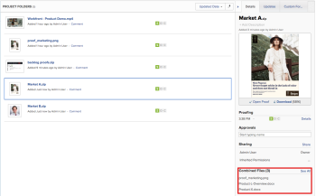

# View all files contained in a combined proof

>[!IMPORTANT]
>
>You're currently viewing the Adobe Workfront Classic version of this document. Adobe Workfront Classic is no longer supported. All Adobe Workfront Classic functionality, along with this documentation, will be removed in July 2022. Please transition to the the new Adobe Workfront experienceas soon as possible, and switch to the new Adobe Workfront experience version of this document.

You can view all files contained in a combined proof.

## Access requirements

You must have the following access to perform the steps in this article:

<table> 
 <col> 
 <col> 
 <tbody> 
  <tr> 
   <td role="rowheader">Adobe Workfront plan*</td> 
   <td> 
Current plan: Pro or Higher
 
or
 
Legacy plan: Select or Premium
 
For more information about proofing access with the different plans, see .
 </td> 
  </tr> 
  <tr> 
   <td role="rowheader">Adobe Workfront license*</td> 
   <td> 
Current plan: Work or Plan
 
Legacy plan: Any (You must have proofing enabled for the user)
 </td> 
  </tr> 
  <tr> 
   <td role="rowheader">Proof Permission Profile </td> 
   <td>Manager or higher</td> 
  </tr> 
  <tr> 
   <td role="rowheader">Access level configurations*</td> 
   <td> 
Edit access to Documents
 
For information on requesting additional access, see <a href="../../../workfront-basics/grant-and-request-access-to-objects/request-access.md" class="MCXref xref">Request access to objects </a>.
 </td> 
  </tr> 
 </tbody> 
</table>

&#42;To find out what plan, role, or Proof Permission Profile you have, contact your Workfront or Workfront Proof administrator.

## View all files contained in a combined proof

1. Go to the document list that contains the combined proof with the files you want to view.
1. Select the combined proof in the document list.
1. On the **Details** tab, locate the **Combined Files** section.

   The first five files are displayed. This section is displayed only if the proof is a combined proof.

   

1. (Optional) Click **See All** to view all files.

