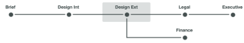

# Automated Workflow Stages overview

Proof stages are segments of time in which different users review a proof. As the proof moves from one stage to the next, Adobe Workfront notifies the reviewers to tell them when it's time to work on it.



Stages occur in two different situations:

* [Create a proof with an Automated workflow](#create-a-proof-with-an-automated-workflow) 
* [Assign deadlines for different reviewers on a proof](#assign-deadlines-for-different-reviewers-on-a-proof)

## Create a proof with an Automated workflow {#create-a-proof-with-an-automated-workflow}

When you add an automated workflow to a proof, you set up the stages of review work you want to occur.

When you set up stages for a proof with an automatic workflow:

* You can configure the stages to run consecutively or simultaneously.
* You can configure some stages to become active only after a previous stage is completed.
* You can make some stages private. This is useful, for example, for an agency that reviews a proof before it is shared with a client and does not want the resulting comments visible to the client.

For instructions on creating stages for a proof with an automated workflow, see [Create an advanced proof with an Automated workflow](../../../review-and-approve-work/proofing/creating-proofs-within-workfront/create-automated-proof-workflow.md).

>[!NOTE]
>
>If a user isn’t included on any stages but has access to the document and opens the proof, the system creates a stage called *Workfront*. 
>
>The user who opened the proof is assigned the role specified in Setup > Review and Approval > Roles for non-recipients that open a document proof.

## Assign deadlines for different reviewers on a proof {#assign-deadlines-for-different-reviewers-on-a-proof}

When you assign different proofing deadlines to reviewers on a proof, the system creates a stage for each deadline and groups&nbsp;the reviewers for each deadline in the corresponding stage.&nbsp;

``` ```**Example: **``````For example, if you create a proof with four reviewers:

* For reviewers Olivia and Tony, you specify a deadline for 14:00 a few days from now.
* For Aaron and Amy, you specify a deadline for 17:00 a few days later.
* You don't specify a deadline for yourself.

The system creates a stage for each of these three "groups" of reviewers:


If you share the proof with another reviewer, and do not specify a deadline, Workfront adds the user to Stage 3, where there is no deadline.&nbsp;
