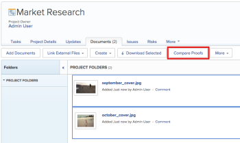

# Compare proofs

>[!IMPORTANT]
>
>You're currently viewing the Adobe Workfront Classic version of this document. Adobe Workfront Classic is no longer supported. All Adobe Workfront Classic functionality, along with this documentation, will be removed in July 2022. Please transition to the the new Adobe Workfront experienceas soon as possible, and switch to the new Adobe Workfront experience version of this document.

You can use the proofing viewer to compare two different proofs or two versions of the same proof.

## Access requirements

You must have the following access to perform the steps in this article:

<table cellspacing="0"> 
 <col> 
 <col> 
 <tbody> 
  <tr> 
   <td role="rowheader">Adobe Workfront plan*</td> 
   <td> 
Current plan: Pro or Higher
 
or
 
Legacy plan: Select or Premium
 
For more information about proofing access with the different plans, see .
 </td> 
  </tr> 
  <tr> 
   <td role="rowheader">Adobe Workfront license*</td> 
   <td> 
Current plan: Review
 
Legacy plan: Review
 </td> 
  </tr> 
  <tr> 
   <td role="rowheader">Proof Permission Profile </td> 
   <td>Manager or higher</td> 
  </tr> 
  <tr> 
   <td role="rowheader">Access level configurations*</td> 
   <td> 
Edit access to Documents
 
For information on requesting additional access, see <a href="../../../../workfront-basics/grant-and-request-access-to-objects/request-access.md" class="MCXref xref">Request access to objects </a>.
 </td> 
  </tr> 
 </tbody> 
</table>

&#42;To find out what plan, role, or Proof Permission Profile you have, contact your Workfront or Workfront Proof administrator.

## Compare two different proofs

You can compare two proofs within any single document list, such as within the Documents tab in a project, task, issue, portfolio, or within the main Documents area in the Global Navigation Bar.&nbsp;

1. Go to the document list that contains the two proofed documents you want to compare.
1. Select the first document that you want to compare, then press and hold the Command key (on Mac) or the Ctrl key (on Windows) and select the second document that you want to compare.

   >[!NOTE]
   >
   >A proof must already be generated for each document that you select for comparison.

1. Click **Compare Proofs**.

   <!--
   
If this button is not visible, ensure that two proofed documents are selected.

   -->

   

   Both proofs are displayed in the proofing viewer in a side-by-side view. You can review each document while comparing them.

   Separate breadcrumbs above each proof allow you to view and go to the work item associated with the proof:

   

   For information about the tools you can use to compare the two proofs, see&nbsp; [Use the compare tools](../../../../workfront-proof/wp-work-proofsfiles/review-proofs-wpv/compare-proofs.md#using-compare-tools) in [Compare proofs in the proofing viewer](../../../../workfront-proof/wp-work-proofsfiles/review-proofs-wpv/compare-proofs.md).

   ## Compare two versions of the same proof

   For information about comparing two versions of the same proof, see [Compare proof versions](../../../../workfront-proof/wp-work-proofsfiles/review-proofs-wpv/compare-proofs.md#comparing-proof-versions) in [Compare proofs in the proofing viewer](../../../../workfront-proof/wp-work-proofsfiles/review-proofs-wpv/compare-proofs.md).

