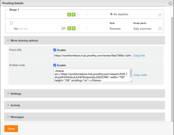
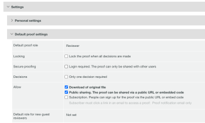

# Disable sharing proof via public URL or embed code

>[!IMPORTANT]
>
>You're currently viewing the Adobe Workfront Classic version of this document. Adobe Workfront Classic is no longer supported. All Adobe Workfront Classic functionality, along with this documentation, will be removed in July 2022. Please transition to the the new Adobe Workfront experienceas soon as possible, and switch to the new Adobe Workfront experience version of this document.

You can turn off the ability to share a proof with a public URL or embed code on a proof by proof basis or for individual users.

## Access requirements

You must have the following access to perform the steps in this article:

<table cellspacing="0"> 
 <col> 
 <col> 
 <tbody> 
  <tr> 
   <td role="rowheader">Adobe Workfront plan*</td> 
   <td> 
Current plan: Pro or Higher
 
or
 
Legacy plan: Select or Premium
 
For more information about proofing access with the different plans, see .
 </td> 
  </tr> 
  <tr> 
   <td role="rowheader">Adobe Workfront license*</td> 
   <td> 
Current plan: Work or Plan
 
Legacy plan: Any (You must have proofing enabled for the user)
 </td> 
  </tr> 
  <tr> 
   <td role="rowheader">Access level configurations*</td> 
   <td> 
Edit access to Documents
 
For information on requesting additional access, see <a href="../../../workfront-basics/grant-and-request-access-to-objects/request-access.md" class="MCXref xref">Request access to objects </a>.
 </td> 
  </tr> 
 </tbody> 
</table>

&#42;To find out what plan, role, or Proof Permission Profile you have, contact your Workfront or Workfront Proof administrator.

## Disable per Proof

You must be the proof owner or creator, or you must have the Author or Moderator proof role.

1. In the project that contains the proof, click **Documents** .
1. Hover over the proof and select **Proof Details**.
1. Open the **More sharing options** section, then disable the **Proof URL** checkbox.

   

1. Click **Done**.

## Disable per user

You can disable the Public proof setting for individual users in your Workfront instance. You must have a Proof Permission Profile of administrator to make this change.

1. Click the **Main Menu** icon  in the upper-right corner of Adobe Workfront, then click **Proofing**.
1. In the Global Navigation Bar, click the **Proofing** icon.

   

1. Click **Account Settings** near the top-right corner.
1. Click the **Users** tab, then click on the name of a user.
1. In the **Default proof settings** section, disable the **Public Sharing** checkbox.

   

