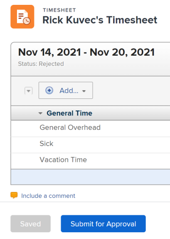
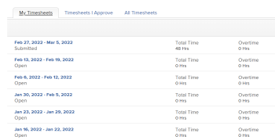

# Submit a timesheet for approval

>[!IMPORTANT]
>
>You're currently viewing the Adobe Workfront Classic version of this document. Adobe Workfront Classic is no longer supported. All Adobe Workfront Classic functionality, along with this documentation, will be removed in July 2022. Please transition to the the new Adobe Workfront experienceas soon as possible, and switch to the new Adobe Workfront experience version of this document.

Submitting your timesheet for approval provides&nbsp;your manager with visibility into your work hours. Approvers can verify that&nbsp;all time recorded has been allocated in the correct areas and that&nbsp;a sufficient number of hours have been recorded for the time period.

## Access requirements

You must have the following access to perform the steps in this article:

<table cellspacing="0"> 
 <col> 
 <col> 
 <tbody> 
  <tr> 
   <td role="rowheader">Adobe Workfront plan*</td> 
   <td> 
Any
 </td> 
  </tr> 
  <tr> 
   <td role="rowheader">Adobe Workfront license*</td> 
   <td> 
Review or higher
 </td> 
  </tr> 
  <tr> 
   <td role="rowheader">Access level configurations*</td> 
   <td> 
View access or higher to Tasks and Issues
 
Note: If you still don't have access, ask your Workfront administrator if they set additional restrictions in your access level. For information on how a Workfront administrator can modify your access level, see <a href="../../administration-and-setup/add-users/configure-and-grant-access/create-modify-access-levels.md" class="MCXref xref">Create or modify custom access levels</a>.
 </td> 
  </tr> 
  <tr> 
   <td role="rowheader">Object permissions</td> 
   <td> 
View or higher permissions on tasks and issues
 
For information on requesting additional access, see <a href="../../workfront-basics/grant-and-request-access-to-objects/request-access.md" class="MCXref xref">Request access to objects </a>.
 </td> 
  </tr> 
 </tbody> 
</table>

&#42;To find out what plan, license type, or access you have, contact your Workfront administrator.

## Submit a timesheet for approval

* [Submit a timesheet for approval](#submit-a-timesheet-for-approval) 
* [View the status of a submitted timesheet](#view-the-status-of-a-submitted-timesheet)

### Submit a timesheet for approval

After&nbsp;a timesheet approver is set&nbsp;(as described in the section [Designate timesheet approvers](../../timesheets/create-and-manage-timesheets/timesheet-approvals.md#designating-a-timesheet-approver) in the article [Approve a timesheet](../../timesheets/create-and-manage-timesheets/timesheet-approvals.md)), the **Save and Close Timesheet**&nbsp;button at the bottom of the timesheet changes to a **Submit for Approval**&nbsp;button.

To submit a timesheet for approval:

1. Go to a timesheet that has been configured to have an approver.
1. Log time, as described in [Log time](../../timesheets/create-and-manage-timesheets/log-time.md).
1. Click **Submit for Approval** to launch the timesheet approval process.

   

   The **Save**and **Submit for Approval** buttons are replaced by the **Approve**,**Reject**,****and**Recall** buttons. The status of the timesheet changes to **Submitted**.

   When your timesheet is submitted for approval, the approver sees the timesheet listed in the **Approvals**&nbsp;area on the **My Work** or **Home** page. The following things might occur:

   * If they approve it, the **Recall** button changes to **Re-Open** and the timesheet status updates to **Closed**.
   * If they reject it, **Save** and **Submit for Approval** buttons replace the **Recall** button and the timesheet status updates to **Rejected**.

1. (Optional)&nbsp;Click&nbsp;**Recall** if you need to reopen the timesheet and update your time. For information, see [Recall a timesheet](#recall-a-timesheet).

### View the status of a submitted timesheet {#view-the-status-of-a-submitted-timesheet}

You can view the status of a timesheet after you submit it.

If the Workfront administrator has enabled the Timesheet Approval to User and the Timesheet Rejection to User event handlers, you are notified after the timesheet is approved or rejected. For information about enabling event notifications, see [Event notifications available in Adobe Workfront](../../administration-and-setup/manage-workfront/emails/event-notifications-available-in-wf.md).

Without these notifications, you can learn about the status of your submitted timesheets in the Timesheet area of Workfront.

To view the status of a timesheet:

1. Go to the **Timesheet** area in your Global Navigation Bar.&nbsp;
1. Click **Back to Timesheets.**
1. Click the **My Timesheets** tab.

   A list of all your timesheets displays. The status of the timesheet displays under the timesheet time frame.

   

   Timesheets may have the following statuses:

   <table cellspacing="0"> 
    <col> 
    <col> 
    <tbody> 
     <tr> 
      <td role="rowheader">Open</td> 
      <td> 
Your timesheet is currently open and you may log time. 
 
Tip: A recalled timesheet displays with a status of Open. For information, see the <a href="#recall-a-timesheet" class="MCXref xref">Recall a timesheet</a> section in this article. 
 </td> 
     </tr> 
     <tr> 
      <td role="rowheader">Submitted</td> 
      <td>You submitted your timesheet for approval but it has not been approved yet. You may recall a submitted timesheet to continue editing it.&nbsp;For information, see the <a href="#recall-a-timesheet" class="MCXref xref">Recall a timesheet</a> section in this article. </td> 
     </tr> 
     <tr> 
      <td role="rowheader">Closed</td> 
      <td> 
The following scenarios exist:
 
       <ul> 
        <li> 
If the timesheet has no approver, you saved your time and closed it.
 </li> 
        <li> 
If the timesheet has an approver, you have submitted it for approval and it has been approved.
 </li> 
       </ul> </td> 
     </tr> 
     <tr> 
      <td role="rowheader">Rejected</td> 
      <td>You submitted the timesheet for approval and the approver rejected it.</td> 
     </tr> 
    </tbody> 
   </table>

## Recall a timesheet {#recall-a-timesheet}

You can recall a timesheet that has already been submitted for approval. Only timesheets that haven't been approved can be recalled.

To recall a timesheet:

1. Go to **Timesheets** in the Global Navigation Bar.
1. Click the time frame for a timesheet with a status of **Submitted**.
1. Click **Recall**.

   The timesheet becomes editable again and its status changes to **Open**.

