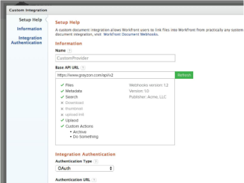

# Webhooks Overview

Adobe Workfront Document Webhooks defines a set of API endpoints through which Workfront makes authorized API calls to an External Document Provider. This allows anyone to create a middleware plugin for any document storage provider.

The user experience for webhook-based integrations will be similar to that of existing document integrations, such as Google Drive, Box, and Dropbox. For example, a Workfront user will be able to perform the following actions:

* Navigate the folder structure of the external document provider
* Search files
* Link files into Workfront
* Upload files to the external document provider
* View a thumbnail for the document

**Reference Implementation**

To help jumpstart the development of a new webhooks implementation, Workfront provides a reference implementation. Code for this can be found at [https://github.com/Workfront/webhooks-app](https://github.com/Workfront/webhooks-app) . This implementation is Java-based and allows Workfront to connect documents on a network file system.&nbsp;

## Versions

* Version 1.0 (Release Date - May, 2015)

   * Initial Specification

* Version 1.1 (Release Date - June, 2015)

   * Updated /uploadInit - Added documentId and documentVersionId

* Version 1.2 (Release Date - October, 2015)

   * Added /createFolder

* Upcoming versions (Release Date - TBD)

   * Added /delete
   * Added /rename
   * Added /serviceInfo
   * Added /customAction
   * Add pagination and parentId to /search

