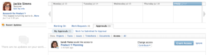

# Grant object access in the My Work area

Users can request access to objects within Adobe Workfront. For more information about requesting access, see&nbsp; [Request access to objects in Adobe Workfront](../../workfront-basics/grant-and-request-access-to-objects/request-access.md).

If you are the owner of an object, you can grant or deny access to items from your My Work area.

## Access requirements

You must have the following:

<table cellspacing="0"> 
 <col> 
 <col> 
 <tbody> 
  <tr> 
   <td role="rowheader">Adobe Workfront plan*</td> 
   <td> 
Any
 </td> 
  </tr> 
  <tr> 
   <td role="rowheader">Adobe Workfront license*</td> 
   <td> 
Review or higher
 </td> 
  </tr> 
  <tr> 
   <td role="rowheader">Access level configurations*</td> 
   <td> 
View access or higher to projects, tasks, issues, or documents
 
Note: If you still don't have access, ask your Workfront administrator if they set additional restrictions in your access level. For information on how a Workfront administrator can modify your access level, see <a href="../../administration-and-setup/add-users/configure-and-grant-access/create-modify-access-levels.md" class="MCXref xref">Create or modify custom access levels</a>.
 </td> 
  </tr> 
  <tr> 
   <td role="rowheader">Object permissions</td> 
   <td> 
View permissions or higher to projects, tasks, issues, or documents
 
For information on requesting additional access, see <a href="../../workfront-basics/grant-and-request-access-to-objects/request-access.md" class="MCXref xref">Request access to objects in Adobe Workfront</a>.
 </td> 
  </tr> 
 </tbody> 
</table>

&#42;To find out what plan, license type, or access you have, contact your Workfront administrator.

## Grant access to objects in the My Work area

1. Click**My Work**&nbsp;in the Global Navigation bar.
1. Click the **Approvals** tab, then click **My Approvals**.

1. Click **Access**.  
   All access requests that have been made to you are&nbsp;displayed.  
   

   >[!NOTE]
   >
   >Access requests that are no longer valid (because they were granted by another user) are automatically removed from your access list after two weeks.

1. (Optional) If the user included a message with the request, the message is displayed next to&nbsp;the orange message icon.
1. In the **Change access** drop-down list, select the level of access that you want to grant to the user.  
   Or  
   Click **Ignore** to remove the access request from your list.  
   The user who is requesting access is&nbsp;not notified that you ignored the request, and the request is still displayed in the user's Work I've Submitted for Approval area.

1. Click **Grant Access**.

## Configure Email Notifications for Requests

You can configure whether you receive email notifications for access requests. Your Workfront administrator can disable this functionality (as described in [Configure event notifications for everyone in the system](../../administration-and-setup/manage-workfront/emails/configure-event-notifications-for-everyone-in-the-system.md)).

1. Click your avatar in the upper-right corner of the Global Navigation bar, then click **My Settings**.
1. Click **Preferences**, or scroll to the Preferences section.
1. In the **Email Me When** drop-down list, select or deselect **Someone requests access from me**, depending on whether you want to receive email notifications when another user requests access from you or not.

1. Click **Save Changes**.

