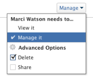
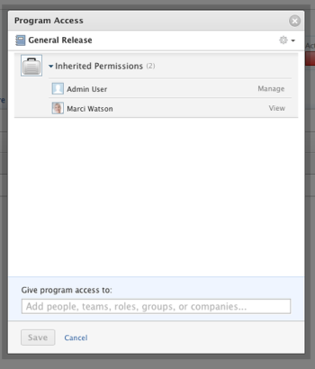

# Share a program

>[!IMPORTANT]
>
>You're currently viewing the Adobe Workfront Classic version of this document. Adobe Workfront Classic is no longer supported. All Adobe Workfront Classic functionality, along with this documentation, will be removed in July 2022. Please transition to the the new Adobe Workfront experienceas soon as possible, and switch to the new Adobe Workfront experience version of this document.

Your Adobe Workfront administrator can grant you access to view or edit programs when assigning your access level. You must have a Plan license to have access to edit a program. For more information, see [Grant access to programs](../../administration-and-setup/add-users/configure-and-grant-access/grant-access-programs.md).

Along with the access level that you are granted, you can also receive permissions to view or manage specific programs from users who can share them with you. For more information about access levels and permissions, see [How access levels and permissions work together](../../administration-and-setup/add-users/access-levels-and-object-permissions/how-access-levels-permissions-work-together.md).

Permissions are specific to each item in Workfront and define which actions users can take on that item.

## Considerations about sharing a program

In addition to the considerations below, also see [Overview of sharing permissions on objects](../../workfront-basics/grant-and-request-access-to-objects/sharing-permissions-on-objects-overview.md).

>[!NOTE]
>
>A Workfront administrator can add or remove permissions to any items in the system, for all users, without being the owner of those items.

* The creator of a program has Manage permissions to it, by default.

* You can share programs individually, or you can share several of them at a time.

  For more information about sharing items in Workfront, see [Share an object](../../workfront-basics/grant-and-request-access-to-objects/share-an-object.md).

* You can only grant View or Manage permissions on programs.

  &nbsp; &nbsp; 

* When you share a program, users inherit the same permissions to all the children objects associated with the program, by default.

  For more information about the hierarchy of objects in Workfront, see [Understand objects in Adobe Workfront](../../workfront-basics/navigate-workfront/workfront-navigation/understand-objects.md).

  

* You can remove inherited permissions from the program. For more information about removing permissions from objects, see&nbsp; [Remove permissions from objects](../../workfront-basics/grant-and-request-access-to-objects/remove-permissions-from-objects.md).

## Program permissions

The following table displays what permissions you can grant users when allowing them to view or manage a program:

| **Actions** |**Manage** |**View** |
|---|---|---|
| Edit program details |✓ |&nbsp; |
| View a program |✓ |✓ |
| Delete a program |✓ |&nbsp; |
| Attach a Custom Form |✓ |&nbsp; |
| Edit a custom field |✓ |&nbsp; |
| Add or remove a project&#42; |✓ |&nbsp; |
| Approve a project |✓ |&nbsp; |
| Add a document folder&#42; |✓ |✓ |
| Add a document |✓ |✓ |
| Add updates/ comments |✓ |✓ |
| Share |✓ |✓ |
| Share system-wide |&nbsp; |✓ |

&#42; These permissions are controlled by the access level and permissions on other objects, like projects.&nbsp;
