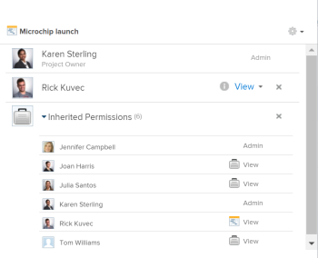

# View inherited permissions on objects

>[!IMPORTANT]
>
>You're currently viewing the Adobe Workfront Classic version of this document. Adobe Workfront Classic is no longer supported. All Adobe Workfront Classic functionality, along with this documentation, will be removed in July 2022. Please transition to the the new Adobe Workfront experienceas soon as possible, and switch to the new Adobe Workfront experience version of this document.

Your Adobe Workfront administrator can grant you access to view or edit objects when assigning your access level. For more information, see [Grant access to projects](../../administration-and-setup/add-users/configure-and-grant-access/grant-access-projects.md).

Along with the access level that users are granted, you can also grant them permissions to specific objects that you have access to share. For more information about access levels and permissions, see [How access levels and permissions work together](../../administration-and-setup/add-users/access-levels-and-object-permissions/how-access-levels-permissions-work-together.md).

Objects inherit permissions from parent objects in&nbsp;Adobe Workfront.

For information about the hierarchy of objects in Workfront, see [Understand objects in Adobe Workfront](../../workfront-basics/navigate-workfront/workfront-navigation/understand-objects.md).

## Access requirements

You must have the following:

<table> 
 <col> 
 <col> 
 <tbody> 
  <tr> 
   <td role="rowheader">Adobe Workfront plan*</td> 
   <td> 
Any 
 </td> 
  </tr> 
  <tr> 
   <td role="rowheader">Adobe Workfront license*</td> 
   <td> 
Work or higher
 </td> 
  </tr> 
  <tr> 
   <td role="rowheader">Access level configurations*</td> 
   <td> 
View or higher access on the objects you want to view permissions for
 
Note: If you still don't have access, ask your Workfront administrator if they set additional restrictions in your access level. For information on how a Workfront administrator can modify your access level, see <a href="../../administration-and-setup/add-users/configure-and-grant-access/create-modify-access-levels.md" class="MCXref xref">Create or modify custom access levels</a>.
 </td> 
  </tr> 
  <tr> 
   <td role="rowheader">Object permissions</td> 
   <td> 
View or higher permissions on the objects you want to view permissions for
 
For information on requesting additional access, see <a href="../../workfront-basics/grant-and-request-access-to-objects/request-access.md" class="MCXref xref">Request access to objects </a>.
 </td> 
  </tr> 
 </tbody> 
</table>

&#42;To find out what plan, license type, or access you have, contact your Workfront administrator.

## View inherited permissions for an object

Viewing inherited permissions is identical for all objects.

To view inherited permissions for a project:

1. Go to a project whose sharing permissions you want to view. 
1. Near the upper-right corner of Workfront, click **Project Actions**, then click **Sharing**. 

1. Expand the **Inherited Permissions** list.

   This list displays the names of users that have access to either the portfolio or the program that the project belongs to and also have permissions to the project.

   

1. (Optional) To remove inherited permissions from an object, see [Remove permissions from objects](../../workfront-basics/grant-and-request-access-to-objects/remove-permissions-from-objects.md).

   >[!NOTE]
   >
   >You must have Manage permissions on an object to remove the inherited permissions.

&nbsp;

&nbsp;
