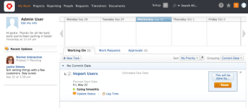
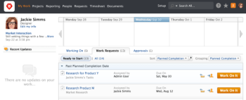

# Change the My Work and Work Requests areas with Layout Templates

>[!IMPORTANT]
>
>You're currently viewing the Adobe Workfront Classic version of this document. Adobe Workfront Classic is no longer supported. All Adobe Workfront Classic functionality, along with this documentation, will be removed in July 2022. Please transition to the the new Adobe Workfront experienceas soon as possible, and switch to the new Adobe Workfront experience version of this document.

You can configure which layout template&nbsp;is&nbsp;used in any of the following locations:

* The Working On tab&nbsp;in your My Work area
* The&nbsp;Work Requests tab in your My Work area

In addition to the default layout, you can have custom layout templates if your Adobe Workfront administrator has configured them.

The Workfront administrator can assign you to a layout template as described in [Create and manage layout templates](../../../administration-and-setup/customize-workfront/use-layout-templates/create-and-manage-layout-templates.md).&nbsp;This can have an impact on the way your Working On and Work Requests tabs appear in your My Work area.  
For information about&nbsp;how you can customize the Working on and Work Requests tab through layout templates, see&nbsp; [Create and manage layout templates](../../../administration-and-setup/customize-workfront/use-layout-templates/create-and-manage-layout-templates.md).

## Access requirements

You must have the following access to perform the steps in this article:

<table cellspacing="0"> 
 <col> 
 </col> 
 <col> 
 </col> 
 <tbody> 
  <tr> 
   <td role="rowheader">Adobe Workfront plan*</td> 
   <td> <p>Any</p> </td> 
  </tr> 
  <tr> 
   <td role="rowheader">Adobe Workfront license*</td> 
   <td> <p>Work or higher to apply the layout template for a team; Plan to apply the layout template for a user</p> </td> 
  </tr> 
  <tr> 
   <td role="rowheader">Access level configurations*</td> 
   <td>System administrator access is required to apply the layout templates for other users; a Planner who also has administrative rights to the user object can apply a layout template to their own My Work area. For more information, see <a href="../../../administration-and-setup/add-users/configure-and-grant-access/grant-access-other-users.md" class="MCXref xref">Grant access to users</a>.</td> 
  </tr> 
 </tbody> 
</table>

&#42;To find out what plan or license type you have, contact your Workfront administrator.

## Default Layout Templates

By default, the following layouts are used in the My Work area:&nbsp;

* [Default Working On Tab in the My Work Area](#default-working-on-tab-in-the-my-work-area) 
* [Default Work Requests Tab in the My Work Area](#default-work-requests-tab-in-the-my-work-area)

### Default Working&nbsp;On Tab in the My Work Area {#default-working-on-tab-in-the-my-work-area}



### Default Work Requests Tab in the My Work Area {#default-work-requests-tab-in-the-my-work-area}



## Apply a custom Layout Template for the My Work area

By applying a layout template, you can configure what fields you can see in the&nbsp;Working On and Work Requests tabs in your My Work area.

To apply a custom layout template:

1. ```If you are a Workfront administrator:```

   1. Go to the&nbsp;**People** area&nbsp;on the Global Navigation Bar.&nbsp;
   1. Click the&nbsp;**People** tab.
   1. Find the name of the user you want to assign a layout template to.
   1. Click their name to edit their profile.
   1. Click **Edit User's Info** on the upper right of the user panel.

1. If you are a Plan license user and you want&nbsp;to change the layout template for yourself:

   1. ```Click your avatar in the upper-right corner of any Workfront page.```   
      

   1. Click **My Settings**.

1. Do either of the following:

   * In the **Access**&nbsp;section, in the **Layout Template**&nbsp;field, begin typing the name of the layout template that you want to apply to the&nbsp;My Work area, then click it when it appears in the drop-down list.  
     When this field is populated, the layout template defined here takes precedence over the layout template of the home team.
   
   * Populate the **Home Team** field in the **Organization** section with the name of a team whose layout template you want this user to adopt.  
     The Workfront administrator can tell you what layout template is associated with what team.  
     To use this method, the **Layout Template**&nbsp;field of your user profile must be blank.  
     If it is not blank, the layout template defined in the **Layout Template**&nbsp;field takes precedence over the layout template of the home team.

1. Click **Save Changes**.  
   If you are a Workfront administrator applying the layout template for another user, log in as that user to ensure that the layout template has been applied for them. For more information on how to log in as another user, see [Log in as another user](../../../administration-and-setup/add-users/create-and-manage-users/log-in-as-another-user.md). If you are editing your own profile, navigate to your My Work area by clicking **My Work** in the Global Navigation Bar to ensure that the layout template has been applied.

## Apply the Layout Template to a team

You can apply a custom layout template to a team.  
When you designate the team with this layout template as the Home Team of users, all users in this team will see the customizations in this layout template.  
Their individual layout template settings will override the settings of the home team layout template.&nbsp;

To assign a layout template to a team:

1. Go to the&nbsp;**People**&nbsp;area in the Global Navigation Bar.
1. Click the **Teams**tab.
1. In the drop-down list, select the team whose layout template you want to change.
1. Click **Team Settings**&nbsp;in the upper-right corner of the page.  
   The Team Settings dialog box is displayed.

1. In the **Basic Info** section, locate the **Layout Template** field.

1. If the **Layout Template**&nbsp;field is not already populated with the custom layout template that you want to use, begin typing the name of the layout template that you want to apply to the team, then click it when it appears in the drop-down list.
1. Click **Save Changes**.

