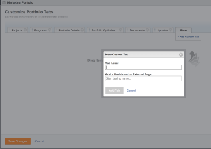

# Create custom tabs or sections

>[!IMPORTANT]
>
>You're currently viewing the Adobe Workfront Classic version of this document. Adobe Workfront Classic is no longer supported. All Adobe Workfront Classic functionality, along with this documentation, will be removed in July 2022. Please transition to the the new Adobe Workfront experienceas soon as possible, and switch to the new Adobe Workfront experience version of this document.

## Adobe Workfront tabs {#adobe-workfront-tabs}

The information you see in the Workfront web application is often displayed in tabs  by default. Each tab contains different information about a Workfront area or object.  
For more information about the default tabs of Workfront, see the article [About the default Adobe Workfront layout](../../../administration-and-setup/customize-workfront/use-layout-templates/about-the-default-wf-layout.md).

In addition to the tabs that come with Workfront by default, you can create custom tabs on which you can display information relevant to your workflow. You cannot add custom tabs to all areas and objects.

The following table lists all the Workfront areas and objects that contain tabs and which of them can be customized:

| **Workfront area or object** |**Default system tabs** |**Custom tabs** |
|---|---|---|
| Projects |✓ |✓ |
| Reporting |✓ |✓ |
| People |✓ |&nbsp; |
| Requests |✓ |✓ |
| Timesheet |✓ |&nbsp; |
| Portfolios |✓ |✓ |
| Programs |✓ |✓ |
| Projects |✓ |✓ |
| Tasks |✓ |&nbsp;✓ |
| Issues |&nbsp;✓ |&nbsp;✓ |
| Users |&nbsp;✓ |&nbsp;✓ |
| Documents |&nbsp;✓ |&nbsp; |

&nbsp;

## Access requirements

You must have the following access to perform the steps in this article:

<table> 
 <col> 
 </col> 
 <col> 
 </col> 
 <tbody> 
  <tr> 
   <td role="rowheader">Adobe Workfront plan*</td> 
   <td> 
Any
 </td> 
  </tr> 
  <tr> 
   <td role="rowheader">Adobe Workfront license*</td> 
   <td> 
Review or higher
 </td> 
  </tr> 
  <tr> 
   <td role="rowheader">Access level configurations*</td> 
   <td>Reviewer or higher</td> 
  </tr> 
  <tr> 
   <td role="rowheader">Object permissions</td> 
   <td>View access to the object type</td> 
  </tr> 
 </tbody> 
</table>

&#42;To find out what plan or license type you have, contact your Workfront administrator.

## Add a custom tab to a Workfront area or object {#add-a-custom-tab-to-a-workfront-area-or-object}

Before you can create a custom tab, you must build a dashboard with all the information you want to display on the tab. You may also build an external page.  
For more information about building dashboards, see the article [Create a dashboard](../../../reports-and-dashboards/dashboards/creating-and-managing-dashboards/create-dashboard.md).  
For more information about building external pages, see the article [Embed an external web page in a dashboard](../../../reports-and-dashboards/dashboards/creating-and-managing-dashboards/embed-external-web-page-dashboard.md).

After you build the dashboard or the external page, you can add them to the custom tab .

To add a custom tab:

1. Go to one of the Workfront areas or objects where you can add a custom tab .  
   Or
1. Go to an object where you can add a custom tab .  
   For more information about what areas and objects you can add custom tabs  to, see [Adobe Workfront tabs](#adobe-workfront-tabs) .
1. Click **More**, then **Customize Tabs**. 
1. Click **Add Custom Tab**.  
   

1. Specify the name of the tab in the **Tab Label** field.

   This is visible only to you.&nbsp;

1. In the **Add a Dashboard** **or External Page** field, start typing the name of the dashboard or external page you want to add and click it when it appears in the list.&nbsp;

1. Click**Add Tab.**&nbsp;
1. (Optional) Drag and drop the tabs in the order in which you would like to display them.

   You can only display six tabs at a time in one area or within one object.

   If you have more than six tabs, the rest of the tabs are listed under the&nbsp;**More** drop-down menu.

   The far left tab is the default tab for the page.

1. Click **Save Changes**.  
   The tabs you created for objects display when you access all objects of the same type and are available only to you.&nbsp;

## Display custom tabs under an object

For more information about adding a custom tab under an object, see the section [Add a custom tab to a Workfront area or object](#add-a-custom-tab-to-a-workfront-area-or-object) in this article.

When you add a dashboard to a custom tab under an object, the object acts as a filter for the dashboard. For example, if you add a task report on a dashboard and you add the dashboard to a project, the custom tab that contains the dashboard on the project displays only tasks on the project you are viewing.&nbsp;

The following objects are filtered for the object under which they display, if that object is higher in hierarchy than them:

* Project
* Task
* Issue
* Approval Process
* Note
* Document

For more information about the hierarchy and interdependency of objects, see the section [Interdependency and hierarchy of objects](../../../workfront-basics/navigate-workfront/workfront-navigation/understand-objects.md#understanding-interdependency-and-hierarchy-of-objects) in the article [Understand objects in Adobe Workfront](../../../workfront-basics/navigate-workfront/workfront-navigation/understand-objects.md).

## Customize tabs in a Layout Template

When you add custom tabs to your Workfront instance, they are only visible to you.&nbsp;

You can customize the tabs in Workfront and share the new layout with several users by using Layout Templates. Only a system or a group administrator can share them with other users by using Layout Templates.&nbsp;

For more information about customizing tabs using a Layout Template, see the section "Customizing Tabs" in the article [Create and manage layout templates](../../../administration-and-setup/customize-workfront/use-layout-templates/create-and-manage-layout-templates.md).
