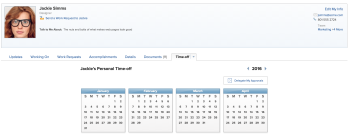

# Configure personal time off in Adobe Workfront

>[!IMPORTANT]
>
>You're currently viewing the Adobe Workfront Classic version of this document. Adobe Workfront Classic is no longer supported. All Adobe Workfront Classic functionality, along with this documentation, will be removed in July 2022. Please transition to the the new Adobe Workfront experienceas soon as possible, and switch to the new Adobe Workfront experience version of this document.

Adobe Workfront is&nbsp;not designed to replicate or replace your existing systems for managing, accruing, and tracking personal time off.

However, it is important to indicate when approved time off happens, because this affects&nbsp;your schedule&nbsp;and impacts the Planned Completion Dates of the tasks you&nbsp;are assigned to.

For example, if you are assigned to a task that is scheduled to take two weeks, and you plan to take three days off during that time, Workfront adds three days to the task timeline to account for the time off.

Resource Management tools also use your personal time off to indicate when you are available to be scheduled for work.

>[!NOTE]
>
>To ensure that no inconsistencies occur with the dates that you schedule your time off for, we recommend that your user profile's time zone matches that of your schedule. For more information, see the following articles: 
>
>* [Create a schedule](../../../administration-and-setup/set-up-workfront/configure-timesheets-schedules/create-schedules.md) 
>* [Edit a user's profile](../../../administration-and-setup/add-users/create-and-manage-users/edit-a-users-profile.md) 
>

## Access requirements

You must have the following access to perform the steps in this article:

<table> 
 <col> 
 </col> 
 <col> 
 </col> 
 <tbody> 
  <tr> 
   <td role="rowheader">Adobe Workfront plan*</td> 
   <td> 
Any
 </td> 
  </tr> 
  <tr> 
   <td role="rowheader">Adobe Workfront license*</td> 
   <td> 
Work or higher (to configure your personal time off)
 </td> 
  </tr> 
  <tr> 
   <td role="rowheader">Access level configurations*</td> 
   <td>Manager with Edit User access (to make changes to the Time-off calendar of other users)</td> 
  </tr> 
 </tbody> 
</table>

&#42;To find out what plan or license type you have, contact your Workfront administrator.

## Configure personal time off in Workfront

1. Click your avatar in the Global Navigation Bar.  
   

1. Click your name.
1. Click the **More** tab.
1. Click the **Time-off** tab. This displays your personal**Time-off** calendar.  
   

1. Select the desired date for your personal time off. 
1. Select&nbsp;**All day**, if you are taking a full day off.  
   Leave it unselected&nbsp;if you are taking less than a full day off and indicate the start and end times of your time off. 

1. Click **Save**.  
   Your time off is&nbsp;now visible across the Workfront system in scheduling tools like the Resource Grid. When you are assigned work during this time, a tool tip appears informing the user you have scheduled time off.

