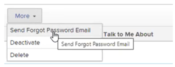

# Reset a user's password with Enhanced Authentication

>[!IMPORTANT]
>
>You're currently viewing the Adobe Workfront Classic version of this document. Adobe Workfront Classic is no longer supported. All Adobe Workfront Classic functionality, along with this documentation, will be removed in July 2022. Please transition to the the new Adobe Workfront experienceas soon as possible, and switch to the new Adobe Workfront experience version of this document.

When Enhanced Authentication (eAuth) is enabled for your Workfront Environment, a Workfront administrator can’t reset login credentials for another user. This differs from Workfront environments without eAuth or those environments for which Single Sign On (SSO) is enabled.

## Access requirements

You must have the following access to perform the steps in this article:

<table> 
 <col> 
 <col> 
 <tbody> 
  <tr> 
   <td role="rowheader">Adobe Workfront plan</td> 
   <td> 
 Any
 </td> 
  </tr> 
  <tr> 
   <td role="rowheader">Adobe Workfront license</td> 
   <td> 
Plan
 </td> 
  </tr> 
  <tr> 
   <td role="rowheader">Access level configurations</td> 
   <td> 
System administrator 
 </td> 
  </tr> 
 </tbody> 
</table>

## Reset a user’s password in an eAuth enabled environment

1. Select the **People** heading from the **Global Navigation Bar**. 

1. 

1. 

1. Click the **People tab** and select the **User** that requires a password reset. 

1. 

1. Click the **More button** that appears after you've chosen the desired **User** and select the **Send Forgot Password Email** option from the drop-down menu.

1. 

After selecting the **Send Forgot Password Email** option, an email is sent to the selected user that contains instructions for them to change their own password.

