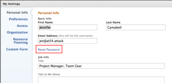

# Reset your password

You can reset your Adobe Workfront password. As an important security measure, we recommend that you do this regularly.

>[!NOTE]
>
>A Workfront administrator can configure custom password restrictions, as explained in&nbsp; [Configure system security preferences](../../../administration-and-setup/manage-workfront/security/configure-security-preferences.md) and [Configure password policies for authentication](../../../administration-and-setup/manage-workfront/security/configure-password-policies-authentication.md).
>
>A Workfront administrator can also reset your password in an Enhanced Authentication enabled environment. For more information, see [Reset a user's password with Enhanced Authentication](../../../workfront-basics/manage-your-account-and-profile/managing-your-workfront-account/reset-user-password-eauth.md).

## Access requirements

You must have the following access to perform the steps in this article:

<table cellspacing="0"> 
 <col> 
 </col> 
 <col> 
 </col> 
 <tbody> 
  <tr> 
   <td role="rowheader">Adobe Workfront plan*</td> 
   <td> 
Any
 </td> 
  </tr> 
  <tr> 
   <td role="rowheader">Adobe Workfront license*</td> 
   <td> 
Request or higher
 </td> 
  </tr> 
 </tbody> 
</table>

&#42;To find out what plan or license type you have, contact your Workfront administrator.

## Reset your password in Adobe Workfront

1. Click your profile picture in the upper-right corner of Adobe Workfront. 

   

1. Click **My Settings**.
1. In the **My Settings** box that displays, under **Personal Info**, click **Reset Password**.

   

   If your organization has integrated Workfront with an SSO solution, you may be routed to reset your passwords through your SSO&nbsp;system when you click **Reset Password**.&nbsp;This resets your SSO password which affects logging in to all your other applications inside your organization.

1. Type your old password, then type the new password you want twice.

   Your password must be at least 8 characters and contain two of the following types of characters:

   * Letters
   * Numbers
   * Special characters (i.e. ! @ # $ % etc.)

   Password rules might be more strict than this, depending on configuration settings set by your Workfront administrator.

1. Click **Save Changes**.

