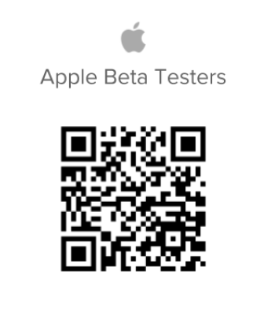

# Be an iOS beta tester

>[!IMPORTANT]
>
>You're currently viewing the Adobe Workfront Classic version of this document. Adobe Workfront Classic is no longer supported. All Adobe Workfront Classic functionality, along with this documentation, will be removed in July 2022. Please transition to the the new Adobe Workfront experienceas soon as possible, and switch to the new Adobe Workfront experience version of this document.

## Download the beta app

There are a couple of ways to become a beta tester for the Adobe Workfront app:

### App Store

You can use the Apple App Store to find and download the app.

>[!IMPORTANT]
>
>After you install the TestFlight app and become a beta tester on your iOS device, you must download updated versions of Workfront using the TestFlight app, instead of the Apple Store. If you are not a beta tester for iOS, you can continue to update your mobile app from the Apple Store.

#### 1. Install the TestFlight app

To install the beta version of the Workfront app you are required to have the TestFlight app installed on your device. After you install TestFlight, you need to install the Workfront app.

1. Install the Workfront app if you have not done so already.
1. Open the Workfront mobile app.
1. Tap **More** in the bottom navigation bar.
1. Tap your name, then tap **Be a Beta Tester**.
1. Tap **View in App Store** to view the TestFlight app.
1. Tap **Get** to install TestFlight on your device, then tap **Install**.
1. Tap **Open**, then **Continue** in the TestFlight app.
1. Tap **Accept** to accept the Terms and Conditions of the TestFlight app.  
   The TestFlight app is installed on your device. Continue to the next section.

#### 2. Install the Workfront Beta app in TestFlight

You must have the Workfront app and the TestFlight app installed on your iOS device before you can be a beta tester on an iOS device.

1. Open the Workfront mobile app.
1. Tap **More** in the bottom navigation bar.
1. Tap your name, then tap **Be a Beta Tester**.  
   The TestFlight app opens and Workfront is listed as an app available for download.

1. Tap **Accept**.
1. When the app is finished updating, tap **Open**.  
   You are redirected to your Workfront app and you are now a beta tester for Workfront. An orange dot displays next to the Workfront mobile app on your home screen to indicate that the beta version app is installed on your device.

### QR code

You can also scan the QR Code below to sign up for the beta and download the app:

## Let us know how we're doing

To provide feedback about the beta app or to report a problem:

1. Tap **More** in the bottom Navigation bar.
1. Tap your name, then **Submit Feedback**.
1. Choose **Start Survey** to provide general feedback about the app.  
   or  
   Choose **Report a Problem** to submit a ticket to the Workfront Customer Care Team.

## Update the Workfront Beta app

If you are enrolled as a beta tester, you must update the Workfront app in TestFlight to access new features available in beta.

1. Open the TestFlight app.
1. Tap **Update**.

## Opt out of beta testing

1. Open the TestFlight app.
1. Tap the Workfront Icon.
1. At the bottom of the page, tap **Stop Testing**.

