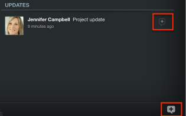

# Add updates in Adobe Workfront View

You can review and add updates to projects you are reviewing in the Adobe Workfront View app.

You cannot add updates to tasks or issues in Workfront View.

## Access requirements

You must have the following access in Workfront to perform the steps in this article:

<table cellspacing="0"> 
 <col> 
 </col> 
 <col> 
 </col> 
 <tbody> 
  <tr> 
   <td role="rowheader">Adobe Workfront plan*</td> 
   <td> 
Any
 </td> 
  </tr> 
  <tr> 
   <td role="rowheader">Adobe Workfront license*</td> 
   <td> 
Review or higher
 </td> 
  </tr> 
 </tbody> 
</table>

&#42;To find out what plan, license type, or access you have, contact your Workfront administrator.

## Add updates to a project in Workfront View

1. From the home page of Workfront View, tap a project to access it.
1. (Optional) Add the **Updates** widget to your view.  
   For more information about adding widgets to your project view, see [Update widgets in the Project Details view](../../../workfront-basics/mobile-apps/using-workfront-view/update-widgets-in-workfront-view.md).

1. Tap the **Updates** icon (bottom right) or (conditional) the **[+]** icon on an update in the **Updates** widget.  
   

1. Type in an update.
1. (Optional) Include others in the update by tapping the people icon and specifying the name of another user.  
   

1. Tap **Post**.  
   The update appears on the project, in the **Updates** widget.

