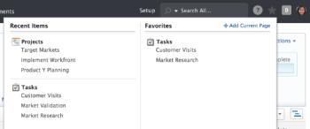
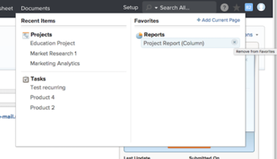

# View and manage favorites

The Favorites menu allows you to access items quickly. Items remain on the Favorites menu until you remove them. You can have up to 40 items on the Favorites menu.

## Access requirements

You must have the following access to perform the steps in this article:

<table cellspacing="0"> 
 <col> 
 </col> 
 <col> 
 </col> 
 <tbody> 
  <tr> 
   <td role="rowheader">Adobe Workfront plan*</td> 
   <td> <p>Any</p> </td> 
  </tr> 
  <tr> 
   <td role="rowheader">Adobe Workfront license*</td> 
   <td> <p>Request or higher</p> </td> 
  </tr> 
 </tbody> 
</table>

&#42;To find out what plan or license type you have, contact your Workfront administrator.

## View a favorite

To view an item that you have previously added as a favorite:

1. Click the **Favorites** icon in the upper-right corner of any Adobe Workfront page.  

1. In the Favorites list, click the item you want to view.

## Add an item as a favorite

You can add recent items or the current page to the Favorites menu.

* [Add recent items as a favorite](#adding-recent-items-as-a-favorite) 
* [Add the current item as a favorite](#adding-the-current-item-as-a-favorite)

### Add recent items as a favorite

```<li value="1">Click the <strong>Favorites</strong> icon in the upper-right corner of any Workfront page.</li>``` ```<li value="2">In the <strong>Recent Items</strong> column, hover over the recent item that you want to save as a favorite, then click the star.<br>The recent item displays in the Favorites column.<br></li>```  

### Add the current item as a favorite

1. Go to the page that you want to add as a favorite.
1. Click the **Favorites** icon in the upper-right corner of any Workfront page, then click **Add Current Page**.

   

   Or
   Click the object's **Actions** menu, then click **Add to Favorites**.

## Remove an item from the Favorites menu

1. Click the **Favorites** icon in the upper-right corner of any Workfront page.  

1. Hover over the item that you want to remove as a favorite, then click the **X** next to it.

   

   Or

   If you are on the page that you want to remove as a favorite, click **Remove Current Page** to remove it from the Favorites menu.

