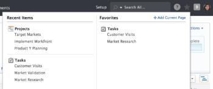

# View recent items

The Recents menu is located on the Global Navigation Bar. This menu shows recently viewed projects, reports, dashboards, tasks, issues, etc.

## Access requirements

You must have the following access to perform the steps in this article:

<table cellspacing="0"> 
 <col> 
 </col> 
 <col> 
 </col> 
 <tbody> 
  <tr> 
   <td role="rowheader">Adobe Workfront plan*</td> 
   <td> 
Any
 </td> 
  </tr> 
  <tr> 
   <td role="rowheader">Adobe Workfront license*</td> 
   <td> 
Request or higher
 </td> 
  </tr> 
 </tbody> 
</table>

&#42;To find out what plan or license type you have, contact your Workfront administrator.

## View recent items

1. Click the **Favorites** icon in the upper-right corner of any Adobe Workfront page.  
     
   Under each object type on the left, you can see up to 3 of the last items that you recently viewed.

1. (Optional) To expand the list of recent items, click **More** just below the third item of the list. You can expand the list to display up to 20 items per object type.

For information about how to mark recent items as favorites, see [View and manage favorites](../../../workfront-basics/navigate-workfront/recent-and-favorites/view-and-manage-favorites.md).
