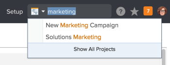
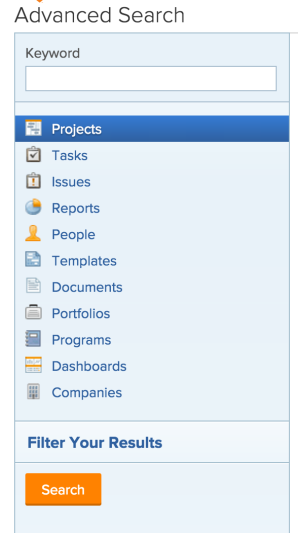
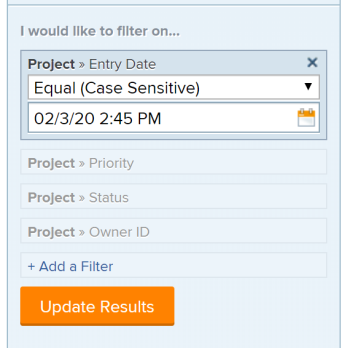

# Search Adobe Workfront

>[!IMPORTANT]
>
>You're currently viewing the Adobe Workfront Classic version of this document. Adobe Workfront Classic is no longer supported. All Adobe Workfront Classic functionality, along with this documentation, will be removed in July 2022. Please transition to the the new Adobe Workfront experienceas soon as possible, and switch to the new Adobe Workfront experience version of this document.

You can easily locate items in Adobe Workfront by searching for them when you cannot remember their exact location.

You can see the Search box in the upper-right corner of any page within Workfront.

You must have permissions to View an object before you can find it in a search. For this reason, search results vary from user to user.

## Access requirements

You must have the following access to perform the steps in this article:

<table cellspacing="0"> 
 <col> 
 <col> 
 <tbody> 
  <tr> 
   <td role="rowheader">Adobe Workfront plan*</td> 
   <td> 
Any
 </td> 
  </tr> 
  <tr> 
   <td role="rowheader">Adobe Workfront license*</td> 
   <td> 
Request or higher
 </td> 
  </tr> 
  <tr> 
   <td role="rowheader">Access level configurations*</td> 
   <td> 
View access to the type of object 
 
Note: If you still don't have access, ask your Workfront administrator if they set additional restrictions in your access level. For information on how a Workfront administrator can modify your access level, see <a href="../../../administration-and-setup/add-users/configure-and-grant-access/create-modify-access-levels.md" class="MCXref xref">Create or modify custom access levels</a>.
 <!--
     
 You must be a Workfront administrator. For information on Workfront administrators, see <a href="../../../administration-and-setup/add-users/configure-and-grant-access/grant-a-user-full-administrative-access.md" class="MCXref xref">Grant a user full administrative access</a>.

    --> <!--
     
You must be a group administrator. For more information on group administrators, see <a href="../../../administration-and-setup/manage-groups/group-roles/group-administrators.md" class="MCXref xref">Group administrators</a>.

    --> </td> 
  </tr> 
  <tr> 
   <td role="rowheader">Object permissions</td> 
   <td> 
You must have permissions to View an object before you can find it in a search.
 
For information on requesting additional access, see <a href="../../../workfront-basics/grant-and-request-access-to-objects/request-access.md" class="MCXref xref">Request access to objects </a>.
 </td> 
  </tr> 
 </tbody> 
</table>

&#42;To find out what plan, license type, or access you have, contact your Workfront administrator.

## Understand Search {#understand-search}

* [Objects available for search](#objects-available-for-search) 
* [Fields available for search](#fields-available-for-search)

### Objects available for search {#objects-available-for-search}

You can search for the following objects in Workfront:

* Projects
* Tasks
* Issues
* Reports
* People 
* Templates
* Documents
* Portfolios
* Programs
* Dashboards
* Companies
* Notes

### Fields available for search {#fields-available-for-search}

The fields available for search are based on the type of search: Basic or Advanced Search.

* **Basic Search**: When searching for objects in a basic search, Workfront looks for text that might contain your keywords in the following fields:

   * Object names
   * Descriptions
   * Custom data fields
   * Updates
   * Document names (in specific document searches and in a basic search)

  For more information about basic searching in Workfront, see [Basic Search](#basic-search) in this article.

* **Advanced Search**: In an Advanced Search, you can set up filters to search fields not available in basic search. Therefore, Advanced Search allows you to search any field in the object.

  For more information about Advanced Search, see [Advanced Search](#advanced-search) in this article.

>[!NOTE]
>
>To perform an Advanced Search, you must select the Advanced Search option when beginning your search. You cannot refine a basic search into an Advanced Search.

## Understand limitations of Workfront searches

Consider the following limitations when using Search in Workfront:

* Searches are not case-sensitive
* Workfront does not correct or understand typos
* Searching in Workfront does not support Wildcards
* Searching in Workfront supports partial word searches, but does not support substring searches.  
  For example, the search keyword "stand" would return results including the word "standard" but would not return results including the word "understand."

## Search for multiple words

When you include multiple words in a search and you want to find only objects that match all of the words in the Search box, you can type the words in any order.

For example, searching for "Marketing Demo" (without quotation marks) finds objects with the following names:

* Marketing Demo
* Demo Marketing
* January Market Analysis Demo

It also finds objects that might have "Marketing" in the name and "Demo" in the description.

However, you can do the following in the Search box to adjust the search results that appear:

<table cellspacing="15"> 
 <col> 
 <col> 
 <tbody> 
  <tr> 
   <td>Include quotation marks</td> 
   <td> 
Entering words in the correct order inside of double quotation marks allows you to find only objects that are an exact match. For example, searching for "Marketing Demo" (with quotation marks) finds objects with the following names:
 
    <ul> 
     <li> Marketing Demo</li> 
     <li> January Marketing Demo</li> 
     <li>Marketing Demo Plan</li> 
    </ul> 
However, this search would not find an object with the name "Demo Marketing."
 </td> 
  </tr> 
  <tr> 
   <td>Include OR</td> 
   <td> 
Connecting words by "OR" (without quotation marks) allows you to find only objects that match at least one of the words in the Search box. These words can be entered in any order. For example, searching for "Marketing OR Demo" (without quotation marks) finds objects with the following names:
 
    <ul> 
     <li> Market Analysis Demo</li> 
     <li>January Market Analysis Demo</li> 
     <li>Demo</li> 
     <li>Market Analysis</li> 
    </ul> 
Note:  "OR" must be in all caps. Otherwise, it is interpreted as another word in the phrase you are searching for.
 </td> 
  </tr> 
  <tr> 
   <td>Include AND</td> 
   <td> 
Connecting words by "AND" (without quotation marks) allows you to find only objects that match all words in the Search box. These words can be entered in any order. For example, searching for "Marketing AND Demo" (without quotation marks) finds objects with the following names:
 
    <ul> 
     <li>Marketing Demo</li> 
     <li>Demo Marketing</li> 
     <li>January Market Analysis Demo</li> 
    </ul> 
Note:  "AND" must be in all caps. Otherwise, it is interpreted as another word in the phrase you are searching for. Likewise, including "&amp;" (without quotation marks) searches only for objects that include the ampersand character.
 </td> 
  </tr> 
 </tbody> 
</table>

## Use Search in Workfront

Workfront features two types of searches: Basic and advanced. Use basic search if you want to find keywords in common object fields such as name or description. Use Advanced Search if you want to use filters to search other object fields.

* [Basic Search](#basic-search) 
* [Advanced Search](#advanced-search)

### Basic Search {#basic-search}

A basic search allows you to search for keywords across all objects in the system or on just one object at a time (such as projects). Workfront then searches for those keywords in a few specific fields. You can then refine your search results based on other object-specific fields selected by Workfront.

For a list of the specific fields searched in basic search, see [Fields available for search](#fields-available-for-search) in this article.

>[!NOTE]
>
>To perform an Advanced Search, you must select the Advanced Search option when beginning your search. You cannot refine a basic search into an Advanced Search.

* [Perform a basic search](#perform-a-basic-search) 
* [Refine a basic search](#refine-a-basic-search)

#### Perform a basic search {#perform-a-basic-search}

You can do a basic search in either of the following ways:

* Across all objects in the system (general search).
* On just one object at a time (object-specific search).

To perform a basic search:

1. Locate the **Search** box in the upper-right corner of the Workfront interface. 
1. (Optional) To search for a specific object, click the magnifying glass and select an object—**Projects**, for example—from the drop-down menu.
1. In the **Search** box, start typing the information you are searching for.  
   For information about what fields are searched in Workfront, see [Understand Search](#understand-search).  
     
   As you begin typing in the search bar, Workfront makes recommendations based on your viewing history and it highlights the keyword you are searching for in orange.

1. If the item you are looking for displays in the typeahead menu, click it.

   Or

   Press **Enter** to perform a comprehensive search. This search queries the entire database instead of your most recently viewed items.

   The Search Results page displays.

   If you chose the magnifying glass, for a general search, Workfront returns results for any object that matches the search term in any of the fields searched, as described in [Understand Search](#understand-search). The objects that match your search display in a list, with the keyword you typed highlighted in orange in the name.

   >[!NOTE]
   >
   >Sometimes, variations of a word display in the list of found items.  
   >For example, searching for "marketing" displays objects that contain either "marketing" or "market" in the name.

1. (Optional) If your search generated too many results, refine your search as described in [Refine a basic search](#refine-a-basic-search).

#### Refine a basic search {#refine-a-basic-search}

After performing a basic search—as described in [Perform a basic search](#perform-a-basic-search)—you can refine the search.

Use the toolbar to the left of your search results to narrow down the information you are looking for.

To refine a search:

1. (Conditional) If you performed a general search, select the object you were searching for in the list of objects to the upper left of your results.
1. Locate the fields available for the objects displayed in the search in the toolbar to the left of your results.  
   The values of each field display, sorted by count, up to 10 values for each field.
1. Click inside any of the fields available to shorten the list of results.  
   The selections you make are highlighted in orange and the field values that you do not select are hidden.  
   After you select each new value, the results to the right update dynamically.  
   

1. (Optional) Click the selected values to deselect them and display all values for each field again.

### Advanced Search {#advanced-search}

Advanced Search allows you to search using fields and filters not available to basic search. For example, you could search for projects with a specific Priority or Document Owner Name.

>[!NOTE]
>
>To perform an Advanced Search, you must select the Advanced Search option when beginning your search. You cannot refine a basic search into an Advanced Search.

* [Use Advanced Search](#use-advanced-search) 
* [Select new filters for Advanced Search](#select-new-filters-for-advanced-search)

#### Use Advanced Search {#use-advanced-search}

You can use Advanced Search to filter your search based on specific criteria.  
This type of search is helpful when you cannot remember a keyword associated with an object but you know some specific information about that object (example: Project Priority, Document Owner Name, etc).

To perform an advanced search:

1. In the upper-right corner of any page in Workfront, locate and click the drop-down arrow in the **Search** box.  

1. At the bottom of the Search menu, click **Advanced Search**.  
   -350x386.png)  
   The Advanced Search page displays.  

1. Select the type of object you are searching for.  
   **Projects** is selected by default.

   

1. (Optional) Type a keyword in the field at the top of the list.  
1. (Optional) Click **Filter your results** to filter your search results based on specific field types, then select a field from the list. If necessary, also select a value for the field.  
   Or  
   Add a new filter.  
   For information on adding a filter, see [Select new filters for Advanced Search](#select-new-filters-for-advanced-search).

1. Click **Search**.  
   A list of items that match your search displays to the right of the Advanced Search toolbar.

#### Select new filters for Advanced Search {#select-new-filters-for-advanced-search}

After performing an advanced search—as described in [Use Advanced Search](#use-advanced-search)—you can change your filters to update your search results.

To update your filters:

1. Click **Filter your results**.  
   A short list of previously searched fields for that object is shown.  
   The search remembers the 5 most recent fields you have used, and they display the next time you perform a search for the same object.  
   Or  
   Click **Add a Filter**.  
   This expands the list of fields you can associate with the object you selected.

1. Select a field from the list. If necessary, also select a value for the field.
1. Click **Update Results**.  
     
   Your updated list of results shows to the right of the Advanced Search toolbar.

