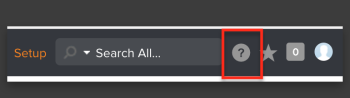
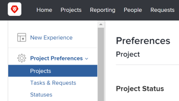
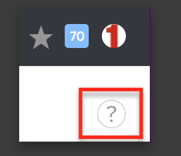
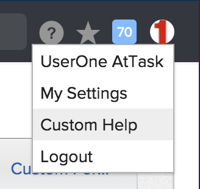

# Access Adobe Workfront help

>[!IMPORTANT]
>
>You're currently viewing the Adobe Workfront Classic version of this document. Adobe Workfront Classic is no longer supported. All Adobe Workfront Classic functionality, along with this documentation, will be removed in July 2022. Please transition to the the new Adobe Workfront experienceas soon as possible, and switch to the new Adobe Workfront experience version of this document.

Workfront offers a wide variety of content to help you find answers to questions you might have concerning functionality within the various products offered by Workfront.

## Access requirements

You must have the following access to perform the steps in this article:

<table> 
 <col> 
 </col> 
 <col> 
 </col> 
 <tbody> 
  <tr> 
   <td role="rowheader">Adobe Workfront plan*</td> 
   <td> 
Any
 </td> 
  </tr> 
  <tr> 
   <td role="rowheader">Adobe Workfront license*</td> 
   <td> 
Request or higher
 </td> 
  </tr> 
 </tbody> 
</table>

&#42;To find out what plan or license type you have, contact your Workfront administrator.

## Access the Adobe Workfront help site

1. Go to the [Adobe Workfront One site](https://one.workfront.com/).

In addition to searching for help documentation, you can also access the following from Adobe Workfront One:

* Training: For more information, see [Learn Workfront online](https://one.workfront.com/s/training).
* Innovation Lab: For more information, see [The Innovation Lab](../../../workfront-basics/tips-tricks-and-troubleshooting/idea-exchange.md).
* Workfront Community: For more information, see [The Adobe Workfront Community](../../../workfront-basics/tips-tricks-and-troubleshooting/workfront-community.md)

## Access help for a specific area in the Global Navigation Bar

1. Go to any of the following areas in the Global Navigation Bar:

   * Home
   * Projects
   * Reporting
   * People (Teams)  
   * Requests
   * Timesheet
   * Documents
   * Setup

1. Click the **Help** icon in the Global Navigation Bar.

   

1. Click **All Help Articles** to search through all the articles on [Adobe Workfront One](https://one.workfront.com/).

   Or

   Click **Help on `<area>`** to access specific documentation regarding the area.

   For example, if you want to get help for the People area, you select People in the Global Navigation Bar, click the Help icon in the People area, then select Help on People. A Help article for the People area opens.

   >[!NOTE]
   >
   >The **Setup** area does not have a link to a specific Help article. For more information about areas included in Setup, use the context-sensitive Help icons. For more information about context-sensitive help, see [Access context-sensitive help](#access-context-sensitive-help).

## Access context-sensitive help {#access-context-sensitive-help}

In various locations throughout Workfront, you can click the context-sensitive icon to access related articles on Adobe Workfront One.

For example, to access help information about areas of the Setup menu:

1. In the Global Navigation Bar, click **Setup**, then select an area in the left panel.

   For example, expand **Project Preferences**, then click **Projects**.

   

1. Click the context-sensitive **Help** icon located in the upper-right corner of the interface under your profile picture.

   

   This opens [Configure system-wide project preferences](../../../administration-and-setup/set-up-workfront/configure-system-defaults/set-project-preferences.md) on Adobe Workfront One where you can find more information about how to set up project preferences.

## Access a custom help URL

Your Workfront administrator can add a custom help link from the Workfront interface to a help site used by your organization.

For example, if you have an internal site that users are accustomed to visiting for help, you can link to that site fromWorkfront.

A custom help URL added to the Workfront user interface is in addition to and does not affect the main Help link in the Global Navigation Bar and the context-sensitive help links throughout Workfront, which take you to the Workfront Help site.

For information about how a Workfront administrator can add a custom help URL, see [Access Adobe Workfront help](#configuring-a-custom-help-url).

To access a custom help URL:

1. Click your profile picture in the upper-right corner of Workfront. 
1. Click **Custom Help**. 

   <!--
   <MadCap:conditionalText data-mc-conditions="QuicksilverOrClassic.Draft mode">
   Just guessing on this until Marvel team adds it.
   </MadCap:conditionalText>
   -->

   

   This link should take you to a help location other than the Workfront Help Site.

   If your Workfront administrator set up a help site outside of Workfront, you might need separate credentials to log in to the specified help site. Contact your Workfront administrator to learn what the login credentials are for this site.

