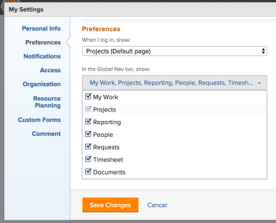

# Customize the Adobe Workfront navigation

>[!IMPORTANT]
>
>You're currently viewing the Adobe Workfront Classic version of this document. Adobe Workfront Classic is no longer supported. All Adobe Workfront Classic functionality, along with this documentation, will be removed in July 2022. Please transition to the the new Adobe Workfront experienceas soon as possible, and switch to the new Adobe Workfront experience version of this document.

The Global Navigation Bar changes with the access level you have been assigned by your Adobe Workfront administrator. By default, you are given access only to the areas of the Global Navigation Bar that include functionality allowed by your access level. To understand the components of the default layout of each access level, see [About the default Adobe Workfront layout](../../../administration-and-setup/customize-workfront/use-layout-templates/about-the-default-wf-layout.md).

You can customize the Global Navigation Bar to better fit your needs and your workflow.

## Access requirements

You must have the following access to perform the steps in this article:

<table cellspacing="0"> 
 <col> 
 </col> 
 <col> 
 </col> 
 <tbody> 
  <tr> 
   <td role="rowheader">Adobe Workfront plan*</td> 
   <td> 
Any
 </td> 
  </tr> 
  <tr> 
   <td role="rowheader">Adobe Workfront license*</td> 
   <td> 
Review or higher
 
Note: Users with a Request license can access their profiles and see the Global Nav Bar field, but the only option is Requests and it cannot be removed.
 </td> 
  </tr> 
 </tbody> 
</table>

&#42;To find out what plan or license type you have, contact your Workfront administrator.

## Customize the Global Navigation Bar

1. Click your user avatar in the upper-right corner of Workfront, then click **My Settings**. 
1. Click **Preferences**.  

1. (Optional) In the **When I log in, show:** field, select the default landing page for your Workfront web application.
1. Click the **In the Global Nav bar, show:** drop-down list, then select the areas that you want to show in the Global Navigation Bar.

   

1. Click **Save Changes**.

