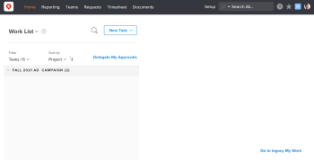

# Understand a Worker's  Global Navigation Bar  in&nbsp;Adobe Workfront

The  Global Navigation Bar  changes with the access level you have been assigned by your Adobe Workfront administrator. By default, you are given access only to the areas that include functionality allowed by your access level. To understand the components of the default layout of each access level, see [About the default Adobe Workfront layout](../../../administration-and-setup/customize-workfront/use-layout-templates/about-the-default-wf-layout.md).

## Understand the default  Global Navigation Bar  of a Worker

As a Worker, your main responsibility is to complete work. The areas in the  Global Navigation Bar  that are visible to you allow you to do that.

The following areas are included in the default layout of a Worker:

* **Home**: Tasks and issues assigned to you display here. This is the default landing page for a Worker.
* **Report** **ing** : Reports , dashboards, and calendars  that are shared with you display here.

* **Teams**: Tasks and issues assigned to your teams display in this area. As a Worker, you are the only Workfront user who sees the Teams area by default.

  <!--
  <MadCap:conditionalText data-mc-conditions="QuicksilverOrClassic.Draft mode">
  This area is named "
  <!--
  People
  -->" for users with a Plan license. As a Worker, you cannot edit users, so the
  <!--
  People tab of this
  --> area is not available to you. You can see the work assigned to your Teams, however, and this is why this
  <!--
  tab
  --> is more accurately renamed to "Teams."
  </MadCap:conditionalText>
  -->

* **Requests**: You can submit requests and review requests you or your team members have submitted here.
* **Timesheet**: You can access your current, future, or old timesheets here.
* **Documents**: You can upload documents, or review documents shared with you, here.

## Customize your default  Global Navigation Bar

You can customize the areas that you see in your Global Navigation Bar  by removing or adding areas.

For more information about customizing the  Global Navigation Bar , see [Customize the Global Navigation Bar in Adobe Workfront](../../../workfront-basics/navigate-workfront/workfront-navigation/customize-global-navigation-bar.md).

Your Workfront administrator can also modify your Workfront default layout by assigning you a Layout Template. For more information about working with Layout Templates, see  [Create and manage layout templates](../../../administration-and-setup/customize-workfront/use-layout-templates/create-and-manage-layout-templates.md) .
