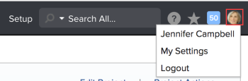

# Supported languages in Adobe Workfront

You can change the language in which you display Adobe Workfront and emails coming from Workfront, by adjusting the language preferences on your browser and your default Locale within Workfront.

Workfront terminology is updated for the supported languages with every Workfront update.

Workfront supports the following languages:

* Chinese - Simplified (zh-CN)
* Chinese - Traditional (zh-TW)
* English (en-US)
* French (fr-FR)
* German (de-DE)
* Italian (it_IT)
* Japanese (ja)
* Portuguese (pt-BR)
* Spanish - Latin America

The language used to view Workfront in your browser is controlled by your browser language settings. Ensure you select a language for your browser which is listed in the supported languages list.

To display outgoing emails in any of the supported languages, modify your User Locale or Customer Info settings in Workfront.  
You must be a Workfront administrator to modify the Customer Info settings.  
For more information about changing the Customer Info and User Locale, see [Change the Workfront and User Locales](#changing-the-locale).

You can contract a third party to have the Workfront interface and the outgoing emails from Workfront translated in other languages. These translations are not supported by Workfront and any language outside of the ones listed above are unsupported.

>[!NOTE]
>
>Portions of the interface might still be untranslated for the following:  
>
>* When using an unsupported language, the interface displays in English
>* The Help menu, as well as the help content accessed from that menu, displays in English
>* User-entered text remains in the original language entered. This can include, but is not limited to:
>
>   * Project names
>   * Task names
>   * Issue names
>   * Portfolio names
>   * Program names
>   * Approval names
>   * Descriptions
>   * Custom Form names
>   * Hour Types names
>   * Expense Types
>   * Milestones
>   * Custom tabs
>   * Statuses
>   * Report names
>

## Supported language discrepancies when using proofing

The Web Proofing Viewer within Workfront supports most languages that are supported in Workfront.

The following languages are not supported in the proofing tool:

* Chinese - Simplified (zh-CN)
* Chinese - Traditional (zh-TW)
* Portuguese (pt-BR)

Your company must purchase a proofing license for you to access the Web Proofing Viewer.

For more information about proofing, see [Proofing](../review-and-approve-work/proofing/proofing.md).

When viewing Workfront in a language not supported in the proofing tool, the Web Proofing Viewer displays in English.

If you use Workfront Proof (the standalone proofing tool) in a language that is not supported in Workfront, the Web Proofing Viewer within Workfront displays in English.  
For more information about the languages supported in Workfront Proof, see [Language Settings in Workfront Proof](../workfront-proof/wp-getstarted/system-information/language-settings.md).

## Supported language in Adobe Workfront Fusion

Currently, Workfront Fusion supports only English.

* All content in Workfront Fusion, as well as any help content related to Workfront Fusion, displays in English.
* Workfront Fusion does not support the use of non-English text characters in user-entered fields.

Your company must purchase a Workfront Fusion license for you to access Workfront Fusion.   
For more information about Workfront Fusion, see [Adobe Workfront Fusion overview](../workfront-fusion/get-started/workfront-fusion-overview.md).

## Change the language

You can change the language in which you view Workfront and the language of the outgoing emails by modifying the following settings:

* The language on your browser
* The Customer Info and User Locale settings in your Workfront account.

In order to see all available translations for your chosen language, both the Workfront locale and browser locale should be set to the same language.

* [Change the browser language](#changing-browser-language) 
* [Change the Workfront and User Locales](#changing-the-locale)

### Change the browser language

When you change the browser language, your Workfront interface displays in that language.   
For more information about what languages are supported by Workfront, see [Supported languages in Adobe Workfront](#supported-languages).

The browser language must be changed on an individual user basis.

See the "Help" menu for your browser for specific information about how to change the language of your browser.

### Change the Workfront and User Locales

* [Change the Workfront Locale](#changing) 
* [Change the User Locale](#changing-user-locale)

### Change the Workfront Locale

When changing the Workfront Locale, you modify the language, date, and number format used in outgoing messages for all Workfront users. These settings become the default for every new user you create.

To change the Workfront Locale:

1. Log in to Workfront as the Workfront administrator.
1. Click **Setup** near the upper-right corner of Adobe Workfront on the Global Navigation Bar.
1. Click **System** > **Customer Info.**

1. In the **Basic Info** section, click the **Locale** drop-down list to select the language that you want Workfront emails to display in.

1. Click **Save**.

### Change the User Locale

When changing your User Locale, you modify the language, date, and number format used in your outgoing messages. These settings override the system settings selected in the Customer Info area of Setup.

To change your User Locale:

1. Click your user profile avatar on the upper right corner of the Workfront interface.
1. 

1. My Settings
1. In the **Preferences** section, click the **Locale** drop-down list to select the language that you want Workfront emails to display in.

1. Click **Save Changes**.

