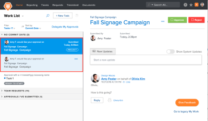

# Duplicate approval processes showing in the Home Work List

>[!IMPORTANT]
>
>You're currently viewing the Adobe Workfront Classic version of this document. Adobe Workfront Classic is no longer supported. All Adobe Workfront Classic functionality, along with this documentation, will be removed in July 2022. Please transition to the the new Adobe Workfront experienceas soon as possible, and switch to the new Adobe Workfront experience version of this document.

## Problem

You see more than one of the same approval in your Home Work List.

## Cause

You have been assigned to the approval as an individual user and as a member of a team.

## Solution

The user setting up the approval process should ensure that any individual users added to the approval process are not members of any teams assigned to the approval process.

If you are assigned as an individual user and as part of a team and see the approval twice, you need to make a decision on only one of the entries.
