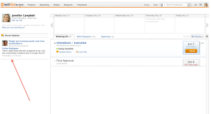

# Access the Recent Updates area

## Access requirements

You must have the following access to perform the steps in this article:

<table cellspacing="0"> 
 <col> 
 </col> 
 <col> 
 </col> 
 <tbody> 
  <tr> 
   <td role="rowheader">Adobe Workfront plan*</td> 
   <td> 
Any
 </td> 
  </tr> 
  <tr> 
   <td role="rowheader">Adobe Workfront license*</td> 
   <td> 
Work or higher
 </td> 
  </tr> 
 </tbody> 
</table>

&#42;To find out what plan or license type you have, contact your Workfront administrator.

## Access the Recent Updates area

1. Log in to Adobe Workfront as a user with a Plan or Worker license.
1. Go to the **My Work** area in the Global Navigation Bar.
1. Notice the **Recent Updates** area in the lower-left corner of the My Work page.  
   The information in the Recent Updates area displays a live feed of relevant updates submitted by you, your teammates or co-workers. The most recent comment will always appear first on the list.   
   The following updates show up in the Recent Updates area of My Work:

   * Updates made to work items assigned to you
   * Updates made to work items you assigned to someone else
   * Updates made to work items assigned to your teams
   * Updates made to work items that you created
   * Updates in which you have been directly tagged (regardless of assignments)
   * Updates that have been made in the past two weeks.

