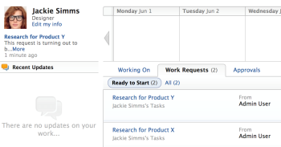

# Access the Working On and Work Request tabs

You can navigate to your Working On and Work Request tabs from the My Work area of Adobe Workfront.

## Access requirements

You must have the following access to perform the steps in this article:

<table cellspacing="0"> 
 <col> 
 </col> 
 <col> 
 </col> 
 <tbody> 
  <tr> 
   <td role="rowheader">Adobe Workfront plan*</td> 
   <td> 
Any
 </td> 
  </tr> 
  <tr> 
   <td role="rowheader">Adobe Workfront license*</td> 
   <td> 
Work or higher
 </td> 
  </tr> 
 </tbody> 
</table>

&#42;To find out what plan or license type you have, contact your Workfront administrator.

Requestors cannot see the My Work area, because they are not&nbsp;assigned work.  
Reviewers see the My Updates area&nbsp;instead of the My Work area.&nbsp;For more information about My Updates, see [My Updates area](../../../workfront-basics/using-home/my-work/my-updates-area-my-work.md).

## Working On tab in the My Work Area

### Access the Working On Tab

1. Click **My Work** in the Global Navigation Bar.  
   **Working On** is the default tab, in the right corner of the page.   
   The Working On tab is your personal work list. This tab shows tasks and issues you are in the process of completing. &nbsp;

### Populate the Working On Tab

After accepting a work item by clicking on it from the Work Requests tab, that item moves to your Working On tab. For more information on the Work Requests tab, see [Manage work and team requests](../../../people-teams-and-groups/work-with-team-requests/manage-work-and-team-requests.md).

You can also automatically add items to your Working On tab.

To automatically add tasks and issues that you assign to yourself to your Working On list:

1. Click your avatar in the upper-right corner of any Workfront page.
1. Click **My Settings**.
1. In the **Preferences** section, select **Send work I assign to myself to my Working On tab.**

1. Click **Save changes**.  
   Any time you make yourself the assignee of any issue or task anywhere in the system, the issue or task is added to your Working On list. This bypasses the Work Requests list. &nbsp;&nbsp;

### Understand the Working On Tab

There are several things you can do from the Working On tab:

* View&nbsp;your currently active work items and some details&nbsp;about them.&nbsp;The details displayed in the Working On items can be customized by your Workfront administrator, through the use of layout templates. For more information on how to customize your Working On tab through a layout template, see [Create and manage layout templates](../../../administration-and-setup/customize-workfront/use-layout-templates/create-and-manage-layout-templates.md) and [Change the My Work and Work Requests areas with Layout Templates](../../../workfront-basics/manage-your-account-and-profile/configuring-your-user-profile/change-my-work-layout-templates.md).

* Understand the priority and type of your work items. For more information on understanding the priority and type of your work items, see the "Viewing Item Type Priority" section of [Organize work on the My Work page](../../../workfront-basics/using-home/my-work/organize-work-my-work.md).
* Organize your list of work items, by using either the **Sort** or **Grouping**&nbsp;functionality. For more information on organizing work items on the Working On list, see the "Sorting Items That&nbsp;You Are Working On" and the "Grouping Items That You Are Working On" sections in [Organize work on the My Work page](../../../workfront-basics/using-home/my-work/organize-work-my-work.md).

* Search for an item by using the **Filter** functionality. For more information on filtering work items on the Working On list, see the "Filtering Work Items" section in [Organize work on the My Work page](../../../workfront-basics/using-home/my-work/organize-work-my-work.md).

* Update the status of a work item by using the **Update Status** link. For more information on updating the status of a work item, see [Update work](../../../workfront-basics/updating-work-items-and-viewing-updates/update-work.md).

* Log time for a work item by clicking the **Log Time** link. For more information on logging time for work items, see the "My Work Page" section in [Log time](../../../timesheets/create-and-manage-timesheets/log-time.md).

* Add ad hoc tasks that are not part of a bigger project by using the **New Task** button. For more information on ad hoc tasks, see [Create ad hoc work items](../../../workfront-basics/using-home/my-work/create-ad-hoc-work-items-my-work.md).

* Mark your tasks and issues complete. You can do this&nbsp;by using either of the following options:

   * Click **Done** on the work item.
   * Click **Update Status** and change the status of the item to a Complete or Closed status. &nbsp;

* Remove items from your Working On list. For more information on removing items from the Working On list, see [Remove requests from the Working On list](../../../workfront-basics/using-home/my-work/remove-requests-my-work.md).

  >[!NOTE]
  >
  >If a Task is marked as Complete and then moved back to an Active status, the project manager&nbsp;must re-assign the task or the assignee must click **Actually, I'm not done yet** for the object to return to the Working On list.

## Work Requests tab in the My Work Area

For more information on the Work Requests tab, see&nbsp; [Manage work and team requests](../../../people-teams-and-groups/work-with-team-requests/manage-work-and-team-requests.md).&nbsp;&nbsp;

### Ready to Start and All subtabs

There are two subtabs&nbsp;on the Work Requests tabs in the My Work area: Ready to Start&nbsp;and All.

The Ready to Start&nbsp;subtab&nbsp;shows only tasks and issues that meet all of the following criteria:

* All predecessors have met the&nbsp;conditions for their&nbsp;predecessor dependency types.  
  For example, if the type of predecessor relationship is&nbsp;Finish-Start (predecessor task must finish before the dependent task can start), the predecessor must be&nbsp;marked as Complete. (For more information about predecessor dependency types, see [Overview of task dependency types](../../../manage-work/tasks/use-prdcssrs/task-dependency-types.md).)

* The logged-in user&nbsp;is the person assigned to these tasks and issues (for Work Requests). Or the selected team is assigned to these tasks and issues (for Team Requests).
* The project status is in a status of Current.
* The Projected Start Date or Planned Start Date has passed or is scheduled to begin within two weeks from today's date (or no Projected Start Date or Planned Start Date&nbsp;has been defined).
* The&nbsp;Handoff Date has already occurred or will occur within 2 weeks from the current date.

The&nbsp;All&nbsp;subtab&nbsp;shows all tasks and issues on current projects that are assigned to the logged-in user or all tasks or issues assigned to the team.
