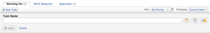
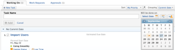
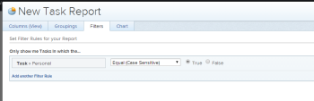
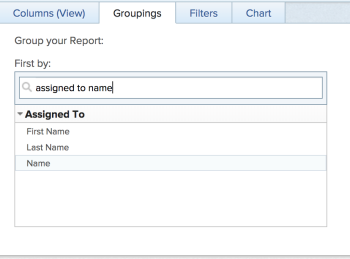
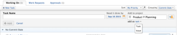

# Create ad hoc work items

An ad&nbsp;hoc work item is a task or issue created in My Work.&nbsp; You have the following options for creating ad hoc tasks or issues in Adobe Workfront:

* Create a personal task independent&nbsp;of a project for yourself or another user. 
* Create and add a task or issue to a project for yourself or another user.

## Access requirements

You must have the following access to perform the steps in this article:

<table cellspacing="0"> 
 <col> 
 </col> 
 <col> 
 </col> 
 <tbody> 
  <tr> 
   <td role="rowheader">Adobe Workfront plan*</td> 
   <td> 
Any
 </td> 
  </tr> 
  <tr> 
   <td role="rowheader">Adobe Workfront license*</td> 
   <td> 
Work or higher
 </td> 
  </tr> 
  <tr> 
   <td role="rowheader">Access level configurations*</td> 
   <td> 
Edit access with permission to create tasks and issues
 
Note: If you still don't have access, ask your Workfront administrator if they set additional restrictions in your access level. For information on how a Workfront administrator can modify your access level, see <a href="../../../administration-and-setup/add-users/configure-and-grant-access/create-modify-access-levels.md" class="MCXref xref">Create or modify custom access levels</a>.
 </td> 
  </tr> 
  <tr> 
   <td role="rowheader">&nbsp;</td> 
   <td>&nbsp;</td> 
  </tr> 
 </tbody> 
</table>

&#42;To find out what plan, license type, or access you have, contact your Workfront administrator.

## Create a personal ad hoc task

You can add a personal task for yourself or another user from My Work. Personal tasks are not associated with&nbsp;an existing project. After you create a personal task, you can move it to a project. For more information about moving a task to a project, see&nbsp; [Move tasks](../../../manage-work/tasks/manage-tasks/move-tasks.md).

>[!NOTE]
>
>If you create a personal task for yourself, you only have the option to edit the task name and description in the Task Details tab. If you create a personal task and assign it to another user, they have the option to edit all task details, including the Planned Completion Date,&nbsp;in the Task Details tab.

To create a personal task for yourself or another user:

1. Click `My Work` in the Global Navigation Bar, then click the `Working On`&nbsp;tab.

1. Click `New Task`.  
   

1. Specify a name for the task.
1. (Optional) Click the `Calendar`icon, then select the&nbsp;date when the task is due.  
   

1. (Optional) Click the `Assign`&nbsp;icon, and type the name of the user, team, or role who you want to assign the task to.  
   When you assign an ad hoc task to another user, team, or role, the task does not display in your Working On list.

1. Click `Add`&nbsp;to save the task.  
   The task displays in your Working On list.

## View a personal task in a report

Personal ad hoc tasks appear in your Working On lists, and they are not associated with any projects.

To view a list of personal tasks for several users, you can create the following report:

1. Create a `Task` report.  
   For more information about creating a report, see [Create a custom report](../../../reports-and-dashboards/reports/creating-and-managing-reports/create-custom-report.md).

1. In the `Filters` tab, click `Add a Filter Rule`.

1. Start trying `Personal` in the `Only show Tasks in which the ...` field and select it when it appears on the list.

1. Select `Equal (Case Sensitive)` for the modifier, then `True`.  
     

1. (Optional) Click `Add another Filter Rule` if you want to further modify the filter.
1. (Optional) in the `Groupings` tab, click `Add Grouping`.

1. (Optional and conditional) Start typing `Assigned to Name` in the `First by:` field and select it when it appears on the list.  
     

1. Click `Save + Close`.
1. Enter a new name for your report, then click `Save Report`.  
   The report displays personal ad hoc tasks that are assigned to the users displayed in the Groupings of the report.

## Create an ad hoc task or issue for a project

You can add a task or issue&nbsp;to a project for yourself or another user from My Work. When you create a new ad hoc task or issue and associate it with a project, the item is&nbsp;treated like other tasks and issues on the&nbsp;project. It is not treated like a personal ad hoc task.

To create an ad hoc task or issue for a project from My Work:

1. Click `My Work` in the Global Navigation Bar, then click the `Working On`&nbsp;tab.

1. Click `New Task`.  
   

1. Specify a name for the task.
1. (Optional) Click the `Calendar`icon, then select the&nbsp;date when the task is due.  
   

1. (Optional) Click the `Assign`&nbsp;icon, and type the name of the user, team, or role who you want to assign the task to.  
   When you assign an ad hoc task or issue to another user, team, or role, the task does not display in your Working On list.

1. Click the `Project` icon.
1. Type the project name in the `Add to Project` field, and select the project name when it appears in the list.  
   You can add a task or issue only to a project where you have at least Contribute permissions.

1. Click the `add as task` drop-down list, and specify whether it is a  `Task` or  `Issue`.  
   Task is always selected by default.  
   

1. Click `Add`&nbsp;to save the task or issue.  
   The task or issue displays in the specified project.

