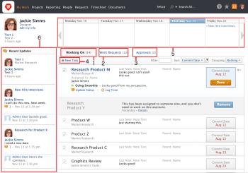

# Navigate My Work

The My Work area displays items you have agreed to work on. You must have a Planner or a Worker license to see the My Work area in your Global Navigation Bar.

The My Work area has been renamed to My Updates for users with a Reviewer license. For information, see [My Updates area](../../../workfront-basics/using-home/my-work/my-updates-area-my-work.md).

Users with a Requestor license do not have a My Work or My Updates area in the Global Navigation Bar.

By controlling the contents of your My&nbsp;Work page, you can organize your work to be easily accessible to you. You decide what you need to work on, establish the priority of your work, create personal tasks, and much more.

The following features are available on the My Work page:

1. `Working On:`&nbsp;Your personal work list. This tab shows tasks and issues you are in the process of completing.
1. `Work Requests:`&nbsp;You can review, select, and reply to work requests assigned to you by a project manager or someone else in your organization. Items that are assigned to your teams are also listed here.
1. `Approvals:`&nbsp;This tab allows you to approve or reject work items submitted for review. You&nbsp;can also use the Approvals tab to track work items you have submitted for approval.
1. `New Task:`&nbsp;Allows you to create ad hoc tasks or issues. You can associate the new tasks with an existing project, or you can leave them unassociated with any other project. In this case, they are associated with your individual project. When you enter ad hoc tasks for yourself, the tasks&nbsp;remain in your Working On tab.   
   When you associate an ad hoc task with a project you can select to enter the ad hoc item as an issue, instead of a task.&nbsp;Ad hoc issues can only be associated with projects.  
   You can also assign&nbsp;the new ad hoc tasks or issues to other users from your Working On tab. &nbsp;  
   Tasks or issues created this way are added to your Working On list&nbsp;or to the Work Requests list of the user&nbsp;who the task is assigned to.  
   For more detailed information about creating tasks and issues from the Working On tab, see [Create ad hoc work items](../../../workfront-basics/using-home/my-work/create-ad-hoc-work-items-my-work.md).

1. `My Work Calendar:`&nbsp;Shows your committed as well as completed work. It displays&nbsp;the current work week, with today shown with a blue header. When a user commits to a date on a work item, that item appears in the calendar with the commit date in blue. Once a task is completed, it is grayed out.  
   For more information about the My Work Calendar, see [View assigned work on the My Work calendar](../../../workfront-basics/using-home/my-work/view-assigned-work-on-calendar-my-work.md).

1. `Recent Updates:`&nbsp;Displays a live feed of relevant updates submitted by you, your teammates, or co-workers. The most recent comment will always appear first on the list.   
   The following updates appear in the Recent Updates area of My Work:

  * Updates made to work items assigned to you
  * Updates made to work items you assigned to someone else
  * Updates made to work items assigned to your teams
  * Updates in which you have been directly tagged (regardless of assignments)
  * Updates that have been made in the past two weeks

