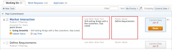
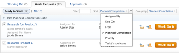
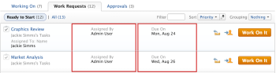
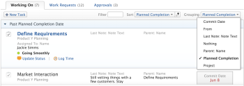
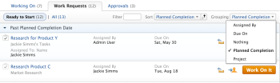

# Organize work on the My Work page

You can organize work in the My Work area and in the Team Requests list by sorting and by grouping work items. This enables you to more easily locate and prioritize your work. If items are both sorted and grouped, sorting occurs within each group.

## Access requirements

You must have the following access to perform the steps in this article:

<table cellspacing="0"> 
 <col> 
 </col> 
 <col> 
 </col> 
 <tbody> 
  <tr> 
   <td role="rowheader">Adobe Workfront plan*</td> 
   <td> 
Any
 </td> 
  </tr> 
  <tr> 
   <td role="rowheader">Adobe Workfront license*</td> 
   <td> 
Work or higher
 </td> 
  </tr> 
 </tbody> 
</table>

&#42;To find out what plan or license type you have, contact your Workfront administrator.

## Filter work items

You can filter which tasks and issues&nbsp;in the Working On and Work Requests tabs in the My Work area are displayed.

You can filter on the following types data on tasks and issues:

* Task or issue&nbsp;name&nbsp;
* Project name&nbsp;
* Date
* Additional Fields  
  You can filter items&nbsp;based on the two fields that appear to the right of the task or issue name. These fields are configured by the Adobe Workfront administrator, and are not there by default. (Workfront administrators have the option to display these fields&nbsp;on tasks and issues on the Working On tab by modifying the Layout Template, as described in [Create and manage layout templates](../../../administration-and-setup/customize-workfront/use-layout-templates/create-and-manage-layout-templates.md).)  
  The graphic below is an example of a Working On tab with the following additional fields: `Last Note: Note Text` and `Parent: Name`  
  Fields that are added by the Workfront administrator that you are able to filter on are always displayed in the middle two columns of each task or issue, as shown in the following example:  
  

To filter items in the Working On or Work Requests tabs in the My Work area:

1. Click in the `Filter` field.
1. Begin typing the text that you want to filter on.  
   The list is filtered as you type, based on items that match the text you are typing.  
   When filtering on additional fields:

  * You can filter only on the value of the field (you cannot filter on the field name itself)
  * The filter recognizes words only when you begin typing them from the beginning of a word. For example, typing *require* would return results including the word `requirements`, but typing *ments*&nbsp;would not return results with the word *requirements*.

## Sort work items

* [Sort items that you are working on](#sorting-items-that-you-are-working-on) 
* [Sort requested items](#sorting-requested-items)

### Sort items that you are working on

1. Go to the My Work area, then click the `Working On`tab.
1. Click the `Sort`&nbsp;drop-down&nbsp;list.  
   

1. Select one of the following options for sorting work items:  
   `Commit Date:`&nbsp;(Displays if you have chosen to show Commit Dates.)&nbsp;Organizes the work in order by the date you have committed to complete the work item.&nbsp;It appears in ascending order.  
   Depending on how your Workfront administrator has configured the My Work area, either the Commit Date or the Planned Completion Date is shown for each item on the Working On tab. You can sort by the date that your Workfront administrator chooses to show.  
   For more information about the Commit Date, see [Commit Date overview](../../../manage-work/projects/updating-work-in-a-project/overview-of-commit-dates.md).  
   `My Priority:`&nbsp;Allows you to organize&nbsp;work based on your individual priority of tasks or issues in the Working On tab. By default, items are set in the order they are added to the list. (Your individual priority--the order in which items appear--is not related to the priority that is set on the specific task or issue in the task or issue details.)  
   To change the order of items on the Working On tab, ensure that `My Priority` is selected in the `Sort` drop-down list, and that `Nothing` is selected in the `Grouping`&nbsp;drop-down list. Drag a task or issue using the drag-and-drop indicators and drop it into a new location in the list.  
   `Planned Completion:` Organizes the work in order by the date when the item is planned to be completed.  
   Depending on how your Workfront administrator has configured the My Work area, either the Commit Date or the Planned Completion Date is shown for each item on the Working On tab. You can sort by the date that your Workfront administrator chooses to show.  
   For more information about the Planned Completion Date, see [Overview of the task Planned Completion Date](../../../manage-work/tasks/task-information/task-planned-completion-date.md).  
   `Project:` Organizes the work alphabetically by project.  
   `Task/Issue Name:`&nbsp;Organizes the work alphabetically by name.  
   `Additional Fields:`&nbsp;You can sort items on the Working On tab based on the two fields that appear to the right of the task or issue name. These fields are configured by the Workfront administrator, and are not there by default. (Workfront administrators have the option to display these fields&nbsp;on tasks and issues on the Working On tab by modifying the Layout Template, as described in [Create and manage layout templates](../../../administration-and-setup/customize-workfront/use-layout-templates/create-and-manage-layout-templates.md).)  
   The graphic below is an example of a Working On tab with the following additional fields: `Last Note: Note Text` and `Parent: Name`  
   Fields that are added by the Workfront administrator that you are able to sort on are always displayed in the middle two columns of each task or issue, as shown in the following example:  
   

### Sort requested items

1. Go to the My Work area, then click the `Work Requests`tab.  
   Or  
   Navigate to a team, then click the `Team Requests`&nbsp;tab.

1. Click the `Sort by`drop-down list.  
   

1. Select one of the following options for sorting work items:  
   `From:` Organizes the work alphabetically by who sent the work request.  
   `Planned Completion Date:`&nbsp;Groups the work by the date when the item is planned to be completed.  
   For more information about the Planned Completion Date, see [Overview of the task Planned Completion Date](../../../manage-work/tasks/task-information/task-planned-completion-date.md).  
   `Priority:` Organizes the work by priority of the item.  
   `Task/Issue Name:` Organizes the work alphabetically by name of work item.  
   `Additional Fields:`&nbsp;You can sort items on the Work&nbsp;Requests tab based on the two fields that appear to the right of the task or issue name. These fields are configured by the Workfront administrator, and are not there by default. (Workfront administrators have the option to display these fields&nbsp;on tasks and issues on the Work Requests&nbsp;tab by modifying the Layout Template, as described in [Create and manage layout templates](../../../administration-and-setup/customize-workfront/use-layout-templates/create-and-manage-layout-templates.md).  
   The graphic below is an example of a Work Requests tab with the following additional fields: `Assigned By`and `Due On`  
   Fields that are added by the Workfront administrator that you are able to sort on are always displayed in the middle two columns of each task or issue, as shown in the following example:  
   

## Group work items

Grouping provides an additional way to organize information.

* [Group items that you are working on](#grouping-items-that-you-are-working-on) 
* [Group requested items](#grouping-requested-items)

### Group items that you are working on

1. Go to the My Work area, then click the `Working On`tab.
1. Click the `Grouping`&nbsp;drop-down list.  
   

1. Select one of the following options for grouping work items:  
   `Commit Date:`&nbsp;(Displayed only for items in the Working On tab) Work items are grouped together by the commit date. The following groups are used, and are displayed in the following order: Past Commitment, Committed Today, Committed Tomorrow, Committed Next Week, Committed Later, No Commitment.  
   Depending on how your Workfront administrator has configured the My Work area, either the Commit Date or the Planned Completion Date is shown for each item on the Working On tab. You can sort by the date that your Workfront administrator chooses to show.  
   For more information about the Commit Date, see [Commit Date overview](../../../manage-work/projects/updating-work-in-a-project/overview-of-commit-dates.md).  
   `Nothing:` No groupings are displayed. This option is selected by default.  
   `Planned Completion Date:`&nbsp;Groups the work by the date when the item is planned to be completed.  
   Depending on how your Workfront administrator has configured the My Work area, either the Commit Date or the Planned Completion Date is shown for each item on the Working On tab. You can sort by the date that your Workfront administrator chooses to show.  
   For more information about the Planned Completion Date, see [Overview of the task Planned Completion Date](../../../manage-work/tasks/task-information/task-planned-completion-date.md).   
   `Project:` Work items are grouped together by project name and are sorted alphabetically.  
   You can click the group heading to navigate directly to the project.  
   `Additional Fields:`&nbsp;You can group items on the Working On tab based on the two fields that appear to the right of the task or issue name. These fields are configured by the Workfront administrator, and are not there by default. (Workfront administrators have the option to display these fields&nbsp;on tasks and issues on the Working On tab by modifying the Layout Template, as described in [Create and manage layout templates](../../../administration-and-setup/customize-workfront/use-layout-templates/create-and-manage-layout-templates.md).)  
   The graphic below is an example of a Working On tab with the following additional fields: `Last Note: Note Text`and `Parent: Name`  
   Fields that are added by the Workfront administrator that you are able to use for grouping items are always displayed in the middle two columns of each task or issue, as shown in the following example:  
   

1. (Optional) After you have selected a grouping, you can collapse and expand groupings for easy navigation. The next time you return to the Working On tab, the groupings are displayed in the state that you last left them.

### Group requested items

1. Go to the My Work area, then click the `Work Requests`&nbsp;tab.  
   Or  
   Navigate to a team, then click the `Team Requests`tab.

1. Click the `Grouping`drop-down list.  
   

1. Select one of the following options for grouping work items:  
   `Nothing:` No groupings are displayed. This option is selected by default.  
   `Planned Completion Date:`&nbsp;Groups the work by the date when the item is planned to be completed.  
   For more information about the Planned Completion Date, see [Overview of the task Planned Completion Date](../../../manage-work/tasks/task-information/task-planned-completion-date.md).  
   `Project:` Work items are grouped together by project name and are sorted alphabetically.  
   You can click the group heading to navigate directly to the project.  
   `Additional Fields:`&nbsp;You can sort items on the Work&nbsp;Requests tab based on the two fields that appear to the right of the task or issue name. These fields are configured by the Workfront administrator, and are not there by default. Workfront administrators have the option to display these fields&nbsp;on tasks and issues on the Work Requests&nbsp;tab by modifying the Layout Template, as described in [Create and manage layout templates](../../../administration-and-setup/customize-workfront/use-layout-templates/create-and-manage-layout-templates.md).  
   The graphic below is an example of a Work Requests tab with the following additional fields: `Assigned By` and `Due On`  
   Fields that are added by the Workfront administrator that you are able to use for grouping items are always displayed in the middle two columns of each task or issue, as shown in the following example:  
   

1. (Optional) After you have selected a grouping, you can collapse and expand groupings for easy navigation. The next time you return to the Working On tab, the groupings are displayed in the state that you last left them.

## View item type and priority

The following icons are displayed next to tasks and issues on the `Working On` and `Work Requests` tabs in the My Work area. They are also displayed in the `Team Requests`&nbsp;list.&nbsp;These icons enable you to quickly identify the type (task or issue) and&nbsp;priority of items.

<table border="1" cellspacing="15" cellpadding="1"> 
 <col> 
 <col> 
 <tbody> 
  <tr> 
   <td> 
Low or Normal Priority Task 
 </td> 
   <td>  </td> 
  </tr> 
  <tr> 
   <td> 
High Priority Task 
 </td> 
   <td>  </td> 
  </tr> 
  <tr> 
   <td> 
Urgent Priority Task 
 </td> 
   <td>  </td> 
  </tr> 
  <tr> 
   <td> 
Urgent Priority Task or Issue&nbsp; (expanded on Working On tab) 
 </td> 
   <td>  </td> 
  </tr> 
  <tr> 
   <td> 
Low or Normal Priority Issue 
 </td> 
   <td>  </td> 
  </tr> 
  <tr> 
   <td> 
High Priority Issue 
 </td> 
   <td>  </td> 
  </tr> 
  <tr> 
   <td> 
High Priority Task or Issue&nbsp; (expanded on the Working On tab) 
 </td> 
   <td>  </td> 
  </tr> 
  <tr> 
   <td> 
Urgent Priority Issue 
 </td> 
   <td>  </td> 
  </tr> 
 </tbody> 
</table>

