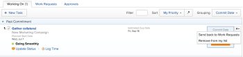

# Remove requests from the Working On list

When work tasks and issues&nbsp;are assigned to you, they are listed on the Work Requests list under the My Work area.

After you click the Work On It button, requests&nbsp;move to your Working On list, as described in the [Manage work and team requests](../../../people-teams-and-groups/work-with-team-requests/manage-work-and-team-requests.md) section of [Manage work and team requests](../../../people-teams-and-groups/work-with-team-requests/manage-work-and-team-requests.md).

If you decide that you should not be working on these requests, you can either send them back to the Work Requests list or remove&nbsp;them from your list.

## Access requirements

You must have the following access to perform the steps in this article:

<table cellspacing="0"> 
 <col> 
 </col> 
 <col> 
 </col> 
 <tbody> 
  <tr> 
   <td role="rowheader">Adobe Workfront plan*</td> 
   <td> 
Any
 </td> 
  </tr> 
  <tr> 
   <td role="rowheader">Adobe Workfront license*</td> 
   <td> 
Work or higher
 </td> 
  </tr> 
 </tbody> 
</table>

&#42;To find out what plan or license type you have, contact your Workfront administrator.

## Remove requests from the Working On list

1. Go to the **My Work** area in your Global Navigation Bar.
1. On the **Working On** list, locate any of the items waiting to be worked on.
1. On the far right of each item, click the drop-down menu in the upper-right corner of the item.  
   

1. Select&nbsp;from the following options:

* **Send back to Work Requests:**&nbsp;Select this option to send a request back to the Work Requests list.   
  The request moves back to the Work Requests list and you remain assigned to the request.  
  You can accept the request at a later time by clicking **Work on It** again.

* **Remove from my list:**Select this option&nbsp;to remove a request from your Working On list.  
  The request is&nbsp;removed from both your Working On and your Work Requests lists. You are unassigned from the&nbsp;request and the&nbsp;request is&nbsp;no longer associated with your name in Adobe Workfront.  
  If the request is not assigned to anyone else or to another team or job role, the request is&nbsp;left unassigned.

