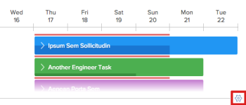
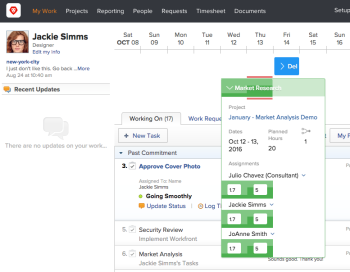
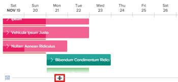
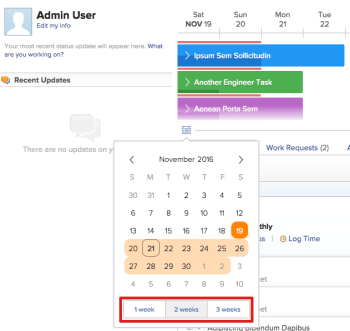
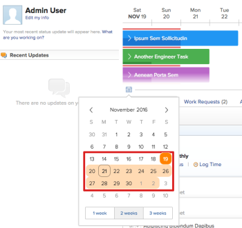
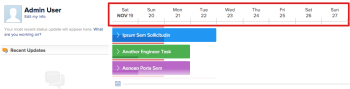

# View assigned work on the My Work calendar

>[!IMPORTANT]
>
>Adobe Workfront Classic is no longer supported. All Adobe Workfront Classic functionality, along with this documentation, will be removed in July 2022. Please transition to the new Workfront experience as soon as possible.

>[!NOTE]
>
>The information on this page refers to the new My Work calendar. Your Adobe Workfront administrator determines whether you have access to the new My Work calendar or the legacy calendar. If you cannot use the My Work calendar as described in this section, contact your Workfront administrator.  
>For information about how the Workfront administrator determines which calendar is displayed, see [Create and manage layout templates](../../../administration-and-setup/customize-workfront/use-layout-templates/create-and-manage-layout-templates.md) in [Create and manage layout templates](../../../administration-and-setup/customize-workfront/use-layout-templates/create-and-manage-layout-templates.md).&nbsp;

A calendar is displayed at the top of the My Work area, enabling you to quickly view all tasks and issues assigned to you that are not yet complete.

## Access requirements

You must have the following access to perform the steps in this article:

<table cellspacing="0"> 
 <col> 
 </col> 
 <col> 
 </col> 
 <tbody> 
  <tr> 
   <td role="rowheader">Adobe Workfront plan*</td> 
   <td> 
Any
 </td> 
  </tr> 
  <tr> 
   <td role="rowheader">Adobe Workfront license*</td> 
   <td> 
Work or higher
 </td> 
  </tr> 
 </tbody> 
</table>

&#42;To find out what plan or license type you have, contact your Workfront administrator.

## Understand how&nbsp;tasks and issues are displayed&nbsp;in the calendar

* Work that is assigned specifically to you is displayed. (This does not include work assigned to a team you are on.)&nbsp;  
  Completed tasks are removed from the calendar.
* By default, a 14-day&nbsp;period (including weekends) is displayed on the calendar, starting with the current day.  
* Task and issue duration is visually represented on the calendar (tasks and issues span the number of days equal to&nbsp;the duration).  
* The project where the task or issue resides is visually represented by color. Each project is assigned a color; any tasks from a single project are displayed in the same color.
* Time off is represented on the calendar with a gray indicator.

## Configure issues to be displayed on the calendar

By default, issues are not displayed on the calendar in the My Work area. To configure issues to be displayed on the calendar in the My Work area:

1. Click the **Settings** icon in the lower-right corner of the calendar in the My Work area.  
   

1. In the Personal Calendar Settings dialog box, in the **Include Issues**&nbsp;section, select **Yes**.

1. Click **Save**.

## Configure completed work to display on the calendar

By default, completed work is not displayed on the calendar in the My Work area. To&nbsp;configure the calendar in the My Work area&nbsp;to display work that has already been marked as Complete:

1. Click the **Settings** icon in the lower-right corner of the calendar in the My Work area.  
   

1. In the Personal Calendar Settings dialog box, in the **Show Completed Work**&nbsp;section, select **Yes**.

1. Click **Save**.

## View task and issue details

You can view details of tasks and issues directly from the calendar in the Working On area:

1. In the calendar, expand the task or issue that contains the&nbsp;details you want to view.  
     
   The following information is displayed:  
   **Project:**&nbsp;The name and link to the project where the task resides.  
   **Dates:** The Start on and Due On dates associated with the task.  
   **Planned Hours:** The number of Planned Hours associated with the task.  
   **Predecessor icon:** Any predecessors associated with the task. (The predecessor icon is displayed only if there are predecessors associated with the task.)  
   **Assignments:** Any user or job role assignments associated with the task. Job role assignments are displayed in parenthesis next to the user assignment.  
   Team assignments are not displayed.  
   If you have Manage access to the task or issue, you can modify the hours for which users are allocated on each day within the task or issue duration. For more information about modifying user allocations, see [Manage user allocations in the Scheduling areas](../../../resource-mgmt/resource-scheduling/manage-allocations-scheduling-areas.md).

## Hide or adjust the size of the calendar view

You can adjust the amount of space the calendar view occupies in the My Work area. Any adjustments you make are visible only to you.

Whether your adjustments are maintained the next time you access the My Work area depends&nbsp;on the method you use to make the adjustment:

* [Adjust the calendar view with drag-and-drop](#adjust-the-calendar-view-with-drag-and-drop) 
* [Hide or adjust the calendar view in the settings area](#hide-or-adjust-the-calendar-view-in-the-settings-area)

### Adjust the calendar view with drag-and-drop {#adjust-the-calendar-view-with-drag-and-drop}

You can quickly adjust the size of the calendar view&nbsp;to a precise size. The size you select is not retained&nbsp;the next time you access the My Work area.

1. Navigate to your My Work area.
1. Drag the border at the bottom of the calendar up or down until the calendar is the desired height.  
   

### Hide or adjust the calendar view in the settings area {#hide-or-adjust-the-calendar-view-in-the-settings-area}

You can hide or adjust the size of the calendar view by making changes in the Settings area. Any adjustments you make to the calendar view from the Settings area are retained the next time you access your My Work area.

1. Navigate to your My Work area.
1. Click the **Settings** icon in the lower-right corner of the calendar.  
   

1. In the Personal Calendar Settings dialog box, in the **Calendar View** section, select from the following options:

   * **Off:** Hides the calendar from the My Work area.
   * **Default:** Maintains the default height of the calendar in the My Work area. (Sufficient height&nbsp;for 3 tasks to be displayed.)
   * **Show More:**&nbsp;The calendar occupies more space in the My Work area. (Sufficient height for 8 tasks to be displayed.)

1. Click **Save**.

## Adjust the dates displayed on the calendar

By default, 14 consecutive days (including weekends) are displayed on the scheduling timeline, beginning with the current day.&nbsp;

Use any&nbsp;of the following options to modify the date range&nbsp;for which data is displayed on the scheduling timeline:

* **Week Options:**&nbsp;Click the Calendar icon, then select the number of weeks to&nbsp;display on the timeline.&nbsp;You can display 1 week (7 days), 2 weeks (14 days), or 3 weeks (21 days).  
    

* **Calendar:** Click the Calendar icon, then click the day prior to or after the current day. The time between the current day and the selected day is the new range.  
    

* **Drag-and-drop of the date range:** Drag the date range at the top of the scheduling timeline.  
  

## Re-assign a work item from the calendar

You must have permissions to make assignments on the task or issue in order to re-assign it.

To re-assign a work item from the calendar in the My Work area:

1. In the calendar, expand the task or issue you want to re-assign.  
   

1. In the **Assignments**&nbsp;area, click the drop-down arrow.
1. Begin typing the name of the user you want to assign, then click the name when it appears in the drop-down list.  
   The task or issue is immediately removed from your calendar.

## Manage user allocations from&nbsp;the calendar

You must have permissions to make assignments on the task or issue in order to manage user allocations for it.

For more detailed information about user allocations, see the [Manage user allocations in the Scheduling areas](../../../resource-mgmt/resource-scheduling/manage-allocations-scheduling-areas.md) section in [Manage user allocations in the Scheduling areas](../../../resource-mgmt/resource-scheduling/manage-allocations-scheduling-areas.md).

* [Enable user allocation indicators on the calendar](#enable-user-allocation-indicators-on-the-calendar) 
* [Modify user allocations for a task or issue](#modify-user-allocations-for-a-task-or-issue)

### Enable user allocation indicators on the calendar {#enable-user-allocation-indicators-on-the-calendar}

By default, user allocations are not displayed in the calendar in the My Work area. To enable user allocation indicators in the calendar in the My Work area:&nbsp;

1. Click the **Settings** icon in the lower-right corner of the calendar in the My Work area.  
   

1. In the Personal Calendar Settings dialog box, in the **Show User Allocations**&nbsp;section, select **Yes**.

1. Click **Save**.

### Modify user allocations for a task or issue {#modify-user-allocations-for-a-task-or-issue}

To make allocations for a task or issue from the calendar in the My Work area:

1. In the calendar in the My Work area, expand the task or issue for which you want to manage user allocations.  
   

1. In the **Assignments**&nbsp;area, click the field for the user whose hours you want to adjust on a given day.  
   The first time&nbsp;you click in a&nbsp;field on a given task or issue, hours are adjusted&nbsp;and are rounded to the nearest half hour. (For example, 1.33 is rounded to 1.5.)

1. Specify the adjusted number of hours.  
   You can specify hours in half-hour increments, such as 1, 1.5, 2, 2.5, and so forth.
1. Click **Save**.  
   For more detailed information about modifying&nbsp;user allocations, see [Manage user allocations in the Scheduling areas](../../../resource-mgmt/resource-scheduling/manage-allocations-scheduling-areas.md).

