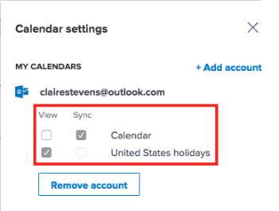

# Configure your Home Calendar view settings

>[!IMPORTANT]
>
>You're currently viewing the Adobe Workfront Classic version of this document. Adobe Workfront Classic is no longer supported. All Adobe Workfront Classic functionality, along with this documentation, will be removed in July 2022. Please transition to the the new Adobe Workfront experienceas soon as possible, and switch to the new Adobe Workfront experience version of this document.

You can configure the Home Calendar settings to do the following:

* Integrate with a web-based version of Outlook in cloud-hosted Office 365 or Outlook Live. You can display all events from your Outlook calendar and any associated calendars you select, such as Birthdays and Holidays calendars, in your Home Calendar.
* Help you track your workload against your available work hours on the Allocation bar.

To learn more about the Home Calendar, see [Home Calendar view](../../../workfront-basics/using-home/using-the-home-area/home-calendar-view.md).

## Access requirements

You must have the following access to perform the steps in this article:

<table cellspacing="0"> 
 <col> 
 </col> 
 <col> 
 </col> 
 <tbody> 
  <tr> 
   <td role="rowheader">Adobe Workfront plan*</td> 
   <td> 
Any
 </td> 
  </tr> 
  <tr> 
   <td role="rowheader">Adobe Workfront license*</td> 
   <td> 
Work or higher
 </td> 
  </tr> 
 </tbody> 
</table>

&#42;To find out what plan or license type you have, contact your Workfront administrator.

## About integrating Microsoft Outlook calendars

Consider the following as you configure your Home Calendar with your Microsoft Outlook calendar:

* You can integrate only a web-based version of Outlook in cloud-hosted Office 365 or Outlook Live.

  On-premises Outlook and Outlook on a cloud-based enterprise Exchange server are not supported.

  If your organization uses single sign-on, you need Microsoft 365 E3 or E5.<![CDATA[    ]]>

* Attachments associated with your Outlook events are not attached to the Outlook events in your Home Calendar. 
* Integration with an Outlook calendar must be completed for each user individually. 
* Events that appear in the Due bar do not appear on your Microsoft calendar unless you have dragged them from the Work List to your Adobe Workfront Calendar. For more information, see [Due bar](../../../workfront-basics/using-home/using-the-home-area/home-calendar-view.md#viewing-the-due-bar)&nbsp;and [Work list on the Home Calendar](../../../workfront-basics/using-home/using-the-home-area/home-calendar-view.md#using-the-left-panel-of-the-home-view) in [Home Calendar view](../../../workfront-basics/using-home/using-the-home-area/home-calendar-view.md).

* When you enable the integration with Outlook, only work items that are dragged onto the Home Calendar from that point forward will sync. Items that were on the Home Calendar prior to enabling the integration will not appear, and you must drag them onto the Home Calendar again if you want them to appear in Outlook.
* When you share (or unshare) an Outlook calendar with other people, or when you change the permission level for a calendar you share with others, this change does not affect their calendars for about 30 minutes (for more information, consult the Microsoft Outlook documentation).  
  Consequently, when you integrate Workfront Calendar with an Outlook calendar that you share with other users, they will not see your Workfront Calendar items for about 30 minutes.

>[!NOTE]
>
>The Outlook calendar configuration is completely separate from the Outlook Add-in (Outlook Integration or Workfront for Outlook). There's no installation required to configure the calendar, but there is an installation needed for the Outlook Add-in. For more information on the Outlook Add-in see [Set up Adobe Workfront for Outlook](../../../workfront-integrations-and-apps/using-workfront-with-outlook/set-up-workfront-for-outlook.md).

## Configure your Home Calendar view settings

1. In the Home Calendar view, click the **Settings** gear icon  in the upper right corner to open the **Calendar settings** panel on the right side of the window.

   If you need information about accessing the Home Calendar view, see [View the Home Calendar](../../../workfront-basics/using-home/using-the-home-area/view-home-calendar.md).

1. (Optional) To integrate your Microsoft Outlook calendar, click **Add account** in the upper-right corner of the **Calendar settings** panel. Then, if you are prompted to do so, enter your Microsoft Outlook login information. You can repeat this step to add multiple Outlook accounts.

   >[!NOTE]
   >
   >You must give Workfront permission to access your Outlook calendar. Granting permission allows Workfront to maintain access to calendar data, read your outlook profile, and read and update your Microsoft calendar.

1. Refresh the browser window to see information from your Outlook account in the calendar and in the Calendar settings panel.
1. Click the **Settings** gear icon again in the upper right corner to open the **Calendar settings** panel.   

1. (Optional) Under each Microsoft account you have added in the previous step, select **View** or **Sync**:

   * **View**: This is a read-only option that displays Microsoft calendar events on your Home Calendar.
   * **Sync**: This option allows a two-way sync between your Microsoft and Home calendars. In other words,&nbsp;Workfront Home Calendar items export to your Microsoft calendar and Microsoft calendar items import to your Workfront Home Calendar in real time.

     

1. (Optional) Under your Workfront account or an integrated account, select the associated calendars you want&nbsp;to view on your Home Calendar (such as your PTO, Birthdays, or Holidays calendar) then click your browser's Refresh or Reload button to see your changes.  

1. (Optional) In the **General** section under **Start Week On**, select the day you want to display&nbsp;&nbsp;as the first day of your&nbsp;work week in the Home Calendar.

1. Configure&nbsp;the following options:

   * **My Work Days:**&nbsp;Select the days you work.
   * **My Usual Start Time:**&nbsp;Select the time you start your work day.
   * **My Usual End Time:**&nbsp;Select the time you end your work day.

   Workfront uses these three settings to calculate the number of hours you work in a week. This number affects the Allocation bar, which helps you track your workload against your available work hours.&nbsp;For more information, see [Allocation bar](../../../workfront-basics/using-home/using-the-home-area/home-calendar-view.md#understanding-the-allocation-of-time) in&nbsp;the article [Home Calendar view](../../../workfront-basics/using-home/using-the-home-area/home-calendar-view.md).

1. Click outside the **Calendar settings** area to dismiss it.

   Workfront saves your changes automatically.

For information about using the Calendar view to manage your&nbsp;work assignments and integrated calendar events, see [Use the Home Calendar view](../../../workfront-basics/using-home/using-the-home-area/use-home-calendar-view.md). 

<!--
<MadCap:conditionalText data-mc-conditions="QuicksilverOrClassic.Draft mode">
(NOTE: from&nbsp;Courtney: [step #] Type your weekly work hours under How many hours a week do you work?This number affects the Allocation bar, which helps you track your workload against your available work hours.&nbsp;For more information, see "Allocation Bar" in the article&nbsp;"Understanding the Home Calendar View.")
</MadCap:conditionalText>
-->

