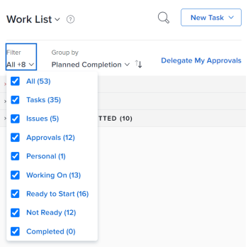
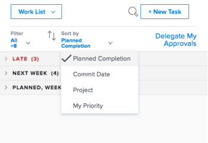
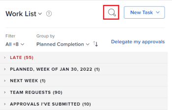
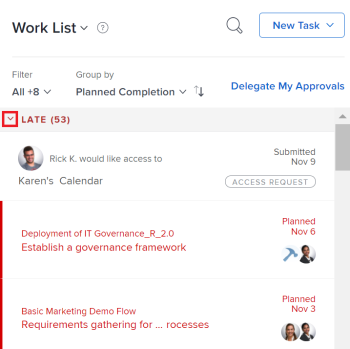

# Display items in the Work List in the Home area

>[!IMPORTANT]
>
>You're currently viewing the Adobe Workfront Classic version of this document. Adobe Workfront Classic is no longer supported. All Adobe Workfront Classic functionality, along with this documentation, will be removed in July 2022. Please transition to the the new Adobe Workfront experienceas soon as possible, and switch to the new Adobe Workfront experience version of this document.

The Work List in the Home area displays all work items that are assigned to you. You can control which items display in the Work List as described below.

## Access requirements

You must have the following access to perform the steps in this article:

<table cellspacing="0"> 
 <col> 
 </col> 
 <col> 
 </col> 
 <tbody> 
  <tr> 
   <td role="rowheader">Adobe Workfront plan*</td> 
   <td> 
Any
 </td> 
  </tr> 
  <tr> 
   <td role="rowheader">Adobe Workfront license*</td> 
   <td> 
Work or higher
 </td> 
  </tr> 
  <tr> 
   <td role="rowheader">Access level configurations*</td> 
   <td> 
View or higher access to Projects,&nbsp;Tasks, Issues, and Documents
 
Note: If you still don't have access, ask your Workfront administrator if they set additional restrictions in your access level. For information on how a Workfront administrator can modify your access level, see <a href="../../../administration-and-setup/add-users/configure-and-grant-access/create-modify-access-levels.md" class="MCXref xref">Create or modify custom access levels</a>.
 </td> 
  </tr> 
  <tr> 
   <td role="rowheader">Object permissions</td> 
   <td> 
Contribute permissions or higher to the tasks and issues you need to work on
 
For information on requesting additional access, see <a href="../../../workfront-basics/grant-and-request-access-to-objects/request-access.md" class="MCXref xref">Request access to objects </a>.
 </td> 
  </tr> 
 </tbody> 
</table>

&#42;To find out what plan, license type, or access you have, contact your Workfront administrator.

## Filter the Work List {#filter-the-work-list}

You can filter items in the Work List to see only specific types of items. For example, you can filter the work list to display only issues or requests.

>[!NOTE]
>
>The filter options are stored in the browser. If you consistently use the same browser on the same computer (and do not clear the site data) the selected filters do not change. If you switch browsers or computers then the filters revert to the default option which is with all filters deselected.

1. Click **Home** in the Global Navigation Bar.

   For information about accessing the Home area if it is not visible to you, see [Try the Home area](../../../workfront-basics/using-home/using-the-home-area/try-home-area.md).

1. Click the **Filter** drop-down menu. 
1. Select from the following filter options to specify the types of items you want to display:

   <!--
   
(NOTE: this and the following step are also repeated in the following article: /Content/Workfront basics/Using Home/Using the Home Area/display-items-in-home-work-list.html) 

   -->

   <table cellspacing="0"> 
    <col> 
    <col> 
    <tbody> 
     <tr> 
      <td role="rowheader">All</td> 
      <td>Displays and selects all items. This includes tasks, requests, issues, approvals, and personal tasks. </td> 
     </tr> 
     <tr> 
      <td role="rowheader">Tasks</td> 
      <td>Displays only tasks.</td> 
     </tr> 
     <tr> 
      <td role="rowheader">Issues</td> 
      <td>Displays only issues you are currently working . The <strong>Issue</strong> icon is displayed next to each issue in the Work List.</td> 
     </tr> 
     <tr> 
      <td role="rowheader">Approvals</td> 
      <td> 
Displays only approvals assigned or delegated to you and approvals you have submitted. Approvals include approvals on work items (projects, tasks, and issues), and approvals for documents, proofs, requests for access, and timesheets. For more information about approvals, see the following articles: 
 
       <ul> 
        <li><a href="../../../review-and-approve-work/manage-approvals/view-approvals.md" class="MCXref xref">View approvals </a> </li> 
        <li><a href="../../../review-and-approve-work/manage-approvals/manage-approvals.md" class="MCXref xref">Manage approvals</a> </li> 
       </ul> </td> 
     </tr> 
     <tr> 
      <td role="rowheader">Personal</td> 
      <td>Displays only personal tasks. These are tasks that you create as a To Do task, as described in the section <a href="../../../workfront-basics/using-home/using-the-home-area/create-work-items-in-home.md#creating-a-personal-task" class="MCXref xref">Create a personal task</a> in the article <a href="../../../workfront-basics/using-home/using-the-home-area/create-work-items-in-home.md" class="MCXref xref">Create work items from the Home area</a>.</td> 
     </tr> 
     <tr> 
      <td role="rowheader">Working On</td> 
      <td>Only tasks and issues you are currently working on are displayed.</td> 
     </tr> 
     <tr> 
      <td role="rowheader">Ready to Start</td> 
      <td> 
Displays only tasks and issues that are ready to start. Both of the following statements must be true:
 
       <ul> 
        <li> 
The Planned Start Date of the tasks or issues is in the past or up to two weeks in the future.
 </li> 
        <li> 
The tasks and their parents have no predecessors or task constraints preventing them from being worked on.
 </li> 
       </ul> </td> 
     </tr> 
     <tr> 
      <td role="rowheader">Not Ready</td> 
      <td> 
 Displays only tasks and issues that are not yet ready to start. Either one of the following statements must be true:
 
       <ul> 
        <li> 
The tasks and their parents might have predecessors or task constraints that prevent them from being worked on.
 </li> 
       </ul> 
       <ul> 
        <li> 
The tasks or issues have a Planned Start Date that is more than two weeks in the future.
 </li> 
       </ul> </td> 
     </tr> 
     <tr> 
      <td role="rowheader">Completed</td> 
      <td> 
Displays only completed tasks, issues, and personal tasks. Completed work displays for the previous two weeks and it is grouped in the Work List according to the week in which they were completed. Approvals are not included.
 
Completed work is hidden in the Work List unless you select this filter.
 </td> 
     </tr> 
    </tbody> 
   </table>

   

   >[!TIP]
   >
   >* Some options are based on objects (Tasks, Issues, Approvals, and Personal tasks), and others are based on the state of the work items (Working On, Ready to Start, Not Ready, and Completed). If no state is selected, all selected objects of any state display. 
   >* Similarly, if no object is selected, all objects of any selected states display. If you select an object that is not in the selected state (for example, Approvals cannot be in a Ready to Start or Working On state), then nothing displays.  

   >* Note that open items in Team Requests and Approvals I've Submitted always display.

1. (Optional) Further organize the Work List, as described in the section [Group and sort by Date, Project, and Priority](#group-and-sort-by-date-project-and-priority) in this article.

## Group and sort by Date, Project, and Priority {#group-and-sort-by-date-project-and-priority}

You can group and sort the Work List by Planned Completion Date, Commit Date, Project, or My Priority. The option you choose determines how items are grouped in the Work List.

1. Click **Home** in the Global Navigation Bar.

   For information about accessing the Home area if it is not visible to you, see [Try the Home area](../../../workfront-basics/using-home/using-the-home-area/try-home-area.md).

1. Click the **Sort by** drop-down menu.   
   

1. Select from the following options:

   <table cellspacing="0"> 
    <col> 
    <col> 
    <tbody> 
     <tr> 
      <td role="rowheader">Planned Completion</td> 
      <td> 
 Items display in the following groupings in the Work List, depending on their Planned Completion Date (the number of items contained within each grouping displays in parenthesis next to the heading title):
 
       <ul> 
       <li> 
Late
 </li> 
       <li> 
No Planned Completion Date
 </li> 
       <li> 
This Week
 </li> 
       <li> 
This grouping is expanded by default.
 </li> 
       <li> 
Next Week
 </li> 
       <li> 
Planned, followed by various Planned Completion Dates (multiple groupings)
 </li> 
       <li> 
Complete
 </li> 
       </ul> </td> 
     </tr> 
     <tr> 
      <td role="rowheader">Commit Date</td> 
      <td> 
Items display in the following groupings in the Work List (the number of items contained within each grouping displays in parenthesis next to the heading title): 
 
       <ul> 
        <li> 
No Commit Date
 </li> 
        <li> 
Committed Next Week
 </li> 
       </ul> </td> 
     </tr> 
     <tr> 
      <td role="rowheader">Project</td> 
      <td>Items are grouped according to project, and projects appear alphabetically in the Work List.&nbsp;(The number of items contained within each grouping displays in parenthesis next to the heading title.)</td> 
     </tr> 
     <tr> 
      <td role="rowheader">My Priority</td> 
      <td>Items display&nbsp;in an order you choose. For more information, see <a href="../../../workfront-basics/using-home/using-the-home-area/prioritize-work-in-home.md" class="MCXref xref">Prioritize work in the Home area</a>.</td> 
     </tr> 
    </tbody> 
   </table>

>[!NOTE]
>
>The default sorting is descending. If you change the sorting to ascending, the selected sorting options are stored in the browser. If you consistently use the same browser on the same computer (and do not clear the site data) the sorting does not change, but if you switch browsers or computers then the sorting changes to the default sorting.

## View late items

Adobe Workfront uses the following dates to determine if work requests are late:

* **Tasks**: Planned Completion Date
* **Issues**: Planned Completion Date
* **Documents**: Submitted date
* **Timesheets**: Submitted date
* **Approvals**: Submitted date
* **Proof approvals**: Proof deadline

## Search the Work List&nbsp;

When you search the Work List, any items assigned to you are returned in the search (even items that are not currently loaded on the screen). If the Show complete option is selected, any items you marked complete within the past two weeks are also returned.

In addition, only the names of the work items are searched (information within the work item are not searched, neither are the names of the projects where the work item resides).

To search the Work List:

1. Click **Home** in the Global Navigation Bar.

   For information about accessing the Home area if it is not visible to you, see [Try the Home area](../../../workfront-basics/using-home/using-the-home-area/try-home-area.md).

1. (Optional) Filter the Work List, as described in [Filter the Work List](#filter-the-work-list) and [Group and sort by Date, Project, and Priority](#group-and-sort-by-date-project-and-priority).

1. (Optional) If you are searching for a work item that is already complete, you must configure the Work List to display completed items before searching.
1. Click the **Search** icon at the top of the Work List.   
   

1. Begin typing the name of the item name you are searching for.   
   The Work List is automatically filtered as to include items with a matching name.

## Change the size of the Work List

You can change the size of the Work List so that it consumes anywhere between about a quarter of the Home area to about half of the Home area.

1. Click **Home** in the Global Navigation Bar.

   For information about accessing the Home area if it is not visible to you, see [Try the Home area](../../../workfront-basics/using-home/using-the-home-area/try-home-area.md).

1. Mouse over the right edge of the Work List, then drag left or right until the Work List is the desired size.

## Collapse and expand groupings

Items in the Work List are displayed within groupings. You can collapse and expand groupings to control how much information is displayed on the page at a given time.&nbsp;

You can collapse and expand groupings within the Work List to better control what information is visible.  
By default, the This Week grouping is expanded and all other groupings are collapsed.&nbsp;Any changes you make are remembered the next time you access the Home area.&nbsp;

1. Click **Home** in the Global Navigation Bar.

   For information about accessing the Home area if it is not visible to you, see [Try the Home area](../../../workfront-basics/using-home/using-the-home-area/try-home-area.md).

1. Click the **Expand** or **Collapse** arrow next to any grouping you want to expand or collapse.

   <!--
    
   -->

   

