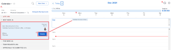
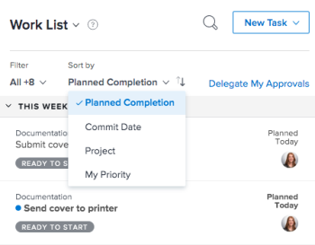
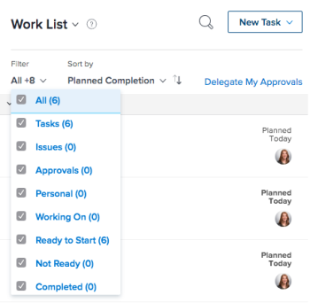
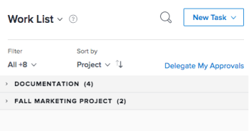
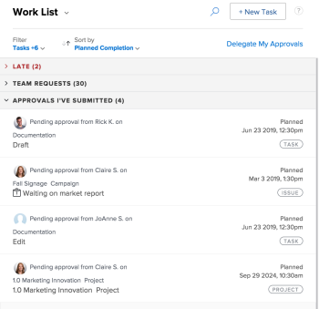
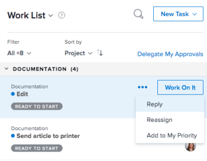

# Get started with Home

There are two ways to view your work in the Home area, either from the Work List or the Calendar.

## Work List

The Work List allows you to view all of your assigned work in one place:

A. Use the left panel to filter, sort, and select work assigned to you.

B. After selecting a work item in the left panel, use the right panel to interact with custom fields, make updates, and log time.

For more information on using the Home Work List, see the following articles:

* [Display items in the Work List in the Home area](../../../workfront-basics/using-home/using-the-home-area/display-items-in-home-work-list.md) 
* [Create work items from the Home area](../../../workfront-basics/using-home/using-the-home-area/create-work-items-in-home.md)

## Calendar

The Calendar allows you to visualize your work by displaying when work items are due and allowing you to block out time to complete them:

A. Use the Calendar view to create a visual map of the work you need to complete. Simply click and drag work items from the Work List on to the Calendar to block out time to work.

B. Use the Calendar's sync option to sync with your Outlook calendar. Manage meetings and work all in one place.

C. Use the Details button to open a new right panel where you can view more information about the work item.

D. Use the due bar to keep track of when work assigned to you is due.

For more information on how to use the Home Calendar, see [Use the Home Calendar view](../../../workfront-basics/using-home/using-the-home-area/use-home-calendar-view.md).

## Find your work

The Home area is your one-stop shop to find tasks, issues, and approvals assigned to you. The filter and sort options built into the Home area work together to support you in working the way you want.&nbsp;You can use the Sort by option to group items together and then use the Filter to focus in on work that needs to be completed.

>[!NOTE]
>
>The filter and sort options are stored in the browser. If you consistently use the same browser on the same computer (and do not clear the site data) the filters and sorting will not change, but if you switch browsers or computers then the filters and sorting will be different.<![CDATA[   ]]>

###  Group similar work items together with the Sort By option

The Sort by option allows you to group like items in the Work List. You can sort by:

* Planned Completion 
* Commit Date
* Project
* My Priority

For more information on how to use groupings, see [Display items in the Work List in the Home area](../../../workfront-basics/using-home/using-the-home-area/display-items-in-home-work-list.md).

  

### Narrow your focus with filters

The Work List Filter allows you to narrow your focus to specific work items.

The following are examples of how you can filter items you see in Home :&nbsp;

* Filter based solely on work item type or state:

   * **Type**: Tasks, Issues, Approvals, or Personal tasks
   * **State**: Working On, Ready to Start, Not Ready, or Completed

* Filter using type and state together.

  For example, you can select Tasks and Ready to Start to find all of the tasks in your work list that are ready for work.

For more information on how to use filters, see&nbsp; [Display items in the Work List in the Home area](../../../workfront-basics/using-home/using-the-home-area/display-items-in-home-work-list.md).

### Access work assigned to your team

The Home area has a permanent grouping dedicated to team requests with a direct link to the team's request page. Use this grouping to view and access requests for any of the teams you're on.

>[!NOTE]
>
>The Filter and Sort by options do not affect the Team Requests grouping. This grouping is visible as long as you have work assigned to your team.

For more information on accessing team requests, see the article [Manage work and team requests in the Home area](../../../workfront-basics/using-home/using-the-home-area/manage-work-and-team-requests-home.md).

  

### Monitor work that you submitted

Keep track of work that you submitted for approval directly from Work List. You can remind the approver about the work that needs approval. You can also recall the approval if needed.

>[!NOTE]
>
>The Filter and Sort by options do not affect the Approvals I've Submitted grouping. This grouping is visible as long as you have work waiting for approval.

For more information on how to keep track of work you've submitted, see [Managing Approvals.](https://support.workfront.com/hc/en-us/sections/203948437-Managing-Approvals)  
 

## Prioritize what's important to you

The Work List allows you to surface and prioritize work that is important to you with the My Priority Sort by option. You can add up to 20 items to your My Priority list. Use the More menu to add work items to your priority list.&nbsp;

>[!NOTE]
>
>Any work items added to My Priority are visible only to you, and no one can prioritize work for you.

For more information on how to use My Priority, see [Prioritize work in the Home Area](../../../workfront-basics/using-home/using-the-home-area/prioritize-work-in-home.md).

  

## Get it done

Use the right panel in Home to update and complete your work.

### Work in a space customized for you

Your Adobe Workfront administrator can add up to 16 custom fields to make it easier to find and update the information you need. Most of the fields are editable, so you don't have to navigate to into the work item.

To update any of the fields in this area, simply click on the field.

>[!NOTE]
>
>You can't update the Commit Date in this area.

### Update coworkers with important information

Communicate quickly and efficiently with coworkers from the Home area. You ask coworkers questions, notify them of recent updates, or reply to direct comments. In addition, you can update others on the progress you're making by:

* Updating the Commit Date

  <!--
  <note type="note">
  This is the only place you can update the Commit Date in Home.
   
  </note>
  -->

* Reporting on how you feel things are going
* Updating the percent complete bar

For more information on communicating in the Home area, see [Update work](../../../workfront-basics/updating-work-items-and-viewing-updates/update-work.md).

### Log your time

Keep track of the hours you've worked on individual work items. You can choose a general hour type, such as Task Time, or you can choose a project-specific hour type set up by your Workfront administrator.

For more information on how to log time in the Home area, see the section [Home](../../../timesheets/create-and-manage-timesheets/log-time.md#home) in the article [Log time](../../../timesheets/create-and-manage-timesheets/log-time.md).  

