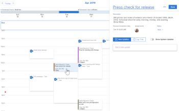
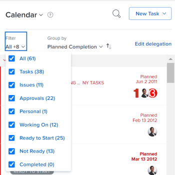
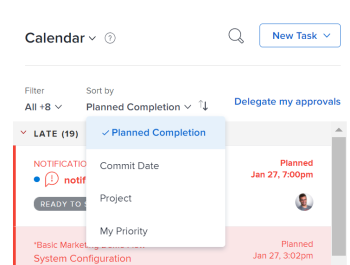
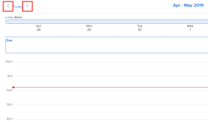

# Use the Home Calendar view

>[!IMPORTANT]
>
>You're currently viewing the Adobe Workfront Classic version of this document. Adobe Workfront Classic is no longer supported. All Adobe Workfront Classic functionality, along with this documentation, will be removed in July 2022. Please transition to the the new Adobe Workfront experienceas soon as possible, and switch to the new Adobe Workfront experience version of this document.

You can use the Calendar view in the Home area to manage your work day and work assignments. Only you can view and manage your Home Calendar.

>[!NOTE]
>
>The Calendar view in the Home area is different from a Adobe Workfront Calendar report, which is a&nbsp;dynamic report that provides a visual representation of your work. For information about the Workfront Calendar report, see [Calendar reports overview](../../../reports-and-dashboards/reports/calendars/calendar-reports-overview.md).
>
>  <!--
>  <li data-mc-conditions="QuicksilverOrClassic.Draft mode">Due to a temporary problem, your Workfront Calendar data might not display as described in this article. This problem will be fixed in the near future.&nbsp;(NOTE: From&nbsp;Alina: Spoke with Lisa and Court and they agreed to draft or delete this. Court could not remember what this was referring to and Lisa did not add this note. Lisa might update this if she hears from the team that this is still accurate.)</li>>
>  -->

## Access requirements

You must have the following access to perform the steps in this article:

<table> 
 <col> 
 </col> 
 <col> 
 </col> 
 <tbody> 
  <tr> 
   <td role="rowheader">Adobe Workfront plan*</td> 
   <td> 
Any
 </td> 
  </tr> 
  <tr> 
   <td role="rowheader">Adobe Workfront license*</td> 
   <td> 
Work or higher
 </td> 
  </tr> 
  <tr> 
   <td role="rowheader">Access level configurations*</td> 
   <td> 
Edit access to Tasks and Issues
 
Note: If you still don't have access, ask your Workfront administrator if they set additional restrictions in your access level. For information on how a Workfront administrator can modify your access level, see <a href="../../../administration-and-setup/add-users/configure-and-grant-access/create-modify-access-levels.md" class="MCXref xref">Create or modify custom access levels</a>.
 </td> 
  </tr> 
  <tr> 
   <td role="rowheader">Object permissions</td> 
   <td> 
Contribute permissions or higher to the tasks and issues you want to add to the calendar
 
For information on requesting additional access, see <a href="../../../workfront-basics/grant-and-request-access-to-objects/request-access.md" class="MCXref xref">Request access to objects </a>.
 </td> 
  </tr> 
 </tbody> 
</table>

&#42;To find out what plan, license type, or access you have, contact your Workfront administrator.

## Schedule work items in your Home Calendar

You can use the Home Calendar to schedule work items for your week.

>[!NOTE]
>
>&nbsp;Placing a&nbsp;work item on your Home Calendar does not change the existing dates associated with the work item.

To add a Workfront work item to your calendar:

1. Go to the Home Calendar view, as explained in [View the Home Calendar](../../../workfront-basics/using-home/using-the-home-area/view-home-calendar.md).

   All the work items assigned to you or your groups, teams, or job roles display in the left panel. You can sort the list and filter it to display only certain items.

   For more information, see [Filter and sort work items](#filter-and-sort-work-items)&nbsp;later in this article.

1. From the left panel, drag the work item to the day and time when you want to work on it.

   If you schedule yourself to work on an item after its planned completion date or for more time than the number of hours it's planned for, the work item displays in red and a warning appears.

   To learn about work item due dates and how they affect allocated time in the Home Calendar, see&nbsp; [Home Calendar view](../../../workfront-basics/using-home/using-the-home-area/home-calendar-view.md).

1. Do any of the following:

   * **To schedule a work item for multiple days:** Repeat step 2 to add the item to each day and time when you want to work on it.
   * **To modify the duration of a calendar item:**&nbsp;Hover over the bottom edge of the item until the cursor becomes a double arrow, then drag the bottom edge to the ending time you want.
   * **To delete a calendar item:** Hover over the item, then click the trashcan icon that is displayed.

## Update a work item on your Home Calendar

You&nbsp;can make updates to work items that display in Home Calendar view. Your updates also appear on the Updates tab of the actual work item.

1. Go to the Home Calendar view, as explained in [View the Home Calendar](../../../workfront-basics/using-home/using-the-home-area/view-home-calendar.md).  

1. Open the Details panel for the work item you want to update:

   * From the left panel: Select the work item,&nbsp;then click **Details**.
   * From the calendar: Click the scheduled calendar event.

   Details for the work item display in a panel that appears on the right of the window.

   

1. Do any of the following to update the work item:

   * In the&nbsp;**Start a new update**&nbsp;box, type your update, specify any of the following information, then click **Update**.

     <table>
      <col>
      <col>
      <tbody>
       <tr>
        <td role="rowheader">Notify</td>
        <td>
 Tag users you want to notify about your update. For more information, see <a href="../../../workfront-basics/updating-work-items-and-viewing-updates/tag-others-on-updates.md" class="MCXref xref">Tag others on updates</a>.

&nbsp;
</td>
       </tr>
       <tr data-mc-conditions="">
        <td role="rowheader">Commit Date</td>
        <td>In the drop-down calendar, select the date when you are committing to complete the work item. For information about setting the Commit Date, see <a href="../../../manage-work/projects/updating-work-in-a-project/overview-of-commit-dates.md" class="MCXref xref">Commit Date overview</a>.</td>
       </tr>
       <tr data-mc-conditions="">
        <td role="rowheader">How's this going?</td>
        <td>Select a new condition for the task or issue. For information about task and issue conditions, see <a href="../../../manage-work/projects/updating-work-in-a-project/update-condition-for-tasks-and-issues.md" class="MCXref xref">Update Condition for tasks and issues</a>.</td>
       </tr>
       <tr>
        <td role="rowheader">Private to my company</td>
        <td>Disable to prevent users outside your company from being able to view this update.</td>
       </tr>
      </tbody>
     </table>

   * Click the current **Status** for the item, then click a new status in the list that appears. For more information, see [Approval process overview](../../../review-and-approve-work/manage-approvals/approval-process-in-workfront.md).

     >[!NOTE]
     >
     >If you mark a work item assigned to you as Complete - Pending Approval, you may notice that it no longer appears on your calendar. This is because no further action is expected of you until the user who is set to approve the item marks it as Approved. When this occurs, you will be able to see the item on your calendar as an Approved item.

   * (Optional) To reply to an existing comment or update, click **Reply**, specify any recipients in the **Notify** box, type your reply, then click **Reply**.  
     If you need information about specifying recipients, see [Tag others on updates](../../../workfront-basics/updating-work-items-and-viewing-updates/tag-others-on-updates.md).

1. (Optional) To close the **Details** panel, click anywhere outside it.

## Update events from integrated calendars

To update the integrated calendar events in your Home Calendar:

1. Go to the Home Calendar view, as explained in [View the Home Calendar](../../../workfront-basics/using-home/using-the-home-area/view-home-calendar.md).
1. Click **Refresh Calendars** in the upper right corner of the Home Calendar.

   Integrated calendar events update automatically when you open your Home Calendar view or when you refresh your Home Calendar.

## Filter and sort work items  {#filter-and-sort-work-items}

1. Go to the Home Calendar view, as explained in [View the Home Calendar](../../../workfront-basics/using-home/using-the-home-area/view-home-calendar.md).
1. Click the **Filter** drop-down menu.

   >[!NOTE]
   >
   >Some filter options are based on objects (Tasks, Requests, Issues, Approvals, Proofs, and Personal), and others are based on state (Working On, Ready to Start, Not Ready, and Completed). If no state is selected, the Home Calendar displays all selected objects of any state. Similarly, if no object is selected, it displays all objects of any selected state.

1. Select from the following filter options to specify the types of items you want to display:

   <!--
   
(NOTE: this and the following step are also repeated in this article: /Content/Workfront basics/Using Home/Using the Home Area/display-items-in-home-work-list.html)

   -->

   <table> 
    <col> 
    <col> 
    <tbody> 
     <tr> 
      <td role="rowheader">All</td> 
      <td>All item types (Tasks, Requests, Issues, Approvals, and Personal tasks).</td> 
     </tr> 
     <tr> 
      <td role="rowheader">Tasks</td> 
      <td>Tasks you are assigned to.</td> 
     </tr> 
     <tr> 
      <td role="rowheader">Issues</td> 
      <td>Issues you are currently working on.&nbsp;The <strong>Issue</strong> icon appears next to each issue in the Work List. </td> 
     </tr> 
     <tr> 
      <td role="rowheader">Approvals</td> 
      <td> 
Work items that require your approval.
 
For more detailed information about managing approvals in Workfront, see <a href="../../../review-and-approve-work/manage-approvals/manage-approvals.md" class="MCXref xref">Manage approvals</a> 
 </td> 
     </tr> 
     <tr> 
      <td role="rowheader">Personal</td> 
      <td>Tasks that you create as a To Do task, as described in <a href="../../../workfront-basics/using-home/using-the-home-area/create-work-items-in-home.md#creating-a-personal-task" class="MCXref xref">Create a personal task</a> in <a href="../../../workfront-basics/using-home/using-the-home-area/create-work-items-in-home.md" class="MCXref xref">Create work items from the Home area</a>.</td> 
     </tr> 
     <tr> 
      <td role="rowheader">Working On</td> 
      <td>Tasks and issues you are currently working on.</td> 
     </tr> 
     <tr> 
      <td role="rowheader">Ready to Start</td> 
      <td>Items marked as ready to start. These have no predecessors or task constraints preventing them from being worked on. The Start Date is in the past or is the current date.</td> 
     </tr> 
     <tr> 
      <td role="rowheader">Not Ready</td> 
      <td>Requests that are not yet ready to start. These might have predecessors or task constraints that prevent them from being worked on, or the Start Date might be in the future.</td> 
     </tr> 
     <tr> 
      <td role="rowheader">Completed</td> 
      <td>Work you have completed.</td> 
     </tr> 
    </tbody> 
   </table>

   

   &nbsp;

1. To group and sort your list of work, click the **Sort by** drop-down menu, then select the criteria you want to use.

   The items are listed on the left side of the calendar according to the criteria and in the order that you specify.   
   

   Choose from the following options:

   | Planned Completion |Tasks and issues sort in order of the Planned Completion dates. To learn more about Planned Completion dates, see [Planned Hours overview](../../../manage-work/tasks/task-information/planned-hours.md). |
   |---|---|
   | Commit Date |Tasks and issues sort in order of the Commit dates. To learn more about Commit dates, see [Commit Date overview](../../../manage-work/projects/updating-work-in-a-project/overview-of-commit-dates.md). |
   | Project |Work items sort by project. |
   | My Priority |Items display&nbsp;in an order you choose. For more information, see [Prioritize work in the Home area](../../../workfront-basics/using-home/using-the-home-area/prioritize-work-in-home.md). |

## Navigate to a different week

1. Go to your Home Calendar view, as explained in&nbsp; [View the Home Calendar](../../../workfront-basics/using-home/using-the-home-area/view-home-calendar.md).
1. On the **Calendar toolbar**, click the left arrow of the date indicator to move the calendar view back one week or the right arrow to move forward one week.

   

   You can click **Today** to return to the current week.

## Specify which calendars you view

You can specify which integrated calendars, such as your PTO, Birthdays, or Holidays calendar, you want to view on your Home Calendar. For instructions, see [Configure your Home Calendar view settings](../../../workfront-basics/using-home/using-the-home-area/configure-home-calendar-view.md).
