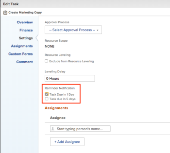

# Attach a reminder notification to an object

>[!IMPORTANT]
>
>You're currently viewing the Adobe Workfront Classic version of this document. Adobe Workfront Classic is no longer supported. All Adobe Workfront Classic functionality, along with this documentation, will be removed in July 2022. Please transition to the the new Adobe Workfront experienceas soon as possible, and switch to the new Adobe Workfront experience version of this document.

Reminder notifications can be associated with several different object types: Projects, Tasks, Issues, Timesheets, Templates, Template Tasks, and Recurring Timesheet Profiles.

Before you can attach reminder notifications to an object, an Adobe Workfront administrator must create the notification, as described in&nbsp; [Set up reminder notifications](../../administration-and-setup/manage-workfront/emails/set-up-reminder-notifications.md).&nbsp;

The steps to attach a reminder ```notifications```&nbsp;are the same, regardless of the object type that you are attaching them to.

## Access requirements

You must have the following access to perform the steps in this article:

<table cellspacing="0"> 
 <col> 
 </col> 
 <col> 
 </col> 
 <tbody> 
  <tr> 
   <td role="rowheader">Adobe Workfront plan*</td> 
   <td> <p>Any</p> </td> 
  </tr> 
  <tr> 
   <td role="rowheader">Adobe Workfront license*</td> 
   <td> <p>Work </p> </td> 
  </tr> 
  <tr> 
   <td role="rowheader">Access level configurations*</td> 
   <td> <p>Worker or higher</p> <p>Note: If you still don't have access, ask your Workfront administrator if they set additional restrictions in your access level. For information on how a Workfront administrator can modify your access level, see <a href="../../administration-and-setup/add-users/configure-and-grant-access/create-modify-access-levels.md" class="MCXref xref">Create or modify custom access levels</a>.</p> </td> 
  </tr> 
  <tr> 
   <td role="rowheader">Object permissions</td> 
   <td> <p>Manage access to the object</p> <p>For information on requesting additional access, see <a href="../../workfront-basics/grant-and-request-access-to-objects/request-access.md" class="MCXref xref">Request access to objects </a>.</p> </td> 
  </tr> 
 </tbody> 
</table>

&#42;To find out what plan, license type, or access you have, contact your Workfront administrator.

## Attach reminder notifications to an object

1. Go to the object where you want to attach the reminder notification.
1. Click the Edit option near the upper-right corner of Workfront.

   The name of this option reflects the type of object you are viewing. For example, if it's a task, the option name is **Edit Task**.

1. In the left panel of the **Edit** box that appears, click **Settings**.

1. Under **Reminder Notification**, select the notifications that you want to attach to the object.

   In this example, the object being edited is a task:

   

   If the Workfront administrator has created multiple reminder notifications, you can attach multiple notifications to a single object.

1. Click **Save Changes**.

   If you need help testing the delivery of a reminder notification, see your Workfront administrator.

