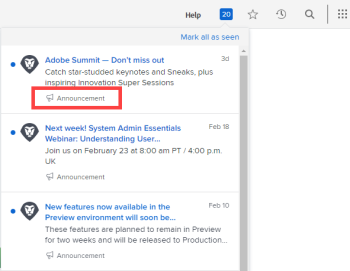
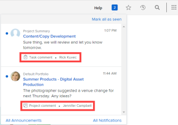

# In-app notifications overview

>[!IMPORTANT]
>
>You're currently viewing the Adobe Workfront Classic version of this document. Adobe Workfront Classic is no longer supported. All Adobe Workfront Classic functionality, along with this documentation, will be removed in July 2022. Please transition to the the new Adobe Workfront experienceas soon as possible, and switch to the new Adobe Workfront experience version of this document.

This article lists the in-app notifications you can receive. In-app notifications keep you informed about two types of information: announcement notifications and work item notifications. They are available from both the web application and the mobile application.

For instructions on how to view and manage these notifications, see [View and manage in-app notifications](../../workfront-basics/using-notifications/view-and-manage-in-app-notifications.md).

* [Announcement notifications](#announcement-notifications) 
* [Work item notifications](#work-item-notifications)

## Announcement notifications {#announcement-notifications}

Announcements come in one of two ways:

* Workfront sends a message to the Announcement page of your organization's Workfront administrators  
* A Workfront administrator sends a message to users from the Announcement page

In both cases, when the administrator or user clicks the numbered icon  in the upper-right corner of Workfront to open their list of notifications, the subject line of the message displays with a megaphone icon  and the word "Announcement."

For information about the Announcements page, see [View and manage in-app notifications](../../workfront-basics/using-notifications/view-and-manage-in-app-notifications.md).

## Work item notifications {#work-item-notifications}

When you click the numbered icon  in the upper-right corner of Workfront to open your list of notifications, the subject line of the work item message displays with an icon and brief description to identify what it's about. The icon and description types are listed below.

>[!NOTE]
>
>In-app notifications for work activities&nbsp;are not tied to email notifications in Workfront. For more information, see [Adobe Workfront notifications](../../workfront-basics/using-notifications/wf-notifications.md).

* [Approvals](#approvals) 
* [Requests](#requests) 
* [Assignments](#assignments) 
* [Comments](#comments) 
* [Updates](#updates) 
* [Date changes](#date-changes) 
* [Share](#share) 
* [Other](#other)

### Approvals

* 

  Project needs your approval - [sender's name] 
*  Task needs your approval - [sender's name]
*  Issue needs your approval - [sender's name]
* 

  Document needs your approval - [sender's name]
* 

  Proof needs your approval - [sender's name]
*  Timesheet needs your approval - [sender's name]

  <!--
  <li data-mc-conditions="QuicksilverOrClassic.Draft mode,QuicksilverOrClassic.Quicksilver">  You need to approve a portfolio</li>
  -->

* [Object name] needs your access approval - [sender's name]

  The object could be a   project,  task,  issue,   document, report, dashboard,  portfolio,  program, or calendar.

*  Timesheet approved - [approver's name]
*  Timesheet rejected - [approver's name]
*  Timesheet reopened - [opener's name]
*  Timesheet comment - [commenter's name]
* 

  Document approval completed - [sender's name]
* 

  Document approved - [sender's name]
* 

  Document approved with changes - [sender's name]
* 

  Document rejected - [sender's name]
* 

  Document approval request cancelled - [sender's name]

### Requests

* 

  [user icon] Asked you to upload a document - [requester's name]
* 

  Document upload request fulfilled - [fulfiller's name]
*  Request comment - Sender name
* 

  Document upload request canceled - [sender's name]
* [Object name] access requested - [sender's name]

  The object could be a   project,  task,  issue,   document, report, dashboard,  portfolio,  program, or calendar.

### Assignments

*  Task assigned to you - [assigner's name]
*  Issue assigned to you - [assigner's name]
*  Issue assigned to [team name] - [assigner's name]
*  Task assigned to [team name] - [assigner's name]
   * Assignment notifications are sent only when the project status is set to Current (or to a custom status that is the equivalent of Current).
   * It is&nbsp;not intended for Requestors and Reviewers to be assigned work. Therefore, they are not notified if they are assigned to tasks and issues.&nbsp;
   * If you assign work to yourself or a team you belong to, you will not receive a notification.

### Comments

*  [Object name] comment - [commenter's name]

  The object could be a   project,  task,  issue,   document, report, dashboard,  portfolio,  program, or calendar.

* [Object name] update - [updater's name]

  The object could be a   project,  task,  issue,   document, report, dashboard,  portfolio,  program, or calendar.

* [Object name] update - [updater's name]

  The object could be a   project,  task,  issue,   document, report, dashboard,  portfolio,  program, or calendar.

*  Liked your comment - [liker's name]
*  Timesheet comment - [commenter's name]
* Comment - [commenter's name]
*  Comment - Commenter name
*  Timesheet comment - Commenter name

### Updates

*  Tagged you in a comment - [tagger's name]
*  Tagged your team in a comment - [tagger's name]
*  Tagged your team in a comment - [tagger's name]

### Date changes

*  Issue due date changed - [changer's name]
*  Task due date changed - [changer's name]
*  Issue commit date changed - [changer's name]
*  Task commit date changed - [changer's name]

### Share

* 

  Document shared with you - [sharer's name]
* 

  Document shared with [team name] - [sharer's name]
*  Proof shared with you - [sharer's name]

### Other

*  An error needs your attention
*  Announcement - [Workfront administrator's name]
