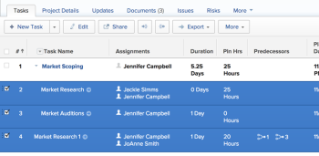

# Add a custom form to an object

>[!IMPORTANT]
>
>You're currently viewing the Adobe Workfront Classic version of this document. Adobe Workfront Classic is no longer supported. All Adobe Workfront Classic functionality, along with this documentation, will be removed in July 2022. Please transition to the the new Adobe Workfront experienceas soon as possible, and switch to the new Adobe Workfront experience version of this document.

You can add an existing custom form to any of the objects listed below. A custom form contains custom fields where you can store information about the object.

* Projects (including business cases)
* Tasks
* Issues
* Companies
* Portfolios
* Programs
* Documents
* Users
* Iterations
* Expenses
* Billing records

You can add a custom form only to the type of object for which the form was created.

## Access requirements

You must have the following access to perform the actions described in this article:

<table cellspacing="0"> 
 <col> 
 <col> 
 <tbody> 
  <tr> 
   <td role="rowheader">Adobe Workfront plan*</td> 
   <td> <p>Any </p> </td> 
  </tr> 
  <tr> 
   <td role="rowheader">Adobe Workfront license*</td> 
   <td> <p>Request or higher</p> </td> 
  </tr> 
  <tr> 
   <td role="rowheader">Access level configurations*</td> 
   <td> <p>Edit access to the objects for which you manage custom forms</p> <p>Note: If you still don't have access, ask your Workfront administrator if they set additional restrictions in your access level. For information on how a Workfront administrator can modify your access level, see <a href="../../administration-and-setup/add-users/configure-and-grant-access/create-modify-access-levels.md" class="MCXref xref">Create or modify custom access levels</a>.</p> </td> 
  </tr> 
  <tr> 
   <td role="rowheader">Object permissions</td> 
   <td> <p>Contribute or higher permissions to the objects for which you manage custom forms</p> <p>View or higher permissions to the custom form with permission to <b>Attach to Custom Data</b> objects (projects, tasks, and issues). For more information, see <a href="../../administration-and-setup/customize-workfront/create-manage-custom-forms/share-access-to-a-custom-form.md" class="MCXref xref">Share a custom form</a>.</p> <p>Important: If you do not have a Plan license with administrative access to&nbsp;Custom&nbsp;Forms, you must have specific permissions to at least view the custom form, as described in <a href="../../administration-and-setup/customize-workfront/create-manage-custom-forms/share-access-to-a-custom-form.md" class="MCXref xref">Share a custom form</a>. These permissions must be granted to you even if the form is visible system-wide. </p> <p>For information on requesting additional access, see <a href="../../workfront-basics/grant-and-request-access-to-objects/request-access.md" class="MCXref xref">Request access to objects </a>.</p> </td> 
  </tr> 
 </tbody> 
</table>

&#42;To find out what plan, license type, or access you have, contact your Workfront administrator.

## Prerequisite

Your Workfront administrator or a user with a Plan license and administrative access to custom forms must create custom forms in your environment before you can add them to objects. For more information, see [Create or edit a custom form](../../administration-and-setup/customize-workfront/create-manage-custom-forms/create-or-edit-a-custom-form.md).

## Add a custom form to an object

You can add a custom form to an object in two ways:

* [Add a custom form to an object by editing the object](#add-a-custom-form-to-an-object-by-editing-the-object) 
* [Add a custom form to an object from the Details area](#add-a-custom-form-to-an-object-from-the-details-area)

### Add a custom form to an object by editing the object {#add-a-custom-form-to-an-object-by-editing-the-object}

1. Go to the object where you want to add the custom form.
1. Click **Edit <Object type>** in the upper-right corner of the page (for example, the **Edit Project** or **Edit Issue** option, depending on the type of object you are attaching the custom form to).

   

1. Click **Custom Forms** > **Add Forms**, then select up to 10 forms from the drop-down menu.

1. (Optional) Update the information in the editable fields on the custom form.

   You must update all required fields on the forms you add. 

1. Click **Save****Changes**.

### Add a custom form to an object from the Details area {#add-a-custom-form-to-an-object-from-the-details-area}

1. Go to the object where you want to add the custom form.
1. Click the **<Object type> Details** tab &nbsp;For example, click **Project Details** to add custom forms to a project or **Issue Details** to add custom forms to an issue. 
1. Click **Custom Forms** > **Make a selection**, then select up to 10 custom forms from the drop-down menu. 
1. (Optional) Click **Edit Custom Form** for each form you want to edit and update the information in the editable custom fields, then click **Save**.

   >[!IMPORTANT]
   >
   >
   >
   ><!--   >
   ><p style="color: #ff1493;" data-mc-conditions="QuicksilverOrClassic.Draft mode">This is true in "Edit custom forms" but not in "Add a custom form to an object." This snippet is used in both articles. The whole snippet is conditioned for classic only in "Add" but not in "Edit." Don't remove the NWE conditioning in the snippet because it is needed in "Edit."</p>   >
   >-->   >
   >
   >You must complete all required fields on the form before you can save the form.&nbsp; The name of a required field displays in bold.

## Multiple custom forms on an object

You can add up to 10 custom forms on a given object, allowing you to make fields available to some users and not to others, or allowing you to better meet the form requirements of multiple projects.

``` ```**Example: **`````` If an existing project has a custom form already, and more custom fields are needed which exist on another custom form, you can add a second form to the project with the additional fields, rather than add the fields to the existing custom form, if those fields are needed just for this one project.

## Add a custom form to multiple objects in bulk

<!--
<p data-mc-conditions="QuicksilverOrClassic.Draft mode">(NOTE: this will need to be edited when the bulk edit is released for NWE) </p>
-->

You can add custom forms to multiple objects by selecting them in a list.

1. Navigate to a list of objects.
1. Select multiple objects in the list.

   

1. Click **Edit**.
1. Click **Custom Forms** in the left panel.
1. In the **Make a selection** drop-down menu, select the form you want to associate with all the selected objects.

   >[!NOTE]
   >
   >If you cannot find the form in the drop-down menu, this means that at least one of the objects has the form already associated with it. Determine which object that is, and eliminate it from your selection, before you can add the form to the remaining objects.

1. Click **Save Changes**.

   >[!IMPORTANT]
   >
   >
   >
   ><!--   >
   ><p style="color: #ff1493;" data-mc-conditions="QuicksilverOrClassic.Draft mode">This is true in "Edit custom forms" but not in "Add a custom form to an object." This snippet is used in both articles. The whole snippet is conditioned for classic only in "Add" but not in "Edit." Don't remove the NWE conditioning in the snippet because it is needed in "Edit."</p>   >
   >-->   >
   >
   >You must complete all required fields on the form before you can save the form.&nbsp; The name of a required field displays in bold.

