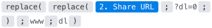

# Dropbox modules

>[!IMPORTANT]
>
>You're currently viewing the Adobe Workfront Classic version of this document. Adobe Workfront Classic is no longer supported. All Adobe Workfront Classic functionality, along with this documentation, will be removed in July 2022. Please transition to the the new Adobe Workfront experienceas soon as possible, and switch to the new Adobe Workfront experience version of this document.

In an Adobe Workfront Fusion scenario, you can automate workflows that use Dropbox, as well as connect it to to multiple third-party applications and services.This allows you to automate activities such as monitoring, searching, retrieving, listing, creating, and editing files and folders in your Dropbox.

If you need instructions on creating a scenario, see [Create a scenario in Adobe Workfront Fusion](../../workfront-fusion/scenarios/create-a-scenario.md).

For information about modules, see [Modules in Adobe Workfront Fusion](../../workfront-fusion/modules/modules.md).

## Access requirements

You must have the following access to use the functionality in this article:

<table> 
 <col> 
 <col> 
 <tbody> 
  <tr> 
   <td role="rowheader">Adobe Workfront plan*</td> 
   <td> <p>Pro or higher</p> </td> 
  </tr> 
  <tr data-mc-conditions=""> 
   <td role="rowheader">Adobe Workfront license*</td> 
   <td> <p>Plan, Work</p> </td> 
  </tr> 
  <tr> 
   <td role="rowheader">Adobe Workfront Fusion license**</td> 
   <td> <p>Workfront Fusion for Work Automation and Integration </p> </td> 
  </tr> 
  <tr> 
   <td role="rowheader">Product</td> 
   <td>Your organization must purchase Adobe Workfront Fusion as well as Adobe Workfront to use functionality described in this article.</td> 
  </tr> <!--
   <tr data-mc-conditions="QuicksilverOrClassic.Draft mode"> 
    <td role="rowheader">Access level configurations*</td> 
    <td> <!--
      <p data-mc-conditions="QuicksilverOrClassic.Draft mode">You must be a Workfront Fusion administrator for your organization.</p>
     --> <!--
      <p data-mc-conditions="QuicksilverOrClassic.Draft mode">You must be a Workfront Fusion administrator for your team.</p>
     --> </td> 
   </tr>
  --> 
 </tbody> 
</table>

&#42;To find out what plan, license type, or access you have, contact your Workfront administrator.

&#42;&#42;For information on Adobe Workfront Fusion licenses, see [Adobe Workfront Fusion licenses](../../workfront-fusion/get-started/license-automation-vs-integration.md)

## Prerequisites

To use Dropbox modules, you must have a Dropbox account.

## Dropbox modules and their fields

When you configure Dropbox modules, Workfront Fusion displays the fields listed below. Along with these, additional Dropbox fields might display, depending on factors such as your access level in the app or service. A bolded title in a module indicates a required field.

If you see the map button above a field or function, you can use it to set variables and functions for that field. For more information, see [Map information from one module to another in Adobe Workfront Fusion](../../workfront-fusion/mapping/map-information-between-modules.md).


* [Trigger modules](#trigger-modules) 
* [Modules for getting Dropbox files and folders](#modules-for-getting-dropbox-files-and-folders) 
* [Modules for creating and editing Dropbox files and folders](#modules-for-creating-and-editing-dropbox-files-and-folders) 
* [Other modules](#other-modules)

### Trigger modules {#trigger-modules}

#### Watch Files

This Trigger type module returns file details when the file in a specified folder is modified.

<table> 
 <col> 
 <col> 
 <tbody> 
  <tr> 
   <td>Connection </td> 
   <td> <p>For instructions about connecting your Dropbox account to Workfront Fusion, see <a href="../../workfront-fusion/connections/connect-to-fusion-general.md" class="MCXref xref" data-mc-variable-override="">Create a connection to Adobe Workfront Fusion - Basic instructions</a></p> </td> 
  </tr> 
  <tr> 
   <td>Folder </td> 
   <td> <p>Select the folder you want to watch for changes.</p> </td> 
  </tr> 
  <tr> 
   <td>Watch also subfolders</td> 
   <td> <p> Enable this option to also monitor subfolders in the selected folder for modified files.</p> </td> 
  </tr> 
  <tr> 
   <td>Limit </td> 
   <td> <p>Enter or map the maximum number of records you want the module to return during each scenario execution cycle.</p> </td> 
  </tr> 
 </tbody> 
</table>

### Modules for getting Dropbox files and folders {#modules-for-getting-dropbox-files-and-folders}

* [Search Files/Folders](#search-files-folders) 
* [Download a File](#download-a-file) 
* [Get a Folder Metadata](#get-a-folder-metadata) 
* [List All Files/Subfolders in a Folder](#list-all-files-subfolders-in-a-folder) 
* [List File Revisions](#list-file-revisions)

#### Search Files/Folders {#search-files-folders}

This search module looks for records in an object in Dropbox that match the search query you specify.

You can map this information in subsequent modules in the scenario.

<table> 
 <col> 
 <col> 
 <tbody> 
  <tr> 
   <td>Connection </td> 
   <td> <p>For instructions about connecting your Dropbox account to Workfront Fusion, see <a href="../../workfront-fusion/connections/connect-to-fusion-general.md" class="MCXref xref" data-mc-variable-override="">Create a connection to Adobe Workfront Fusion - Basic instructions</a></p> </td> 
  </tr> 
  <tr> 
   <td>Search </td> 
   <td> <p>Enter the search term.</p> </td> 
  </tr> 
  <tr> 
   <td>Folder </td> 
   <td> <p>Select the folder you want to search. This module searches the entire Dropbox if you do not select a folder.</p> </td> 
  </tr> 
  <tr> 
   <td>File Status</td> 
   <td> <p> Select the file status to restrict the search to the selected file status.</p> </td> 
  </tr> 
  <tr> 
   <td>File Categories</td> 
   <td> <p> Select the file categories to restrict the search to the selected categories.</p> </td> 
  </tr> 
  <tr> 
   <td>File extensions</td> 
   <td> <p> Choose the file extensions you want to search for.</p> </td> 
  </tr> 
  <tr> 
   <td>Limit </td> 
   <td> <p>Enter or map the maximum number of records you want the module to return during each scenario execution cycle.</p> </td> 
  </tr> 
 </tbody> 
</table>

#### Download a File {#download-a-file}

This action module downloads a file from a folder.

You specify the file and its location.

The module returns the ID of the file and any associated fields, along with any custom fields and values that the connection accesses. You can map this information in subsequent modules in the scenario.

>[!NOTE]
>
>This module is useful for providing files to subsequent modules.

When you are configuring this module, the following fields display.

<table> 
 <col> 
 <col> 
 <tbody> 
  <tr> 
   <td>Connection </td> 
   <td> <p>For instructions about connecting your Dropbox account to Workfront Fusion, see <a href="../../workfront-fusion/connections/connect-to-fusion-general.md" class="MCXref xref" data-mc-variable-override="">Create a connection to Adobe Workfront Fusion - Basic instructions</a></p> </td> 
  </tr> 
  <tr> 
   <td>Way of selecting files</td> 
   <td> <p> Select whether you want to map the file path or select the file manually.</p> </td> 
  </tr> 
  <tr> 
   <td> <p>File Path / File</p> </td> 
   <td> <p style="font-weight: bold;">File Path</p> <p>Enter or map the target path to the file.</p> <p style="font-weight: bold;">File</p> <p>Select the file from the menu.</p> </td> 
  </tr> 
 </tbody> 
</table>

#### Get a Folder Metadata {#get-a-folder-metadata}

This action module retrieves shared folder details.

You specify the ID of the folder.

The module returns the ID of the folder and any associated fields, along with any custom fields and values that the connection accesses. You can map this information in subsequent modules in the scenario.

When you are configuring this module, the following fields display.

<table> 
 <col> 
 <col> 
 <tbody> 
  <tr> 
   <td>Connection </td> 
   <td> <p>For instructions about connecting your Dropbox account to Workfront Fusion, see <a href="../../workfront-fusion/connections/connect-to-fusion-general.md" class="MCXref xref" data-mc-variable-override="">Create a connection to Adobe Workfront Fusion - Basic instructions</a></p> </td> 
  </tr> 
  <tr> 
   <td>Shared Folder ID</td> 
   <td> <p> Enter or map the ID of the folder you want to retrieve details about.</p> </td> 
  </tr> 
 </tbody> 
</table>

#### List All Files/Subfolders in a Folder {#list-all-files-subfolders-in-a-folder}

This action module lists files or folders in a particular folder.

You specify the ID of the folder.

The module returns the IDs of the files or foldes and any associated fields, along with any custom fields and values that the connection accesses. You can map this information in subsequent modules in the scenario.

When you are configuring this module, the following fields display.

<table> 
 <col> 
 <col> 
 <tbody> 
  <tr> 
   <td>Connection </td> 
   <td> <p>For instructions about connecting your Dropbox account to Workfront Fusion, see <a href="../../workfront-fusion/connections/connect-to-fusion-general.md" class="MCXref xref" data-mc-variable-override="">Create a connection to Adobe Workfront Fusion - Basic instructions</a></p> </td> 
  </tr> 
  <tr> 
   <td>List </td> 
   <td> <p>Select whether you want to retrieve files or folders.</p> </td> 
  </tr> 
  <tr> 
   <td>Show Only Downloadable Files</td> 
   <td> <p> Enable this option to return only downloadable files. Some types of files, such as Google Docs, are not downloadable.</p> </td> 
  </tr> 
  <tr> 
   <td>Folder </td> 
   <td> <p>Enter or map the folder you want to retrieve files or folders from.</p> </td> 
  </tr> 
  <tr> 
   <td>Limit </td> 
   <td> <p>Enter or map the maximum number of records you want the module to list during each scenario execution cycle.</p> </td> 
  </tr> 
 </tbody> 
</table>

#### List File Revisions {#list-file-revisions}

This action module retrieves all file revisions (a version history) of a particular file.  
You specify the ID of the file.

The module returns any standard fields associated with the record, along with any custom fields and values that the connection accesses. You can map this information in subsequent modules in the scenario.

When you are configuring this module, the following fields display.

<table> 
 <col> 
 <col> 
 <tbody> 
  <tr> 
   <td>Connection </td> 
   <td> <p>For instructions about connecting your Dropbox account to Workfront Fusion, see <a href="../../workfront-fusion/connections/connect-to-fusion-general.md" class="MCXref xref" data-mc-variable-override="">Create a connection to Adobe Workfront Fusion - Basic instructions</a></p> </td> 
  </tr> 
  <tr> 
   <td>Way of selecting files</td> 
   <td> <p> Select whether you want to map the file path or select the file manually.</p> </td> 
  </tr> 
  <tr> 
   <td> <p>File Path / File</p> </td> 
   <td> <p style="font-weight: bold;">File Path</p> <p>Enter or map the target path to the file.</p> <p style="font-weight: bold;">File</p> <p>Select the file from the menu.</p> </td> 
  </tr> 
  <tr> 
   <td> <p>Limit</p> </td> 
   <td> <p>Enter or map the maximum number of records you want the module to list during each scenario execution cycle.</p> </td> 
  </tr> 
 </tbody> 
</table>

### Modules for creating and editing Dropbox files and folders {#modules-for-creating-and-editing-dropbox-files-and-folders}

* [Upload a File](#upload-a-file) 
* [Create a Folder](#create-a-folder) 
* [Create/Overwrite a Text File](#create-overwrite-a-text-file) 
* [Create/Update a Share Link](#create-update-a-share-link) 
* [Restore a File](#restore-a-file) 
* [Move a File/Folder](#move-a-file-folder) 
* [Rename a File/Folder](#rename-a-file-folder) 
* [Delete a File/Folder](#delete-a-file-folder)

#### Upload a File {#upload-a-file}

This action module uploads a file to a folder.

You specify information such as the location for the file, the file you want to upload, and an optional new name for the file.

The module returns the ID of the  file and any associated fields, along with any custom fields and values that the connection accesses. You can map this information in subsequent modules in the scenario.

When you are configuring this module, the following fields display.

<table> 
 <col> 
 <col> 
 <tbody> 
  <tr> 
   <td>Connection </td> 
   <td> <p>For instructions about connecting your Dropbox account to Workfront Fusion, see <a href="../../workfront-fusion/connections/connect-to-fusion-general.md" class="MCXref xref" data-mc-variable-override="">Create a connection to Adobe Workfront Fusion - Basic instructions</a></p> </td> 
  </tr> 
  <tr> 
   <td>Folder</td> 
   <td> <p> Select the folder of your Dropbox you want to upload the file to.</p> </td> 
  </tr> 
  <tr> 
   <td> <p>Source File</p> </td> 
   <td> <p>Enter or map the file you want to add to the Dropbox folder selected above.</p> <p style="font-weight: bold;">File name</p> <p>Enter or map the file name, including the file extension.</p> <p style="font-weight: bold;">File data</p> <p>Enter or map the file data (from previous module such as Google Drive &gt; Get a File).</p> <p>Note: The maximum size of the uploaded file is 150 MB.</p> </td> 
  </tr> 
  <tr> 
   <td>Overwrite an existing file</td> 
   <td> <p> Enable this option to replace the existing file with the new file. If this option is left disabled, the uploaded file is renamed.</p> </td> 
  </tr> 
 </tbody> 
</table>

#### Create a Folder {#create-a-folder}

This action module creates a new folder.

You specify the path and a name for the folder.

The module returns the ID of the  folder and any associated fields, along with any custom fields and values that the connection accesses. You can map this information in subsequent modules in the scenario.

When you are configuring this module, the following fields display.

<table> 
 <col> 
 <col> 
 <tbody> 
  <tr> 
   <td>Connection </td> 
   <td> <p>For instructions about connecting your Dropbox account to Workfront Fusion, see <a href="../../workfront-fusion/connections/connect-to-fusion-general.md" class="MCXref xref" data-mc-variable-override="">Create a connection to Adobe Workfront Fusion - Basic instructions</a></p> </td> 
  </tr> 
  <tr> 
   <td>Folder Name </td> 
   <td> <p>Enter the name for the new folder.</p> </td> 
  </tr> 
  <tr> 
   <td> <p>Folder</p> </td> 
   <td> <p>Enter or map the path where you want to create a new folder.</p> <p>Note:   <p>If you are using a Dropbox Business account (with team spaces), you must remove the slash <code>/</code>, or do not click <strong>Click here to choose folder</strong> to create a team folder in the root.</p> <p>If the slash is not removed an error <code>[409] path/malformed_path/..</code> is returned.</p> </p> </td> 
  </tr> 
  <tr> 
   <td>Auto rename</td> 
   <td> <p> Enable this option to rename the new folder, if a folder with the same name already exists in the target location.</p> </td> 
  </tr> 
 </tbody> 
</table>

#### Create/Overwrite a Text File {#create-overwrite-a-text-file}

This action module creates a DOC file or overwrites the content of an existing one.

You specify the source file and the folder.

The module returns the ID of the  folder and any associated fields, along with any custom fields and values that the connection accesses. You can map this information in subsequent modules in the scenario.

When you are configuring this module, the following fields display.

<table> 
 <col> 
 <col> 
 <tbody> 
  <tr> 
   <td>Connection </td> 
   <td> <p>For instructions about connecting your Dropbox account to Workfront Fusion, see <a href="../../workfront-fusion/connections/connect-to-fusion-general.md" class="MCXref xref" data-mc-variable-override="">Create a connection to Adobe Workfront Fusion - Basic instructions</a></p> </td> 
  </tr> 
  <tr> 
   <td>Select to</td> 
   <td> <p> Select whether you want to create or overwrite a DOC file.</p> </td> 
  </tr> 
  <tr> 
   <td>Folder </td> 
   <td> <p>Select the target location where you want to create a file.</p> </td> 
  </tr> 
  <tr> 
   <td> <p>Source File</p> </td> 
   <td> <p>Enter or map the file you want to add to the Dropbox folder.</p> <p style="font-weight: bold;">File name</p> <p>Enter the file name for the new DOC file (without an extension).</p> <p style="font-weight: bold;">File Content</p> <p>Enter the text content of the DOC file.</p> </td> 
  </tr> 
 </tbody> 
</table>

#### Create/Update a Share Link {#create-update-a-share-link}

This action module creates a public link to a file.

You specify the file and information about the link.

The module returns the ID of the link and any associated fields, along with any custom fields and values that the connection accesses. You can map this information in subsequent modules in the scenario.

When you are configuring this module, the following fields display.

<table> 
 <col> 
 <col> 
 <tbody> 
  <tr> 
   <td>Connection </td> 
   <td> <p>For instructions about connecting your Dropbox account to Workfront Fusion, see <a href="../../workfront-fusion/connections/connect-to-fusion-general.md" class="MCXref xref" data-mc-variable-override="">Create a connection to Adobe Workfront Fusion - Basic instructions</a></p> </td> 
  </tr> 
  <tr> 
   <td>Way of selecting files</td> 
   <td> <p> Select whether you want to map or enter the file path, or select the file manually.</p> </td> 
  </tr> 
  <tr> 
   <td> <p>File Path / File</p> </td> 
   <td> <p style="font-weight: bold;">File Path</p> <p>Enter or map the target path to the file.</p> <p style="font-weight: bold;">File</p> <p>Select the file from the menu.</p> </td> 
  </tr> 
  <tr> 
   <td> <p>Requested Visibility</p> </td> 
   <td> <p>Select whether the link is public, for team, or password restricted.</p> <p>Note: Team only and Access with password options are only available to users who have Dropbox Pro or higher version.</p> </td> 
  </tr> 
  <tr> 
   <td>Link's Expiration Date</td> 
   <td> <p> Enter the date and time when the link will expire and will be no longer accessible. If this field is left empty, the link will not expire. For a list of supported date and time formats, see <a href="../../workfront-fusion/mapping/type-coercion.md" class="MCXref xref" data-mc-variable-override="">Type coercion in Adobe Workfront Fusion</a>.</p> <p>Note: Team only and Access with password options are only available to users who have Dropbox Pro or higher versions.</p> </td> 
  </tr> 
  <tr> 
   <td> <p>Link's Access Level</p> </td> 
   <td> <p>Set the permission for the link recipient.</p> <p><strong>Viewer</strong> Users who use the link can view and comment on the content.</p> <p><strong>Editor</strong> Users who use the link can edit, view, and comment on the content.</p> <p><strong>Max</strong> Users who use the link receive the maximum access level you can set the link to.</p> </td> 
  </tr> 
 </tbody> 
</table>

#### Restore a File {#restore-a-file}

This action module restores a previous version of a file.

You specify the file and the number of the revision you want.

The module returns the ID of the  version and any associated fields, along with any custom fields and values that the connection accesses. You can map this information in subsequent modules in the scenario.

When you are configuring this module, the following fields display.

<table> 
 <col> 
 <col> 
 <tbody> 
  <tr> 
   <td>Connection </td> 
   <td> <p>For instructions about connecting your Dropbox account to Workfront Fusion, see <a href="../../workfront-fusion/connections/connect-to-fusion-general.md" class="MCXref xref" data-mc-variable-override="">Create a connection to Adobe Workfront Fusion - Basic instructions</a></p> </td> 
  </tr> 
  <tr> 
   <td>Way of selecting files</td> 
   <td> <p> Select whether you want to map or enter the file path, or select the file manually.</p> </td> 
  </tr> 
  <tr> 
   <td> <p>File Path / File</p> </td> 
   <td> <p><strong>File Path</strong> </p> <p>Enter or map the target path to the file.</p> <p><strong>File</strong> </p> <p>Select the file from the menu.</p> </td> 
  </tr> 
  <tr> 
   <td> <p>Revision</p> </td> 
   <td> <p>Enter or map the revision number of the revision you want to restore.</p> </td> 
  </tr> 
 </tbody> 
</table>

#### Move a File/Folder {#move-a-file-folder}

This action module moves a file or folder to a different location.

You specify the file or folder and how and where you ant to move it.

The module returns the ID of the  file or folder and any associated fields, along with any custom fields and values that the connection accesses. You can map this information in subsequent modules in the scenario.

When you are configuring this module, the following fields display.

<table> 
 <col> 
 <col> 
 <tbody> 
  <tr> 
   <td>Connection </td> 
   <td> <p>For instructions about connecting your Dropbox account to Workfront Fusion, see <a href="../../workfront-fusion/connections/connect-to-fusion-general.md" class="MCXref xref" data-mc-variable-override="">Create a connection to Adobe Workfront Fusion - Basic instructions</a></p> </td> 
  </tr> 
  <tr> 
   <td>Way of selecting files </td> 
   <td> <p>Select whether you want to map or enter the file path, or select the file manually.</p> </td> 
  </tr> 
  <tr> 
   <td> <p>File/Folder Path / File/Folder</p> </td> 
   <td> <p style="font-weight: bold;">File/Folder Path</p> <p>Enter or map the target path to the file or folder.</p> <p style="font-weight: bold;">File/Folder</p> <p>Select the file or folder from the menu.</p> </td> 
  </tr> 
  <tr> 
   <td> <p>To Folder</p> </td> 
   <td> <p>Enter or map the target location for the file or folder.</p> </td> 
  </tr> 
  <tr> 
   <td> <p>New Name</p> </td> 
   <td> <p>Enter the new name for the file or folder in the new location.</p> </td> 
  </tr> 
  <tr> 
   <td> <p>Auto Rename</p> </td> 
   <td> <p>Enable this option to ensure that if a file or folder with the same name exists, the module renames the new file or folder by adding (NUMBER) after the file or folder name. Otherwise the file or folder in the target location is overwritten.</p> </td> 
  </tr> 
  <tr> 
   <td> <p>Allow ownership transfer</p> </td> 
   <td> <p>Enable this option to allow moves by owner, even if it would result in an ownership transfer for the content being moved.</p> </td> 
  </tr> 
 </tbody> 
</table>

#### Rename a File/Folder {#rename-a-file-folder}

This action module renames a file or folder.

You specify the file or folder and the new name.

The module returns the ID of the  file or folder and any associated fields, along with any custom fields and values that the connection accesses. You can map this information in subsequent modules in the scenario.

When you are configuring this module, the following fields display.

<table> 
 <col> 
 <col> 
 <tbody> 
  <tr> 
   <td>Connection </td> 
   <td> <p>For instructions about connecting your Dropbox account to Workfront Fusion, see <a href="../../workfront-fusion/connections/connect-to-fusion-general.md" class="MCXref xref" data-mc-variable-override="">Create a connection to Adobe Workfront Fusion - Basic instructions</a></p> </td> 
  </tr> 
  <tr> 
   <td>Way of selecting files</td> 
   <td> <p> Select whether you want to map or enter the file path, or select the file manually.</p> </td> 
  </tr> 
  <tr> 
   <td> <p>File/Folder Path / File/Folder</p> </td> 
   <td> <p style="font-weight: bold;">File/Folder Path</p> <p>Enter or map the target path to the file or folder.</p> <p style="font-weight: bold;">File/Folder</p> <p>Select the file or folder from the menu.</p> </td> 
  </tr> 
  <tr> 
   <td>Rename </td> 
   <td> <p>Enter the target name for the file, including the file extension.</p> </td> 
  </tr> 
 </tbody> 
</table>

#### Delete a File/Folder {#delete-a-file-folder}

This action module deletes a file or folder.

You specify the file or folder.

The module returns the ID of the  record and any associated fields, along with any custom fields and values that the connection accesses. You can map this information in subsequent modules in the scenario.

When you are configuring this module, the following fields display.

<table> 
 <col> 
 <col> 
 <tbody> 
  <tr> 
   <td>Connection </td> 
   <td> <p>For instructions about connecting your Dropbox account to Workfront Fusion, see <a href="../../workfront-fusion/connections/connect-to-fusion-general.md" class="MCXref xref" data-mc-variable-override="">Create a connection to Adobe Workfront Fusion - Basic instructions</a></p> </td> 
  </tr> 
  <tr> 
   <td>Way of selecting files</td> 
   <td> <p> Select whether you want to map or enter the file path, or select the file manually.</p> </td> 
  </tr> 
  <tr> 
   <td> <p>File Path / File</p> </td> 
   <td> <p style="font-weight: bold;">File Path</p> <p>Enter or map the target path to the file.</p> <p style="font-weight: bold;">File</p> <p>Select the file from the menu.</p> </td> 
  </tr> 
 </tbody> 
</table>

### Other modules {#other-modules}

#### Make an API Call

This action module lets you make a custom authenticated call to the Dropbox API. This way, you can create a data flow automation that can't be accomplished by the other Dropbox modules.

When you are configuring this module, the following fields display.

<table> 
 <col> 
 <col> 
 <tbody> 
  <tr> 
   <td>Connection </td> 
   <td> <p>For instructions about connecting your Dropbox account to Workfront Fusion, see <a href="../../workfront-fusion/connections/connect-to-fusion-general.md" class="MCXref xref" data-mc-variable-override="">Create a connection to Adobe Workfront Fusion - Basic instructions</a></p> </td> 
  </tr> 
  <tr> 
   <td> <p>URL</p> </td> 
   <td> <p>Enter a path relative to Enter a path relative to <code>https://api.dropboxapi.com</code>. For example, <code>/2/files/list_folder</code></p> <p>Note: For the list of available endpoints, see the <a href="https://www.dropbox.com/developers/documentation/http/documentation">Dropbox API v2 Documentation</a>.</p> </td> 
  </tr> 
  <tr> 
   <td> <p>Method</p> </td> 
   <td> <p>Select the HTTP request method you need to configure the API call. For more information, see <a href="../../workfront-fusion/modules/http-request-methods.md" class="MCXref xref" data-mc-variable-override="">HTTP request methods in Adobe Workfront Fusion</a>.</p> </td> 
  </tr> 
  <tr> 
   <td>Headers </td> 
   <td> <p>Enter the desired request headers. You don't have to add authorization headers; we already did that for you.</p> </td> 
  </tr> 
  <tr> 
   <td>Query String</td> 
   <td> <p> Enter the request query string.</p> </td> 
  </tr> 
  <tr> 
   <td>Body </td> 
   <td> <p>Add the body content for the API call in the form of a standard JSON object.</p> <p>Note:   <p>When using conditional statements such as <code>if</code> in your JSON, put the quotation marks outside of the conditional statement.</p> 
     <div class="example" data-mc-autonum="<b>Example: </b>">  
      <p>  </p> 
     </div> </p> </td> 
  </tr> 
 </tbody> 
</table>

**Example:** The following API call returns the first 10 files from the /Text files folder in your Dropbox account:

URL:
<pre>/2/files/list_folder</pre>Body:
<pre>{</pre><pre>"path": "/Text files",</pre><pre>"limit": 10,</pre><pre>"recursive": false,</pre><pre>"include_deleted": false</pre><pre>}</pre>Matches of the search can be found in the module's Output under Bundle > Body > entries.

In our example, 10 tickets were returned:

## Common problems

* [Unable to upload or update a file](#unable-to-upload-or-update-a-file) 
* [Image referenced via a shared link does not render](#image-referenced-via-a-shared-link-does-not-render)

### Unable to upload or update a file {#unable-to-upload-or-update-a-file}

There are several situations when uploading or updating a file fails:

* The uploaded file is too big and exceeds the maximum file size allowed for your Dropbox plan, or you have used all of your Dropbox account's storage quota. You must delete existing files from your Dropbox account or upgrade your plan.
* The previously selected folder, to which the file is being uploaded to, no longer exists. The scenario stops and you must select the target folder again.

### Image referenced via a shared link does not render {#image-referenced-via-a-shared-link-does-not-render}

The URL returned by the Dropbox > Create a shared link does not link directly to an image, but to a Dropbox page. To force the image to download, replace the trailing 

```
?dl=0
```

with 

```
?dl=1
```

. To force the image to render (for example, in a Web browser or in Facebook Messenger), append 

```
&raw=1
```

to the URL.

If you need to get the direct or raw link of your image for your website or for other Workfront Fusion modules, you must modify the initial shared URL in the following way:

Original URL:

https://www.dropbox.com/s/ia8qtvs20f3a5ux/Screen%20Shot%202018-10-15%20at%204.21.11%20PM.png?dl=0

1. Replace www with dl.
1. Remove ?dl=0.

Final URL:

https://dl.dropbox.com/s/ia8qtvs20f3a5ux/Screen%20Shot%202018-10-15%20at%204.21.11%20PM.png

To automatically modify the URL, you can use the replace() function twice:

* Replace www with dl

  

* And to remove ?dl=0

  

To do it in one step, combine these functions:



You can also copy it and paste it into the field. Replace 

```
1.url
```

with the URL.

```
{{replace(replace(1.url; "?dl=0"; ""); "www"; "dl")}}
```

