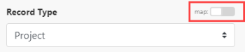
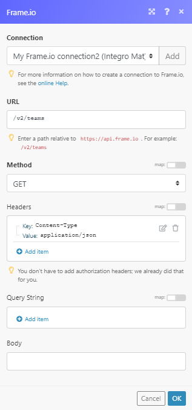

# Frame.io modules

>[!IMPORTANT]
>
>You're currently viewing the Adobe Workfront Classic version of this document. Adobe Workfront Classic is no longer supported. All Adobe Workfront Classic functionality, along with this documentation, will be removed in July 2022. Please transition to the the new Adobe Workfront experienceas soon as possible, and switch to the new Adobe Workfront experience version of this document.

The Adobe Workfront Fusion Frame.io modules enable you to monitor, create, update, retrieve, or delete assets and comments in your Frame.io account.

## Access requirements

You must have the following access to use the functionality in this article:

<table cellspacing="0"> 
 <col> 
 <col> 
 <tbody> 
  <tr> 
   <td role="rowheader">Adobe Workfront plan*</td> 
   <td> <p>Pro or higher</p> </td> 
  </tr> 
  <tr data-mc-conditions=""> 
   <td role="rowheader">Adobe Workfront license*</td> 
   <td> <p>Plan, Work</p> </td> 
  </tr> 
  <tr> 
   <td role="rowheader">Adobe Workfront Fusion license**</td> 
   <td> <p>Workfront Fusion for Work Automation and Integration </p> </td> 
  </tr> 
  <tr> 
   <td role="rowheader">Product</td> 
   <td>Your organization must purchase Adobe Workfront Fusion as well as Adobe Workfront to use functionality described in this article.</td> 
  </tr> <!--
   <tr data-mc-conditions="QuicksilverOrClassic.Draft mode"> 
    <td role="rowheader">Access level configurations*</td> 
    <td> <!--
      <p data-mc-conditions="QuicksilverOrClassic.Draft mode">You must be a Workfront Fusion administrator for your organization.</p>
     --> <!--
      <p data-mc-conditions="QuicksilverOrClassic.Draft mode">You must be a Workfront Fusion administrator for your team.</p>
     --> </td> 
   </tr>
  --> 
 </tbody> 
</table>

&#42;To find out what plan, license type, or access you have, contact your Workfront administrator.

&#42;&#42;For information on Adobe Workfront Fusion licenses, see [Adobe Workfront Fusion licenses](../../workfront-fusion/get-started/license-automation-vs-integration.md)

## Prerequisites

To use Frame.io modules, you must have a Frame.io account

The module dialog fields that are displayed in bold (in the Workfront Fusion scenario, not in this documentation article) are mandatory!

## Connect Frame.io to Adobe Workfront Fusion {#connect-frame-io-to-adobe-workfront-fusion}

You can connect to Frame.io using an API token, or by using OAuth 2.0.

[Connect to Frame.io using an API token](#connect-to-frame-io-using-an-api-token)

[Connect to Frame.io using OAuth 2.0 PKCE](#connect-to-frame-io-using-oauth-2-0-pkce)

### Connect to Frame.io using an API token {#connect-to-frame-io-using-an-api-token}

To connect your Frame.io account to Workfront Fusion using an API token, you must create the API token in your Frame.io account and insert it to the Workfront Fusion Frame.io Create a connection dialog.

1. Log in to your Frame.io account.
1. Go to the **Tokens** page in the Frame.io Developer.
1. Click **New**.
1. Enter the name of the token, select the scopes you want to use, and click **Create**.
1. Copy the provided token.
1. Go to Workfront Fusion and open the Frame.io module's **Create a connection** dialog.
1. In the **Connection type** field, select **Frame.io**.
1. Enter the token you have copied in step 5 to the **Your Frame.io API Key** field and click **Continue** to establish the connection.

The connection has been established. You can proceed with setting up the module.

### Connect to Frame.io using OAuth 2.0 PKCE {#connect-to-frame-io-using-oauth-2-0-pkce}

You can create an connection to Frame.io using OAuth 2.0 PKCE with an optional Client ID. If you want to include a Client ID&nbsp;in your connection, you must create an OAuth 2.0 app in your Frame.io account.

* [Connect to Frame.io using using OAuth 2.0 PKCE (without Client ID)](#connect-to-frame-io-using-using-oauth-2-0-pkce-without-client-id) 
* [Connect to Frame.io using using OAuth 2.0 PKCE (with Client ID)](#connect-to-frame-io-using-using-oauth-2-0-pkce-with-client-id)

#### Connect to Frame.io using using OAuth 2.0 PKCE (without Client ID) {#connect-to-frame-io-using-using-oauth-2-0-pkce-without-client-id}

1. Go to Workfront Fusion and open the Frame.io module's **Create a connection** dialog.
1. In the **Connection type** field, select **Frame.io OAuth 2.0 PKCE**.
1. Enter a name for the new connection in the **Connection name** field.
1. Click **Continue** to establish the connection.

The connection has been established. You can proceed with setting up the module.

#### Connect to Frame.io using using OAuth 2.0 PKCE (with Client ID) {#connect-to-frame-io-using-using-oauth-2-0-pkce-with-client-id}

1. Create an OAuth 2.0 app in Frame.io. For instructions, see the Frame.io documentation on OAuth 2.0 Code Authorization&nbsp;Flow.

   >[!IMPORTANT]
   >
   >When creating the OAuth 2.0 app in Frame.io:
   >
   >   
   >   
   >   * Enter the following as the redirect URI:
   >   
   >   
   >     | Americas / APAC |https://app.workfrontfusion.com/oauth/cb/frame-io5 |
   >     |---|---|
   >     | EMEA |https://app-eu.workfrontfusion.com/oauth/cb/frame-io5 |

   >   
   >   * Enable the PCKE option.
   >   
   >

1. Copy the provided 

   ```
   client_id
   ```

   .
1. Go to Workfront Fusion and open the Frame.io module's **Create a connection** dialog.
1. In the **Connection type** field, select **Frame.io OAuth 2.0 PKCE**.
1. Enter a name for the new connection in the **Connection name** field.
1. Click **Show advanced settings**.
1. Enter the 

   ```
   client_id
   ```

   you copied in step 2 to the **Client ID** field.
1. Click **Continue** to establish the connection.

The connection has been established. You can proceed with setting up the module.

&nbsp;

## Frame.io modules and their fields

When you configure [Fusion app] modules, Workfront Fusion displays the fields listed below. Along with these, additional [Fusion app] fields might display, depending on factors such as your access level in the app or service. A bolded title in a module indicates a required field.

If you see the map button above a field or function, you can use it to set variables and functions for that field. For more information, see [Map information from one module to another in Adobe Workfront Fusion](../../workfront-fusion/mapping/map-information-between-modules.md).



* [Assets](#assets) 
* [Comments](#comments) 
* [Projects](#projects) 
* [Other](#other)

### Assets {#assets}

* [Delete an Asset](#delete-an-asset) 
* [Get an Asset](#get-an-asset) 
* [List Assets](#list-assets) 
* [Update an Asset](#update-an-asset) 
* [Watch Asset Deleted](#watch-asset-deleted) 
* [Watch Asset Label Updated](#watch-asset-label-updated) 
* [Watch New Asset](#watch-new-asset)

Create an Asset

This action module creates a new asset.

<table cellspacing="0"> 
 <col> 
 <col> 
 <tbody> 
  <tr> 
   <td role="rowheader">Connection </td> 
   <td>For instructions on creating a connection to Frame.io, see <a href="#connect-frame-io-to-adobe-workfront-fusion" class="MCXref xref">Connect Frame.io to Adobe Workfront Fusion</a> in this article.</td> 
  </tr> 
  <tr> 
   <td role="rowheader">Team ID </td> 
   <td> <p>Select or map the team that owns the project that you want to create an asset for.</p> </td> 
  </tr> 
  <tr> 
   <td role="rowheader">Project ID </td> 
   <td> <p>Select the project or map the ID of the project that you want to create an asset for.</p> </td> 
  </tr> 
  <tr> 
   <td role="rowheader">Folder ID </td> 
   <td> <p>Select the folder or map the ID of the folder you want to create an asset in.</p> </td> 
  </tr> 
  <tr> 
   <td role="rowheader">Type </td> 
   <td> <p>Select whether to create a folder or file.</p> </td> 
  </tr> 
  <tr> 
   <td role="rowheader">Name </td> 
   <td> <p>Enter the name of the new file or folder.</p> </td> 
  </tr> <!--
   <tr data-mc-conditions="QuicksilverOrClassic.Draft mode"> 
    <td role="rowheader">File Type </td> 
    <td> <p>Select the type of file you want to upload.</p> </td> 
   </tr>
  --> <!--
   <tr data-mc-conditions="QuicksilverOrClassic.Draft mode"> 
    <td role="rowheader">File Size </td> 
    <td> <p>The file size in bytes.</p> </td> 
   </tr>
  --> 
  <tr> 
   <td role="rowheader">Source URL </td> 
   <td> <p>Enter the URL of the file you want to upload.</p> </td> 
  </tr> 
  <tr> 
   <td role="rowheader">Description </td> 
   <td> <p>Enter a brief description of the asset.</p> </td> 
  </tr> 
 </tbody> 
</table>

#### Delete an Asset {#delete-an-asset}

This action module deletes a specified asset.

<table cellspacing="0"> 
 <col> 
 <col> 
 <tbody> 
  <tr> 
   <td role="rowheader">Connection </td> 
   <td>For instructions on creating a connection to Frame.io, see <a href="#connect-frame-io-to-adobe-workfront-fusion" class="MCXref xref">Connect Frame.io to Adobe Workfront Fusion</a> in this article.</td> 
  </tr> 
  <tr> 
   <td role="rowheader">Team ID </td> 
   <td> <p>Select or map the team that owns the project that contains the asset you want to delete.</p> </td> 
  </tr> 
  <tr> 
   <td role="rowheader">Project ID</td> 
   <td> <p> Select the project or that contains the asset you want to delete.</p> </td> 
  </tr> 
  <tr> 
   <td role="rowheader">Folder ID </td> 
   <td> <p>Select the folder that contains the asset you want to delete</p> </td> 
  </tr> 
  <tr> 
   <td role="rowheader">Asset ID </td> 
   <td> <p>Select or map the asset you want to delete.</p> </td> 
  </tr> 
 </tbody> 
</table>

#### Get an Asset {#get-an-asset}

This action module retrieves asset details.

<table cellspacing="0"> 
 <col> 
 <col> 
 <tbody> 
  <tr> 
   <td role="rowheader">Connection </td> 
   <td>For instructions on creating a connection to Frame.io, see <a href="#connect-frame-io-to-adobe-workfront-fusion" class="MCXref xref">Connect Frame.io to Adobe Workfront Fusion</a> in this article.</td> 
  </tr> 
  <tr> 
   <td role="rowheader">Team ID </td> 
   <td> <p>Select or map the team that owns the project that contains the asset you want to retrieve details about.</p> </td> 
  </tr> 
  <tr> 
   <td role="rowheader">Project ID</td> 
   <td> <p> Select the project that contains the asset you want to retrieve details about.</p> </td> 
  </tr> 
  <tr> 
   <td role="rowheader">Folder ID </td> 
   <td> <p>Select the folder that contains the asset you want to retrieve details about.</p> </td> 
  </tr> 
  <tr> 
   <td role="rowheader">Asset ID </td> 
   <td> <p>Select the asset or map the ID of the asset you want to retrieve details about.</p> </td> 
  </tr> 
 </tbody> 
</table>

#### List Assets {#list-assets}

This search module retrieves all assets in the specified project's folder.

<table cellspacing="0"> 
 <col> 
 </col> 
 <col> 
 </col> 
 <tbody> 
  <tr> 
   <td role="rowheader">Connection </td> 
   <td>For instructions on creating a connection to Frame.io, see <a href="#connect-frame-io-to-adobe-workfront-fusion" class="MCXref xref">Connect Frame.io to Adobe Workfront Fusion</a> in this article.</td> 
  </tr> 
  <tr> 
   <td role="rowheader">Team ID </td> 
   <td> <p>Select or map the team that owns the project that contains the folder you want to retrieve assets from.</p> </td> 
  </tr> 
  <tr> 
   <td role="rowheader">Project ID</td> 
   <td> <p> Select the project that contains the folder you want to retrieve assets from.</p> </td> 
  </tr> 
  <tr> 
   <td role="rowheader">Folder ID </td> 
   <td> <p>Select the folder you want to list assets from.</p> </td> 
  </tr> 
  <tr> 
   <td role="rowheader">Limit </td> 
   <td> <p>Set the maximum number of assets Workfront Fusion will return during one execution cycle.</p> </td> 
  </tr> 
 </tbody> 
</table>

#### Update an Asset {#update-an-asset}

This action module allows you to update an existing asset's name, description, or custom fields.

<table cellspacing="0"> 
 <col> 
 <col> 
 <tbody> 
  <tr> 
   <td role="rowheader">Connection </td> 
   <td>For instructions on creating a connection to Frame.io, see <a href="#connect-frame-io-to-adobe-workfront-fusion" class="MCXref xref">Connect Frame.io to Adobe Workfront Fusion</a> in this article.</td> 
  </tr> 
  <tr> 
   <td role="rowheader">Team ID </td> 
   <td> <p>Select or map the team that owns the project that you want to update an asset for.</p> </td> 
  </tr> 
  <tr> 
   <td role="rowheader">Project ID </td> 
   <td> <p>Select the project or map the ID of the project that you want to update an asset for.</p> </td> 
  </tr> 
  <tr> 
   <td role="rowheader">Folder ID </td> 
   <td> <p>Select the folder or map the ID of the folder you want to update an asset in.</p> </td> 
  </tr> 
  <tr> 
   <td role="rowheader">Name </td> 
   <td> <p>Enter the name of the updated file.</p> </td> 
  </tr> 
  <tr> 
   <td role="rowheader">Description </td> 
   <td> <p>Enter a brief description of the updated asset.</p> </td> 
  </tr> 
 </tbody> 
</table>

#### Watch Asset Deleted  {#watch-asset-deleted}

This trigger module starts a scenario when an asset is deleted.

<table cellspacing="0"> 
 <col> 
 <col> 
 <tbody> 
  <tr> 
   <td role="rowheader">Webhook name</td> 
   <td> <p> Enter the name of the webhook, e.g. Asset deleted.</p> </td> 
  </tr> 
  <tr> 
   <td role="rowheader">Connection </td> 
   <td>For instructions on creating a connection to Frame.io, see <a href="#connect-frame-io-to-adobe-workfront-fusion" class="MCXref xref">Connect Frame.io to Adobe Workfront Fusion</a> in this article.</td> 
  </tr> 
  <tr> 
   <td role="rowheader">Team ID </td> 
   <td> <p>Select the team this webhook is created for.</p> </td> 
  </tr> 
 </tbody> 
</table>

#### Watch Asset Label Updated  {#watch-asset-label-updated}

This trigger module starts a scenario when an asset's status is set, changed, or removed.

<table cellspacing="0"> 
 <col> 
 <col> 
 <tbody> 
  <tr> 
   <td role="rowheader">Webhook name</td> 
   <td> <p> Enter the name of the webhook, e.g. Asset status updated.</p> </td> 
  </tr> 
  <tr> 
   <td role="rowheader">Connection </td> 
   <td>For instructions on creating a connection to Frame.io, see <a href="#connect-frame-io-to-adobe-workfront-fusion" class="MCXref xref">Connect Frame.io to Adobe Workfront Fusion</a> in this article.</td> 
  </tr> 
  <tr> 
   <td role="rowheader">Team ID </td> 
   <td> <p>Select the team this webhook is created for.</p> </td> 
  </tr> 
 </tbody> 
</table>

#### Watch New Asset {#watch-new-asset}

This trigger module starts a scenario when a new asset is created.

<table cellspacing="0"> 
 <col> 
 <col> 
 <tbody> 
  <tr> 
   <td role="rowheader">Webhook name</td> 
   <td> <p> Enter the name of the webhook, e.g. Asset created.</p> </td> 
  </tr> 
  <tr> 
   <td role="rowheader">Connection </td> 
   <td>For instructions on creating a connection to Frame.io, see <a href="#connect-frame-io-to-adobe-workfront-fusion" class="MCXref xref">Connect Frame.io to Adobe Workfront Fusion</a> in this article.</td> 
  </tr> 
  <tr> 
   <td role="rowheader">Team ID </td> 
   <td> <p>Select the team this webhook is created for.</p> </td> 
  </tr> 
 </tbody> 
</table>

### Comments {#comments}

* [Create a Comment](#create-a-comment) 
* [Delete a Comment](#delete-a-comment) 
* [Get a Comment](#get-a-comment) 
* [List Comments](#list-comments) 
* [Update a Comment](#update-a-comment) 
* [Watch Comment Updated](#watch-comment-updated) 
* [Watch New Comment](#watch-new-comment)

#### Create a Comment {#create-a-comment}

This action module adds a new comment or reply to the asset.

<table cellspacing="0"> 
 <col> 
 <col> 
 <tbody> 
  <tr> 
   <td role="rowheader">Connection </td> 
   <td>For instructions on creating a connection to Frame.io, see <a href="#connect-frame-io-to-adobe-workfront-fusion" class="MCXref xref">Connect Frame.io to Adobe Workfront Fusion</a> in this article.</td> 
  </tr> 
  <tr> 
   <td role="rowheader">Type </td> 
   <td> <p>Select whether you want to create a comment or reply to a comment.</p> </td> 
  </tr> 
  <tr> 
   <td role="rowheader">Team ID </td> 
   <td> <p>Select or map the team that owns the project that contains the asset you want to add a comment to.</p> </td> 
  </tr> 
  <tr> 
   <td role="rowheader">Project ID </td> 
   <td> <p>Select the project or map the ID of the project that contains the asset you want to add a comment to.</p> </td> 
  </tr> 
  <tr> 
   <td role="rowheader">Folder ID </td> 
   <td> <p>Select the folder or map the ID of the folder that contains the asset you want to add a comment to.</p> </td> 
  </tr> 
  <tr> 
   <td role="rowheader">Asset ID </td> 
   <td> <p>Select or map the asset you want to add a comment to.</p> </td> 
  </tr> 
  <tr> 
   <td role="rowheader">Comment ID </td> 
   <td> <p>Select or map the comment you want to add a reply to.</p> </td> 
  </tr> 
  <tr> 
   <td role="rowheader">Text</td> 
   <td> <p> Enter the text content of the comment or reply.</p> </td> 
  </tr> 
  <tr> 
   <td role="rowheader">Timestamp </td> 
   <td> <p>Enter the frame number in the video the comment should be linked to.</p> </td> 
  </tr> 
 </tbody> 
</table>

#### Delete a Comment {#delete-a-comment}

This action module deletes an existing comment.

<table cellspacing="0"> 
 <col> 
 <col> 
 <tbody> 
  <tr> 
   <td role="rowheader">Connection </td> 
   <td>For instructions on creating a connection to Frame.io, see <a href="#connect-frame-io-to-adobe-workfront-fusion" class="MCXref xref">Connect Frame.io to Adobe Workfront Fusion</a> in this article.</td> 
  </tr> 
  <tr> 
   <td role="rowheader">Team ID</td> 
   <td> <p> Select or map the team that owns the project that contains the asset you want to delete a comment from.</p> </td> 
  </tr> 
  <tr> 
   <td role="rowheader">Project ID</td> 
   <td> <p> Select the project or map the ID of the project that contains the asset you want to delete a comment from.</p> </td> 
  </tr> 
  <tr> 
   <td role="rowheader">Folder ID</td> 
   <td> <p> Select the folder that contains the asset you want to delete a comment from.</p> </td> 
  </tr> 
  <tr> 
   <td role="rowheader">Asset ID </td> 
   <td> <p>Select the asset that contains the comment you want to delete.</p> </td> 
  </tr> 
  <tr> 
   <td role="rowheader">Comment ID </td> 
   <td> <p>Select the comment you want to delete.</p> </td> 
  </tr> 
 </tbody> 
</table>

#### Get a Comment {#get-a-comment}

This action module retrieves details of the specified comment.

<table cellspacing="0"> 
 <col> 
 <col> 
 <tbody> 
  <tr> 
   <td role="rowheader">Connection </td> 
   <td>For instructions on creating a connection to Frame.io, see <a href="#connect-frame-io-to-adobe-workfront-fusion" class="MCXref xref">Connect Frame.io to Adobe Workfront Fusion</a> in this article.</td> 
  </tr> 
  <tr> 
   <td role="rowheader">Team ID </td> 
   <td> <p>Select or map the team that owns the project that contains the folder you want to retrieve assets from..</p> </td> 
  </tr> 
  <tr> 
   <td role="rowheader">Project ID </td> 
   <td> <p>Select the project that contains the folder you want to retrieve assets from.</p> </td> 
  </tr> 
  <tr> 
   <td role="rowheader">Folder ID </td> 
   <td> <p>Select the folder you want to list assets from.</p> </td> 
  </tr> 
  <tr> 
   <td role="rowheader">Asset ID </td> 
   <td> <p>Select the asset that contains the comment you want to retrieve.</p> </td> 
  </tr> 
  <tr> 
   <td role="rowheader">Comment ID </td> 
   <td> <p>Select the comment you want to retrieve details about.</p> </td> 
  </tr> 
 </tbody> 
</table>

#### List Comments {#list-comments}

This search module retrieves all comments of the specified asset.

<table cellspacing="0"> 
 <col> 
 <col> 
 <tbody> 
  <tr> 
   <td role="rowheader">Connection </td> 
   <td>For instructions on creating a connection to Frame.io, see <a href="#connect-frame-io-to-adobe-workfront-fusion" class="MCXref xref">Connect Frame.io to Adobe Workfront Fusion</a> in this article.</td> 
  </tr> 
  <tr> 
   <td role="rowheader">Team ID </td> 
   <td> <p>Select or map the team that owns the project that contains the folder you want to retrieve comments from.</p> </td> 
  </tr> 
  <tr> 
   <td role="rowheader">Project ID </td> 
   <td> <p>Select the project that contains the folder you want to retrieve comments from.</p> </td> 
  </tr> 
  <tr> 
   <td role="rowheader">Folder ID </td> 
   <td> <p>Select the folder that contains the asset you want to list comments from.</p> </td> 
  </tr> 
  <tr> 
   <td role="rowheader">Asset ID </td> 
   <td> <p>Select the asset you want to list comments for.</p> </td> 
  </tr> 
  <tr> 
   <td role="rowheader">Limit </td> 
   <td> <p>Set the maximum number of comments Workfront Fusion will return during one execution cycle.</p> </td> 
  </tr> 
 </tbody> 
</table>

#### Update a Comment {#update-a-comment}

This action module edits an existing comment.

<table cellspacing="0"> 
 <col> 
 <col> 
 <tbody> 
  <tr> 
   <td role="rowheader">Connection </td> 
   <td>For instructions on creating a connection to Frame.io, see <a href="#connect-frame-io-to-adobe-workfront-fusion" class="MCXref xref">Connect Frame.io to Adobe Workfront Fusion</a> in this article.</td> 
  </tr> 
  <tr> 
   <td role="rowheader">Team ID </td> 
   <td> <p>Select or map the team that owns the project that contains the asset you want to update a comment on.</p> </td> 
  </tr> 
  <tr> 
   <td role="rowheader">Project ID </td> 
   <td> <p>Select the project \ that contains the asset you want to update a comment on.</p> </td> 
  </tr> 
  <tr> 
   <td role="rowheader">Folder ID </td> 
   <td> <p>Select the folder that contains the asset you want to update a comment on.</p> </td> 
  </tr> 
  <tr> 
   <td role="rowheader">Asset ID </td> 
   <td> <p>Select the asset you want to update a comment on.</p> </td> 
  </tr> 
  <tr> 
   <td role="rowheader">Comment ID </td> 
   <td> <p>Select the comment you want to update.</p> </td> 
  </tr> 
  <tr> 
   <td role="rowheader">Text</td> 
   <td> <p> Enter the text content of the comment.</p> </td> 
  </tr> 
  <tr> 
   <td role="rowheader">Timestamp </td> 
   <td> <p>Enter the frame number in the video the comment is linked to.</p> </td> 
  </tr> 
 </tbody> 
</table>

#### Watch Comment Updated  {#watch-comment-updated}

This trigger module starts a scenario when a comment is edited.

<table cellspacing="0"> 
 <col> 
 <col> 
 <tbody> 
  <tr> 
   <td role="rowheader">Webhook name </td> 
   <td> <p>Enter the name of the webhook, e.g. Comment Edited.</p> </td> 
  </tr> 
  <tr> 
   <td role="rowheader">Connection </td> 
   <td>For instructions on creating a connection to Frame.io, see <a href="#connect-frame-io-to-adobe-workfront-fusion" class="MCXref xref">Connect Frame.io to Adobe Workfront Fusion</a> in this article.</td> 
  </tr> 
  <tr> 
   <td role="rowheader">Team ID </td> 
   <td> <p>Select the team this webhook is created for.</p> </td> 
  </tr> 
 </tbody> 
</table>

#### Watch New Comment {#watch-new-comment}

This trigger module starts a scenario when a new comment or reply is created.

<table cellspacing="0"> 
 <col> 
 <col> 
 <tbody> 
  <tr> 
   <td role="rowheader">Webhook name </td> 
   <td> <p>Enter the name of the webhook, e.g. New Comment.</p> </td> 
  </tr> 
  <tr> 
   <td role="rowheader">Connection </td> 
   <td>For instructions on creating a connection to Frame.io, see <a href="#connect-frame-io-to-adobe-workfront-fusion" class="MCXref xref">Connect Frame.io to Adobe Workfront Fusion</a> in this article.</td> 
  </tr> 
  <tr> 
   <td role="rowheader">Team ID </td> 
   <td> <p>Select the team this webhook is created for.</p> </td> 
  </tr> 
 </tbody> 
</table>

### Projects {#projects}

#### List Projects

This search module retrieves all projects for the specified team.

<table cellspacing="0"> 
 <col> 
 <col> 
 <tbody> 
  <tr> 
   <td role="rowheader">Connection </td> 
   <td>For instructions on creating a connection to Frame.io, see <a href="#connect-frame-io-to-adobe-workfront-fusion" class="MCXref xref">Connect Frame.io to Adobe Workfront Fusion</a> in this article.</td> 
  </tr> 
  <tr> 
   <td role="rowheader">Team ID </td> 
   <td> <p>Select or map the team you want to retrieve projects for.</p> </td> 
  </tr> 
  <tr> 
   <td role="rowheader">Limit </td> 
   <td> <p>Set the maximum number of projects Workfront Fusion will return during one execution cycle.</p> </td> 
  </tr> 
 </tbody> 
</table>

### Other {#other}

#### Make an API Call

This module allows you to perform a custom API call.

<table cellspacing="0"> 
 <col> 
 <col> 
 <tbody> 
  <tr> 
   <td role="rowheader">Connection </td> 
   <td>For instructions on creating a connection to Frame.io, see <a href="#connect-frame-io-to-adobe-workfront-fusion" class="MCXref xref">Connect Frame.io to Adobe Workfront Fusion</a> in this article.</td> 
  </tr> 
  <tr> 
   <td role="rowheader"> <p>URL</p> </td> 
   <td> <p>Enter a path relative to <code>https://api.frame.io</code>. Example: <code> /v2/teams</code></p> <p>Note: For the list of available endpoints, refer to the Frame.io API Reference.</p> </td> 
  </tr> 
  <tr> 
   <td role="rowheader"> <p>Method</p> </td> 
   <td> <p>Select the HTTP request method you need to configure the API call. For more information, see <a href="../../workfront-fusion/modules/http-request-methods.md" class="MCXref xref">HTTP request methods in Adobe Workfront Fusion</a>.</p> </td> 
  </tr> 
  <tr> 
   <td role="rowheader">Headers</td> 
   <td> <p>Add the headers of the request in the form of a standard JSON object.</p> <p>For example, <code>{"Content-type":"application/json"}</code></p> <p>Workfront Fusion adds authorization headers automatically.</p> </td> 
  </tr> 
  <tr> 
   <td role="rowheader">Query String </td> 
   <td> <p>Enter the request query string. For each parameter that you want to include in the query string, click <b>Add item</b> and enter the field's name and the desired value.</p> </td> 
  </tr> 
  <tr> 
   <td role="rowheader">Body</td> 
   <td> <p>Add the body content for the API call in the form of a standard JSON object.</p> <p>Note:  <p>When using conditional statements such as <code>if</code> in your JSON, put the quotation marks outside of the conditional statement.</p> 
     <div class="example" data-mc-autonum="<b>Example: </b>"> 
      <p>  </p> 
     </div> </p> </td> 
  </tr> 
 </tbody> 
</table>

**Example:** The following API call returns all teams and its details in your Frame.io account:

URL: 

```
/v2/teams
```

Method: 

```
GET
```



The result can be found in the module's Output under Bundle > Body.

In our example, the details of 1 team were returned:


