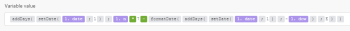
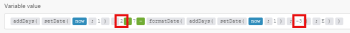
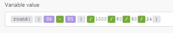
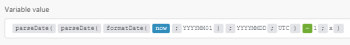

# Date and time functions

## Access requirements

You must have the following access to use the functionality in this article:

<table cellspacing="0"> 
 <col> 
 <col> 
 <tbody> 
  <tr> 
   <td role="rowheader">Adobe Workfront plan*</td> 
   <td> <p>Pro or higher</p> </td> 
  </tr> 
  <tr data-mc-conditions=""> 
   <td role="rowheader">Adobe Workfront license*</td> 
   <td> <p>Plan, Work</p> </td> 
  </tr> 
  <tr> 
   <td role="rowheader">Adobe Workfront Fusion license**</td> 
   <td> <p>Workfront Fusion for Work Automation and Integration </p>  </td> 
  </tr> 
  <tr> 
   <td role="rowheader">Product</td> 
   <td>Your organization must purchase Adobe Workfront Fusion as well as Adobe Workfront to use functionality described in this article.</td> 
  </tr> <!--
   <tr data-mc-conditions="QuicksilverOrClassic.Draft mode"> 
    <td role="rowheader">Access level configurations*</td> 
    <td> <!--
      <p data-mc-conditions="QuicksilverOrClassic.Draft mode">You must be a Workfront Fusion administrator for your organization.</p>
     --> <!--
      <p data-mc-conditions="QuicksilverOrClassic.Draft mode">You must be a Workfront Fusion administrator for your team.</p>
     --> </td> 
   </tr>
  --> 
 </tbody> 
</table>

&#42;To find out what plan, license type, or access you have, contact your Workfront administrator.

&#42;&#42;For information on Adobe Workfront Fusion licenses, see [Adobe Workfront Fusion licenses](../../workfront-fusion/get-started/license-automation-vs-integration.md)

## formatDate (date; format; [timezone])

Use this function when you have a Date value, such as 

```
12-10-2021 20:30
```

, that you want to format as a Text value, such as 

```
Dec 10, 2021 8:30 PM
```

.

This is useful, for example, when you need to change the date format of one app or webservice to that of a connected app or web service in the same scenario.

For more information, see [Date](../../workfront-fusion/mapping/item-data-types.md#date) and [Text](../../workfront-fusion/mapping/item-data-types.md#text) in the article [Item data types](../../workfront-fusion/mapping/item-data-types.md).

### Parameters

<table cellspacing="15"> 
 <col> 
 <col> 
 <col> 
 <thead> 
  <tr> 
   <th>Parameter</th> 
   <th>Expected data type* </th> 
   <th>What it does</th> 
  </tr> 
 </thead> 
 <tbody> 
  <tr> 
   <td>date </td> 
   <td>Date </td> 
   <td> <p>Converts a Date value to a Text value. </p> </td> 
  </tr> 
  <tr> 
   <td>format </td> 
   <td>Text </td> 
   <td> <p>Lets you specify a format using date/time formatting tokens. For more information, see <a href="../../workfront-fusion/functions/tokens-for-date-and-time-formatting.md" class="MCXref xref">Tokens for date and time formatting</a>.</p> <p class="example" data-mc-autonum="<b>Example: </b>"><span class="autonumber"><span><b>Example: </b></span></span><code>DD.MM.YYYY HH:mm</code> </p> </td> 
  </tr> 
  <tr> 
   <td>timezone </td> 
   <td>Text </td> 
   <td> <p>(Optional) Lets you specify the timezone used for the conversion. </p> <p>For the list of recognized timezones, see the "TZ database name" column in the Wikipedia <a href="https://en.wikipedia.org/wiki/List_of_tz_database_time_zones">List of tz database time zones</a>. Only the values listed in this column are recognized by the function as a valid timezone. Any other value is ignored and the Scenarios timezone specified in your Profile is used instead. For more information, see in the article <a href="../../workfront-fusion/workfront-fusion-basics/change-profile-settings.md" class="MCXref xref">Change profile settings</a>.</p> <p>If you omit this parameter, the Scenarios timezone specified in your Profile settings is applied. </p> <p class="example" data-mc-autonum="<b>Example: </b>"><span class="autonumber"><span><b>Example: </b></span></span><code>Europe/Prague</code>, <code>UTC</code></p> </td> 
  </tr> 
 </tbody> 
</table>

&#42; If different type is provided, type coercion is applied. For more information, see [Type coercion](../../workfront-fusion/mapping/type-coercion.md).

### Return value and type

The formatDate function returns a text representation of the given Date value according to the specified format and timezone. The data type is Text.

``` ```**Examples: **`````` The Scenario and Web timezone were both set to 

```
Europe/Prague
```

in these examples.


* ```formatDate(``` ```1. Date created``` ```;```

  ```
  MM/DD/YYYY
  ```

  ```)```

  Returns 10/01/2018

* ```formatDate(``` ```1. Date created``` ```;```

  ```
  YYYY-MM-DD hh:mm A
  ```

  ```)```

  Returns 2018-10-01 09:32 AM

* ```formatDate(``` ```1. Date created``` ```;```

  ```
  DD.MM.YYYY HH:mm
  ```

  ```;```

  ```
  UTC
  ```

  ```)```

  Returns 01.10.2018 07:32

* ```formatDate(``` ```now``` ```;```

  ```
  DD.MM.YYYY HH:mm
  ```

  ```)```

  Returns 19.03.2019 15:30

## parseDate (text; format; [timezone])

Use this function when you have a Text value representing a date (such as 

```
12-10-2019 20:30
```

or 

```
Aug 18, 2019 10:00 AM
```

) and you want to convert (parse) it to a Date value (a binary machine readable representation). For more information, see [Date](../../workfront-fusion/mapping/item-data-types.md#date) and [Text](../../workfront-fusion/mapping/item-data-types.md#text) in the article [Item data types](../../workfront-fusion/mapping/item-data-types.md).

### Parameters

The second column indicates the expected type. If different type is provided, [Type coercion](../../workfront-fusion/mapping/type-coercion.md) is applied.

<table cellspacing="15"> 
 <col> 
 <col> 
 <col> 
 <thead> 
  <tr> 
   <th>Parameter</th> 
   <th>Expected data type* </th> 
   <th>What it does</th> 
  </tr> 
 </thead> 
 <tbody> 
  <tr> 
   <td>text </td> 
   <td>Text </td> 
   <td> <p>Converts a Date value to a Text value. </p> </td> 
  </tr> 
  <tr> 
   <td>format </td> 
   <td>Text </td> 
   <td> <p>Lets you specify a format using date/time formatting tokens. For more information, see <a href="../../workfront-fusion/functions/tokens-for-date-and-time-formatting.md" class="MCXref xref">Tokens for date and time formatting</a>.</p> <p class="example" data-mc-autonum="<b>Example: </b>"><span class="autonumber"><span><b>Example: </b></span></span><code>DD.MM.YYYY HH:mm</code> </p> </td> 
  </tr> 
  <tr> 
   <td>timezone </td> 
   <td>Text </td> 
   <td> <p>(Optional) Lets you specify the timezone used for the conversion. </p> <p>For the list of recognized timezones, see the "TZ database name" column in the Wikipedia <a href="https://en.wikipedia.org/wiki/List_of_tz_database_time_zones">List of tz database time zones</a>. Only the values listed in this column are recognized by the function as a valid timezone. Any other value is ignored and the Scenarios timezone specified in your Profile is used instead. For more information, see in the article <a href="../../workfront-fusion/workfront-fusion-basics/change-profile-settings.md" class="MCXref xref">Change profile settings</a>.</p> <p>If you omit this parameter, the Scenarios timezone specified in your Profile settings is applied.</p> <p class="example" data-mc-autonum="<b>Example: </b>"><span class="autonumber"><span><b>Example: </b></span></span><code>Europe/Prague</code>, <code>UTC</code></p> </td> 
  </tr> 
 </tbody> 
</table>

&#42; If different type is provided, type coercion is applied. For more information, see [Type coercion](../../workfront-fusion/mapping/type-coercion.md).

### Return value and type

This function converts a text string to a date, according to the format and timezone that you specify. The data type of the value is Date.

``` ```**Examples: **``````&nbsp;In the following examples, the returned Date value is expressed according to ISO 8601, but the data type of the result is Date.

* ```parseDate(```

  ```
  2016-12-28
  ```

  ```;```

  ```
  YYYY-MM-DD
  ```

  ```)```

  Returns 2016-12-28T00:00:00.000Z

* ```parseDate(```

  ```
  2016-12-28 16:03
  ```

  ```;```

  ```
  YYYY-MM-DD HH:mm
  ```

  ```)```

  Returns 2016-12-28T16:03:00.000Z

* ```parseDate(```

  ```
  2016-12-28 04:03 pm
  ```

  ```;```

  ```
  YYYY-MM-DD hh:mm a
  ```

  ```)```

  Returns 2016-12-28T16:03:06.000Z

* ```parseDate(```

  ```
  1482940986
  ```

  ```;```

  ```
  X
  ```

  ```)```

  Returns 2016-12-28T16:03:06.000Z

## addDays (date; number) {#adddays-date-number}

Returns a new date as a result of adding a given number of days to a date. To subtract days, enter a negative number.

``` ```**Examples: **``````

* 

  ```
  <span class="function">addDays(</span>2016-12-08T15:55:57.536Z
  ```

  ```;```

  ```
  2
  ```

  ```)```

  Returns 2016-12-10T15:55:57.536Z

* ```addDays(```

  ```
  2016-12-08T15:55:57.536Z
  ```

  ```;```

  ```
  -2
  ```

  ```)```&nbsp;

  Returns 2016-12-6T15:55:57.536Z

## addHours (date; number) {#addhours-date-number}

Returns a new date as a result of adding a given number of hours to a date. To subtract hours, enter a negative number.

``` ```**Examples: **``````

* ```addHours(```

  ```
  2016-12-08T15:55:57.536Z
  ```

  ```;```

  ```
  2
  ```

  ```)```

  Returns 2016-12-08T17:55:57.536Z

* ```addHours(```

  ```
  2016-12-08T15:55:57.536Z
  ```

  ```;```

  ```
  -2
  ```

  ```)```&nbsp;

  Returns 2016-12-08T13:55:57.536Z

## addMinutes (date; number) {#addminutes-date-number}

Returns a new date as a result of adding a given number of minutes to a date. To subtract minutes, enter a negative number.

``` ```**Examples: **``````

* ```addMinutes(```

  ```
  2016-12-08T15:55:57.536Z
  ```

  ```;```

  ```
  2
  ```

  ```)```

  Returns 2016-12-08T15:57:57.536Z

* ```addMinutes(```

  ```
  2016-12-08T15:55:57.536Z
  ```

  ```;```

  ```
  -2
  ```

  ```)```&nbsp;

  Returns 2016-12-08T15:53:57.536Z

## addMonths (date; number)

Returns a new date as a result of adding a given number of months to a date. To subtract months, enter a negative number.

``` ```**Examples: **``````

* ```addMonths(```

  ```
  2016-08-08T15:55:57.536Z
  ```

  ```;```

  ```
  2
  ```

  ```)```

  Returns 2016-10-08T15:55:57.536Z

* ```addMonths(```

  ```
  2016-08-08T15:55:57.536Z
  ```

  ```;```

  ```
  -2
  ```

  ```)```&nbsp;

  Returns 2016-06-08T15:55:57.536Z

## addSeconds (date; number) {#addseconds-date-number}

Returns a new date as a result of adding a given number of seconds to a date. To subtract seconds, enter a negative number.

``` ```**Examples: **``````

* ```addSeconds(```

  ```
  2016-12-08T15:55:57.536Z
  ```

  ```;```

  ```
  2
  ```

  ```)```

  Returns 2016-12-08T15:55:59.536Z

* ```addSeconds(```

  ```
  2016-12-08T15:55:57.536Z
  ```

  ```;```

  ```
  -2
  ```

  ```)```&nbsp;

  Returns 2016-12-08T15:55:55.536Z

## addYears (date; number)

Returns a new date as a result of adding a given number of years to a date. To subtract years, enter a negative number.

``` ```**Examples: **``````

* ```addYears(```

  ```
  2016-08-08T15:55:57.536Z
  ```

  ```;```

  ```
  2
  ```

  ```)```

  Returns 2018-08-08T15:55:57.536Z

* ```addYears(```

  ```
  2016-12-08T15:55:57.536Z
  ```

  ```;```

  ```
  -2
  ```

  ```)```&nbsp;

  Returns 2014-08-08T15:55:57.536Z

## setSecond (date; number)

This function returns a new date with the seconds specified in parameters.

Specify a number from 0 to 59. If the number is outside of that range, the function returns a second from the previous minute (for a negative number) or subsequent minute (for a positive number).

If you need to specify a number outside the range, we recommend that you use addSeconds, as described above in the section [addSeconds (date; number)](#addseconds-date-number).

``` ```**Examples: **``````

* ```setSecond(```

  ```
  2015-10-07T11:36:39.138Z
  ```

  ```;```

  ```
  10
  ```

  ```)```

  Returns 2015-10-07T11:36:10.138Z

* ```setSecond(```

  ```
  2015-10-07T11:36:39.138Z
  ```

  ```;```

  ```
  61
  ```

  ```)```&nbsp;

  Returns 2015-10-07T11:37:01.138Z

## setMinute (date; number)

This function returns a new date with the minutes specified in parameters.

Specify a number from 0 to 59. If the number is outside of that range, the function returns a minute from the previous hour (for a negative number) or subsequent hour (for a positive number).

If you need to specify a number outside the range, we recommend that you use addMinutes, as described above in [addMinutes (date; number)](#addminutes-date-number). 

``` ```**Examples: **``````

* ```setMinute(```

  ```
  2015-10-07T11:36:39.138Z
  ```

  ```;```

  ```
  10
  ```

  ```)```

  Returns 2015-10-07T11:10:39.138Z

* ```setMinute(```

  ```
  2015-10-07T11:36:39.138Z
  ```

  ```;```

  ```
  61
  ```

  ```)```&nbsp;

  Returns 2015-10-07T12:01:39.138Z

## setHour (date; number)

This function returns a new date with the hour specified in parameters.

Specify a number from 0 to 23. If the number is outside this range, the function returns an hour from the previous day (for a negative number) or subsequent day (for a positive number).

If you need to specify a number outside the range, we recommend that you use addHours, as described above in [addHours (date; number)](#addhours-date-number). 

``` ```**Examples: **``````

* ```setHour(```

  ```
  2015-08-07T11:36:39.138Z
  ```

  ```;```

  ```
  6
  ```

  ```)```

  Returns 2015-08-07T06:36:39.138Z

* ```setHour(```

  ```
  2015-08-07T11:36:39.138Z
  ```

  ```;```

  ```
  -6
  ```

  ```)```&nbsp;

  Returns 2015-08-06T18:36:39.138Z

## setDay (date; number/name of the day in English)

This function returns a new date with the day specified in parameters.

You can use this function to set the day of the week, with Sunday as 1 and Saturday as 7. If the you specify a number from 1 to 7, the resulting date is within the current (Sunday-to-Saturday) week. If the number is outside of that range, the function returns a day from the previous week (for a negative number) or subsequent week (for a positive number).

If you need to specify a number outside the range, we recommend that you use addDays, as described above in [addDays (date; number)](#adddays-date-number).

``` ```**Examples: **``````

* ```setDay(```

  ```
  2018-06-27T11:36:39.138Z
  ```

  ```;```

  ```
  Monday
  ```

  ```)```

  Returns 2018-06-25T11:36:39.138Z

* ```setDay(```

  ```
  2018-06-27T11:36:39.138Z
  ```

  ```;```

  ```
  1
  ```

  ```)```&nbsp;

  Returns 2018-06-24T11:36:39.138Z

* ```setDay(```

  ```
  2018-06-27T11:36:39.138Z;7
  ```

  ```;```

  ```
  7
  ```

  ```)```&nbsp;

  Returns 2018-06-30T11:36:39.138Z

## setDate (date; number)

This function returns a new date with the day of the month specified in parameters.

Specify a number from 1 to 31. If the number is outside of this range, the function returns a day from the previous month (for a negative number) or subsequent month (for a positive number).

``` ```**Examples: **``````

* ```setDate(```

  ```
  2015-08-07T11:36:39.138Z
  ```

  ```;```

  ```
  5
  ```

  ```)```

  Returns 2015-08-05T11:36:39.138Z

* ```setDate(```

  ```
  2015-08-07T11:36:39.138Z
  ```

  ```;```

  ```
  32
  ```

  ```)```&nbsp;

  Returns 2015-09-01T11:36:39.138Z

## setMonth (date; number/name of the month in English)

This function returns a new date with the month specified in parameters.

Specify a number from 1 to 12. If the number is outside of this range, the function returns the month in the previous year (for a negative number) or subsequent year (for a positive number).

``` ```**Examples: **``````

* ```setMonth(```

  ```
  2015-08-07T11:36:39.138Z
  ```

  ```;```

  ```
  5
  ```

  ```)```

  Returns 2015-05-07T11:36:39.138Z

* ```setMonth(```

  ```
  2015-08-07T11:36:39.138Z
  ```

  ```;```

  ```
  17
  ```

  ```)```&nbsp;

  Returns 2016-05-07T11:36:39.138Z

* ```setMonth(```

  ```
  2015-08-07T11:36:39.138Z
  ```

  ```;```

  ```
  january
  ```

  ```)```&nbsp;

  Returns 2015-01-07T12:36:39.138Z

## setYear (date; number)

Returns a new date with the year specified in parameters.

``` ```**Example: **`````` ```setMonth(```

```
2015-08-07T11:36:39.138Z
```

```;```

```
2017
```

```)```

Returns 2017-08-07T11:36:39.138Z

## dateDifference (Date1; Date2; Unit)

Returns a number representing the difference in the two dates, expressed in the specified unit.

Date2 is subtracted from Date1.

Use one of the following time values for the 

```
unit
```

parameter:

* milliseconds
* seconds
* minutes
* hours
* days
* weeks
* months

If no unit is specified, the function returns the difference in milliseconds.

``` ```**Examples: **``````

* 

  ```
  dateDifference(2021-05-11T18:10:00.000Z;2021-05-11T18:00:00.000Z)
  ```

  Returns 

  ```
  600,000
  ```

* 

  ```
  dateDifference(2021-05-11T18:10:00.000Z;2021-05-11T18:00:00.000Z;hours)
  ```

  Returns 

  ```
  4
  ```

* 

  ```
  dateDifference2021-06-11T18:10:00.000Z;2021-05-11T18:00:00.000Z;months)
  ```

  Returns 

  ```
  1
  ```

## Additional examples

#### How to calculate n-th day of week in month

This section is adapted for Workfront Fusion from the Exceljet web page that explains how to get the nth day of week in a month.

If you need to calculate a date corresponding to n-th day of week in month (for example, first Tuesday, third Friday, and so on), you can use the following formula:



You can copy and paste the formula's code into a field:
<pre>{{addDays(setDate(1.date; 1); 1.n * 7 - formatDate(addDays(setDate(1.date; 1); "-" + 1.dow); "E"))}}</pre>The formula contains the following items:

<table cellspacing="15"> 
 <col> 
 <col> 
 <tbody> 
  <tr> 
   <td><code>1.n</code> </td> 
   <td> <p> n-th day:</p> 
    <ul> 
     <li><code>1</code> for 1st Tuesday</li> 
     <li><code>2</code> for 2nd Tuesday</li> 
     <li><code>3</code> for 3rd Tuesday, and so on</li> 
    </ul> </td> 
  </tr> 
  <tr> 
   <td><code>2.dow</code> </td> 
   <td> <p> day of week:</p> 
    <ul> 
     <li><code>1</code> for Monday</li> 
     <li><code>2</code> for Tuesday</li> 
     <li><code>3</code> for Wednesday</li> 
     <li><code>4</code> for Thursday</li> 
     <li><code>5</code> for Friday</li> 
     <li><code>6</code> for Saturday</li> 
     <li><code>7</code> for Sunday</li> 
    </ul> </td> 
  </tr> 
  <tr> 
   <td><code>1.date</code> </td> 
   <td> <p> The date determines the month. To calculate n-th day of week in current month use the <code>now </code>variable.</p> </td> 
  </tr> 
 </tbody> 
</table>

In case you want to calculate only one specific case, for example, every second Wednesday, you can replace the items 

```
1.n
```

and 

```
2.dow
```

in the formula with corresponding numbers. For the second Wednesday in the current month, you would use the following values:

* 

  ```
  1.n
  ```

  = 

  ```
  2
  ```

* 

  ```
  1.dow
  ```

  = 

  ```
  3
  ```

* 

  ```
  1.date
  ```

  = 

  ```
  now
  ```



#### Explanation:

* 

  ```
  setDate(now;1)
  ```

  returns first of current month
* 

  ```
  formatDate(....;E)
  ```

  returns day of week (1, 2, ... 6)

### How to calculate days between dates

One possibility is to employ the following expression:



You can copy and paste the following code:
<pre>{{round((2.value - 1.value) / 1000 / 60 / 60 / 24)}}</pre>

>[!NOTE]
>
>* Values of >
>  ```>
>  D1
>  ```>
>  and >
>  ```>
>  D2
>  ```>
>  have be Date type values. If they are String type values (for example, 20.10.2018), use the >
>  ```>
>  parseDate()
>  ```>
>  function to convert them to Date type values. 
>
>* The >
>  ```>
>  round()
>  ```>
>  function is used for cases when one of the dates falls within the daylight savings time period and the other does not. In these cases, the difference in hours is one hour less or more. You can divide it by 24 for a non-integer result. You lose an hour-Daylight Savings. Round flattens it so you don't have a percentage
>

### How to calculate last day/millisecond of month

When you specify a date range, for example in a search module, if the range spans the whole previous month as a closed interval (the interval that includes both its limit points), you need to calculate the last day of the month.

2019-09-01 ≤ D ≤ 2019-09-30

The formula below shows one way how to calculate last day of the previous month:


You can copy & paste the following code:
<pre>{{addDays(setDate(now; 1); -1)}}</pre>In some cases, you need to calculate not only the last day of month, but literally its last millisecond:

2019-09-01T00:00:00.000Z ≤ D ≤ 2019-09-30T23:59:59.999Z

This formula shows one way how to calculate last millisecond of the previous month:



You can copy and paste the following code:
<pre>{{parseDate(parseDate(formatDate(now; "YYYYMM01"); "YYYYMMDD"; "UTC") - 1; "x")}}</pre>If you need the result to use your timezone setting, omit the UTC argument:


<pre>{{parseDate(parseDate(formatDate(now; "YYYYMM01"); "YYYYMMDD") - 1; "x")}}</pre>However, it is preferable to use half-open interval instead (the interval that excludes one of its limit points), specifying the first day of the following month instead and replacing the "less or equal than" operator with "less than" as follows:

2019-09-01 ≤ D < 2019-10-01

2019-09-01T00:00:00.000Z ≤ D < 2019-10-01T00:00:00.000Z
