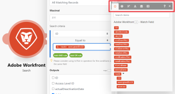

# Map items using functions in Adobe Workfront Fusion

>[!IMPORTANT]
>
>You're currently viewing the Adobe Workfront Classic version of this document. Adobe Workfront Classic is no longer supported. All Adobe Workfront Classic functionality, along with this documentation, will be removed in July 2022. Please transition to the the new Adobe Workfront experienceas soon as possible, and switch to the new Adobe Workfront experience version of this document.

When you map items, you can use functions to create simple or complex formulas.

The functions available in Adobe Workfront Fusion are similar to functions in Excel and in some programming languages. They evaluate general logic, math, text, dates, and arrays. They let you perform conditional logic and transformations of item values, such as converting a text to uppercase, trimming text, converting a date into a different format, and more. For more information, see [Map information from one module to another in Adobe Workfront Fusion](../../workfront-fusion/mapping/map-information-between-modules.md).

## Access requirements

You must have the following access to use the functionality in this article:

<table> 
 <col> 
 <col> 
 <tbody> 
  <tr> 
   <td role="rowheader">Adobe Workfront plan*</td> 
   <td> 
Pro or higher
 </td> 
  </tr> 
  <tr data-mc-conditions=""> 
   <td role="rowheader">Adobe Workfront license*</td> 
   <td> 
Plan, Work
 </td> 
  </tr> 
  <tr> 
   <td role="rowheader">Adobe Workfront Fusion license**</td> 
   <td> 
Workfront Fusion for Work Automation and Integration 
  </td> 
  </tr> 
  <tr> 
   <td role="rowheader">Product</td> 
   <td>Your organization must purchase Adobe Workfront Fusion as well as Adobe Workfront to use functionality described in this article.</td> 
  </tr> <!--
   <tr data-mc-conditions="QuicksilverOrClassic.Draft mode"> 
    <td role="rowheader">Access level configurations*</td> 
    <td> <!--
      
You must be a Workfront Fusion administrator for your organization.

     --> <!--
      
You must be a Workfront Fusion administrator for your team.

     --> </td> 
   </tr>
  --> 
 </tbody> 
</table>

&#42;To find out what plan, license type, or access you have, contact your Workfront administrator.

&#42;&#42;For information on Adobe Workfront Fusion licenses, see [Adobe Workfront Fusion licenses](../../workfront-fusion/get-started/license-automation-vs-integration.md)

## Insert functions into fields

If you click a field, the mapping panel displays. The mapping panel contains several tabs:

The first tab  (shown upon opening the panel) displays the items that you can map from other modules.

The other tabs contain the following types of functions:

* **General functions**  - See [General functions in Adobe Workfront Fusion](../../workfront-fusion/functions/general-functions.md) for more information.

* **Math functions**  - See [Math functions in Adobe Workfront Fusion](../../workfront-fusion/functions/math-functions.md) for more information.

* **Text and binary functions**  - See [String functions in Adobe Workfront Fusion](../../workfront-fusion/functions/string-functions.md) for more information.

* **Date and time**  - See [Date and time functions in Adobe Workfront Fusion](../../workfront-fusion/functions/date-and-time-functions.md) and the articles below for more information.

   * [Tokens for date and time formatting in Adobe Workfront Fusion](../../workfront-fusion/functions/tokens-for-date-and-time-formatting.md)
   * [Tokens for date and time parsing in Adobe Workfront Fusion](../../workfront-fusion/functions/tokens-for-date-and-time-parsing.md)

* **Functions for working with arrays**  - See [Array functions in Adobe Workfront Fusion](../../workfront-fusion/functions/array-functions.md) for more information.

To insert a function into a field:

1. Click the function name.

   Or

   Drag the function into the field.

**Example:** Some data types prevent users from entering more than a certain number of characters. You can use the substring function to limit a value to a certain number of characters.

In this example, the substring function limits project name to 50 characters.

## Nesting functions

You can nest functions within each other to create limitless possibilities.

## Use Google Sheets functions

If Workfront Fusion does not feature a function you want to use, but it is featured by Google Sheets, you can use it by following these steps:

1. In Google Sheets, create a new empty spreadsheet.
1. In Workfront Fusion, open your scenario.
1. Add the **Google Sheets** >**Update a cell** module to the scenario.

   For instructions on adding a module, see [Add a module in a scenario](../../workfront-fusion/scenarios/create-a-scenario.md#add) in the article [Create a scenario in Adobe Workfront Fusion](../../workfront-fusion/scenarios/create-a-scenario.md).

1. Configure the module:

   1. Choose the newly created spreadsheet in the **Spreadsheet** field.
   1. Insert your formula containing the Google Sheets function(s) into the **Value** field.

      You can use the output of preceding modules as usual.

      

1. Insert the **Google Sheets > Get a cell** module to obtain the calculated result.
1. Configure the module, using the same Cell ID that you used in step 4.

   

